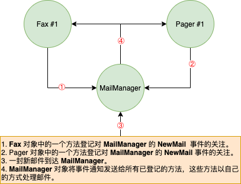

# 第 11 章 事  件

本章内容：
* <a href="#11_1">设计公开事件的类型</a>
* <a href="#11_2">编译器如何实现事件</a>
* <a href="#11_3">设计侦听事件的类型</a>
* <a href="#11_4">显式实现事件</a>

本章讨论可以在类型中定义的最后一种成员：事件。定义了事件成员的类型允许类型(或类型的实例)通知其他对象发生了特定的事情。例如，`Button` 类提供了 `Click` 事件。应用程序中的一个或多个对象可接收关于该事件的通知，以便在`Button`被单击之后采用特定操作。我们用事件这种类型成员来实现这种类型成员来实现这种交互。具体地说，定义了事件成员成员的类型能提供以下功能。

* 方法能登记它对事件的关注。
* 方法能注销它对事件的关注。
* 事件发生时，登记了的方法将收到通知。

类型之所以能提供事件通知功能，是因为类型维护了一个已登记方法的列表。事件发生后，类型将通知列表中所有已登记的方法。

CLR 事件模型以**委托**为基础。委托是调用①回调方法的一种类型安全的方式。对象凭借回调方法接收它们订阅的通知。本章会开始使用委托，但委托的完整细节是在第 17 章"委托"中讲述的。
> 这个“调用”(invoke)理解为“唤出”更恰当。它和普通的“调用”(call)稍有不同。在英语的语境中，invoke 和 call 的区别在于，在执行一个所有信息都已知的方法时，用 call 比较恰当。这些信息包括要引用的类型、方法的签名以及方法名。但是，在需要先“唤出”某个东西来帮你调用一个信息不明的方法时，用 invoke 就比较恰当。但是，由于两者均翻译为“调用”不会对读者的理解造成太大的困扰，所以本书仍然采用约定俗成的方式来进行翻译，只是在必要的时候附加英文原文提醒你区分。 —— 译注

为了帮你完整地理解事件在 CLR 中的工作机制，先来描述事件很有用的一个场景。假定要设计一个电子邮件应用程序。电子邮件到达时，用户可能希望将该邮件转发给传真机或寻呼机。先设计名为 `MailManager` 的类型来接收传入的电子邮件，它公开 `NewMail` 事件。

其他类型(如 `Fax` 和 `Pager`)的对象登记对于该事件的关注。`MailManager` 收到新电子邮件会引发该事件，造成邮件分发给每一个已登记的对象。每个对象都用它们自己的方式处理邮件。

应用程序初始化时只实例化一个 `MailManager` 实例，然后可以实例化任意数量的 `Fax` 和 `Pager`
对象。图 11-1 展示了应用程序如何初始化，以及新电子邮件到达时发生的事情。

  
图 11-1 设计使用了事件的应用程序 

图 11-1 的应用程序首先构造 `MailManager` 的一个实例。 `MailManager` 提供了 `NewMail` 事件。构造 `Fax` 和 `Pager` 对象时，它们向 `MailManager` 的 `NewMail` 事件登记自己的一个实例方法。这样当新邮件到达时， `MailManager` 就知道通知 `Fax` 和 `Pager` 对象。`MailManager` 将来收到新邮件时会引发 `NewMail` 事件，使自己登记的方法都有机会以自己的方式处理邮件。

## <a name="11_1">11.1 设计要公开事件的类型</a>

开发人员通过连续几个步骤定义公开了一个或多个事件成员的类型。本节详细描述了每个必要的步骤。

