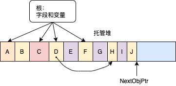
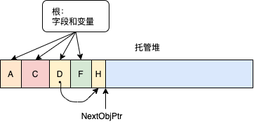

# 第 21 章 托管堆和垃圾回收

本章内容

* <a href="#21_1">托管堆基础</a>
* <a href="#21_2">代：提升性能</a>
* <a href="#21_3">使用需要特殊清理的类型</a>
* <a href="#21_4">手动监视和控制对象生存期</a>

本章要讨论托管应用程序如何构造新对象，托管堆如何控制这些对象的生存期，以及如何回收这些对象的内存。简单地说，本章要解释 CLR 中的垃圾回收器是如何工作的，还要解释相关的性能问题。另外，本章讨论了如何设计应用程序来最有效地使用内存。

## <a name="21_1">21.1 托管堆基础</a>

每个程序都要使用这样或那样的资源，包括文件、内存缓冲区、屏幕空间、网络连接、数据库资源等。事实上，在面向对象的环境中，每个类型都代表可供程序使用的一种资源。要使用这些资源，必须为代表资源的类型分配内存。以下是访问一个资源所需的步骤。

1. 调用 IL 执行 newobj，为代表资源的类型分配内存(一般使用 C# `new` 操作符来完成)。

2. 初始化内存，设置资源的初始状态并使资源可用。类型的实例构造器负责设置初始状态。

3. 访问类型的成员来使用资源(有必要可以重复)。

4. 摧毁资源的状态以进行清理。

5. 释放内存。垃圾回收器独自负责这一步。

如果需要程序员手动管理内存(例如，原生 C++ 开发人员就是这样的)，这个看似简单的模式就会成为导致大量编程错误的“元凶”之一。想想看，有多少次程序员忘记释放不再需要的内存而造成内存泄漏？又有多少次视图使用已经释放的内存，然后由于内存被破坏而造成程序错误和安全漏洞？而且，这两种bug比其他大多数 bug 都要严重，因为一般无法预测他们的后果或发生的时间<sup>①</sup>。如果是其他bug， 一旦发现程序行为异常，改正出问题的代码行就可以了。

> ① 例如，访问越界的bug 可能取回不相干的数据，使程序结果变得不正确。而且错误没有规律，让人捉摸不定。 ————译注

现在，只要写的是可验证的、类型安全的代码(不要用 C# `unsafe` 关键字)，应用程序就不可能会出现内存被破坏的情况。内存仍有可能泄露，但不像以前那样是默认行为。现在内存泄漏一般是因为在集合中存储了对象，但不需要对象的时候一直不去删除

为了进一步简化编程，开发人员经常使用的大多数类型都不需要步骤 4 (摧毁资源的状态以进行清理)。所以，托管堆除了能避免前面提到的 bug，还能为开发人员提供一个简化的编程模型；分配并初始化资源并直接使用。大多数类型都无需资源清理，垃圾回收器会自动释放内存。

使用需要特殊清理的类型时，编程模型还是像刚才描述的那样简单。只是有时需要尽快清理资源，而不是非要等着 GC <sup>①</sup>介入。可在这些类中调用一个额外的方法(称为 `Dispose`)，按照自己的节奏清理资源。另一方面，实现这样的类需要考虑到较多的问题(21.4 节会详细讨论)。一般只有包装了本机资源(文件、套接字和数据库连接等)的类型才需要特殊清理。

> ① 垃圾回收、垃圾回收器都可以简称为 GC。 ———— 译注

### 21.1.1 从托管堆分配资源

CLR 要求所有对象都从**托管堆**分配。进程初始化时，CLR 划出一个地址空间区域作为托管堆。CLR 还要维护一个指针，我把它称作 `NextObjPtr`。该指针指向下一个对象在堆中的分配位置。刚开始的时候，`NextObjPtr` 设为地址空间区域的基地址。

一个区域被废垃圾对象填满后，CLR 会分配更多的区域。这个过程一直重复，直至整个进程地址空间都被填满。所以，你的应用程序的内存受进程的虚拟地址空间的限制。32 为进程最多能分配 1.5 GB，64 位进程最多能分配 8 TB。

C# 的 `new` 操作符导致 CLR 执行以下步骤。

1. 计算类型的字段(以及从基类型继承的字段)所需的字节数。

2. 加上对象的开销所需的字节数。每个对象都有两个开销字段：类型对象指针和同步块索引。对于 32 位应用程序，这两个字段各自需要 32 位，所以每个对象要增加 8 字节。对于 64 位应用程序，这两个字段各自需要 64 位，所以每个对象要增加 16 字节。

3. CLR 检查区域中是否有分配对象所需的字节数。如果托管堆有足够的可用空间，就在 `NextObjPtr` 指针指向的地址处放入对象，为对象分配的字节会被清零。接着调用类型的构造器(为 `this` 参数传递 `NextObjPtr`)，`new` 操作符返回对象引用。就在返回这个引用之前， `NextObjPtr` 指针的值会加上对象占用的字节数来得到一个新值，即下个对象放入托管堆时的地址。

图 21-1 展示了包含三个对象(A，B 和 C)的一个托管堆。如果要分配新对象，它将放在`NextObjPtr` 指针指向的位置(紧接在对象 C 后)。

  

图 21-1 新初始化的托管堆，其中构造了 3 个对象

对于托管堆，分配对象只需在指针上加一个值————速度相当快。在许多应用程序中，差不多同时分配的对象彼此间有较强的联系，而且经常差不多在同一时间访问。例如，经常在分配一个 `BinaryWriter` 对象之前分配一个 `FileStream` 对象。然后，应用程序使用 `BinaryWriter` 对象，而后者在内部使用 `FileStream` 对象。由于托管堆在内存中连续分配这些对象，所以会因为引用的“局部化”（locality）而获得性性能上的提升。具体地说，这意味着进程的工作集会非常小，应用程序只需使用很少的内存，从而提高了速度。还意味着代码使用的对象可以全部驻留在 CPU 的缓存中。结果是应用程序能以惊人的速度访问这些对象，因为 CPU 在执行大多数操作时，不会因为“缓存未命中”(cache miss)而被迫访问较慢的 RAM。

根据前面的描述，似乎托管堆的性能天下无敌。但先别激动，刚才说的有一个大前提————内存无限，CLR总是能分配新对象。但内存不可能无限，所以 CLR 通过称为“垃圾回收”(GC)的技术“删除”堆中你的应用程序不再需要的对象。

### 21.1.2 垃圾回收算法

应用程序调用 `new` 操作符创建对象时，可能没有足够地址空间看来分配该对象。发现空间不够，CLR 就执行垃圾回收。

> 重要提示 前面的描述过于简单。事实上，垃圾回收时在第 0 代满的时候发生的。本章后面会解释“代”。在此之前，先假设堆满就发生来及回收。

至于对象生存期的管理，有的系统采用的是某种引用计数算法。事实上，Microsoft 自己的“组件对象模型”(Component Object Model, COM)用的就是引用计数。在这种系统中，堆上的每个对象都维护着一个内存字段来统计程序中多少"部分"正在使用对象。随着每一“部分”到达代码中某个不再需要对象的地方，就递减对象的计数字段。计数字段变成0，对象就可以从内存中删除了。许多引用计数系统最大的问题是处理不好循环引用。例如在GUI 应用程序中，窗口将容纳对子 UI 元素的引用，而子 UI 元素将容纳对父窗口的引用。这种引用会阻止两个对象的计数器达到 0，所以两个对象永远不会删除，即使应用程序本身不再需要窗口了。

鉴于引用计数垃圾回收器算法存在的问题，CLR 改为使用一种引用跟踪算法。引用跟踪算法只关心引用类型的变量，因为只有这种变量才能引用堆上的对象；值类型变量直接包含值类型实例。引用类型变量可在许多场合使用，包括类的静态和实例字段，或者方法的参数和局部变量。我们将所有引用类型的变量都称为**根**。

CLR 开始 GC 时，首先暂停进程中的所有线程。这样可以防止线程在 CLR 检查期间访问对象并更改其状态。然后，CLR 进入 GC 的 **标记**阶段。在这个阶段，CLR 遍历堆中的所有对象，将同步块索引字段中的一位设为 0。这表明所有对象都应删除。然后，CLR 检查所有活动根。查看它们引用了哪些对象。这正是 CLR 的 GC 称为引用跟踪 GC 的原因。如果一个根包含 null， CLR 忽略这个根并继续检查下个根。

任何根如果引用了堆上的对象，CLR 都会标记那个对象，也就是将该对象的同步块索引中对的位设为 1。一个对象被标记后， CLR 会检查那个对象中的根，标记它们引用的对象。如果发现对象已经标记，就不重新检查对象的字段。这就避免了因为循环引用而产生死循环。

图 21-2 展示了一个堆，其中包含几个对象。应用程序的根直接引用对象 A， C， D 和 F。所有对象都已标记。标记对象 D 时，垃圾回收器发现这个对象含有一个引用对象 H 的字段，造成对象 H 也被标记。标记过程会持续，直至应用程序的所有根所有检查完毕。

  

图 21-2 回收之前的托管堆

检查完毕后，堆中的对象要么已标记，要么未标记。已标记的对象不能被垃圾回收，因为至少有一个根在引用它。我们说这种对象的**可达**(reachable)的，因为应用程序代码可通过仍在引用它的变量抵达(或访问)它。未标记的对象是不可达(unreachable)的，因为应用程序中不存在使对象能被再次访问的根。

CLR 知道哪些对象可以幸存，哪些可以删除后，就进入 GC 的**压缩**(compact)<sup>①</sup>阶段。在这个阶段，CLR 对堆中已标记的对象进行“乾坤大挪移”，压缩所有幸存下来的对象，使它们占用连续的内存空间。这样做有许多好处。首先，所有幸存对象在内存中紧挨在一起，恢复了引用的“局部化”，减小了应用程序的工作集，从而提升了将来访问这些对象时的性能。其实，可用空间也全部是连续的，所以整个地址空间区段得到了解放，允许其他东西进驻。最后，压缩意味着托管堆解决了本机(原生)堆的控件碎片化问题。<sup>②</sup>

> ① 此压缩非彼压缩，这里只是按照约定俗成的当时将 compact 翻译成“压缩”。不要以为“压缩”后内存会增多。相反，这里的“压缩”更接近于“碎片整理”。事实上， compact 正确的意思是“变得更紧凑”。但事实上，从上个世纪 80 年开始，人们就把它看成是 compress 的近义词而翻译成“压缩”，以讹传讹至今。———— 译注

> ② 大对象堆(本章稍后讨论)中的对象不会压缩，所以大对象堆还是可能发生地址空间碎片化的。

在内存中移动了对象之后有一个问题亟待解决。引用幸存对象的根现在引用的还是对象最初在内存中的位置，而非移动之后的位置。被暂停的线程恢复执行时，将访问旧的内存位置，会造成内存损坏。这显然不能容忍的，所以作为压缩阶段的一部分，CLR 还要从每个根减去所引用的对象在内存中偏移的字节数。这样就能保证每个根还是引用和之前一样的对象；只是对象在内存中变换了位置。

压缩好内存后，托管堆的 `NextObjPtr` 指针指向最后一个幸存对象之后的位置。下一个分配的对象将放到这个位置。图 21-3 展示了压缩阶段之后的托管堆。压缩阶段完成后，CLR 恢复应用程序的所有线程。这些线程继续访问对象，就好像 GC 没有发过一样。

  

图 21-3 垃圾回收后的托管堆

如果 CLR 在一次 GC 之后回收不了内存，而且进程中没有空间来分配新的 GC 区域，就说明该进程的内存已耗尽。此时，试图分配更多内存的 `new` 操作符会抛出 `OutOfMemoryException`。应用程序可捕捉该异常并从中恢复。但大多数应用程序都不会这么做；相反，异常会成为未处理异常，Windows 将终止进程并回收进程使用的全部内存。

作为程序员，应注意本章开头描述的两个 bug 不复存在了。首先，内存不可能泄露，因为从应用程序的根<sup>③</sup> 访问不了任何对象，都会在某个时间被垃圾回收。其次，不可能因为访问被释放的内存而造成内存损失，因为现在只能引用活动对象；非活动的对象是引用不了的。

>> ③ 前面说过，所有引用类型的变量都是“根”。————译注

> 重要提示 静态字段引用的对象一直存在，直到用于加载类型的 AppDomain 卸载为止。内存泄漏的一个常见原因就是让静态字段引用某个集合对象，然后不停地向集合添加数据项。静态字段使集合对象一直存活，而集合对象使所有数据项一直存活。因此，应尽量避免使用静态字段。

### 21.1.3 垃圾回收和调试

一旦根离开作用域，它引用的对象就会变得“不可达”，GC 会回收其内存；不保证对象在方法的生存期中自始至终地存活。这会对应用程序产生有趣的影响。例如以下代码：

```C#
using System;
using System.Threading;

public static class Program {
    public static void Main() {
        // 创建每 2000 毫秒就调用一次 TimerCallback 方法的 Timer 对象
        Timer t = new Timer(TimerCallback, null, 0, 2000);

        // 等待用户按 Enter 键
        Console.ReadLine();
    }

    private static void TimerCallback(Object o) {
        // 当调用该方法时，显示日期和时间
        Console.WriteLine("In TimerCallback: " + DateTime.Now);

        // 出于演示目的，强制执行一次垃圾回收
        GC.Collect();
    }
}
```

在命令行上，不用任何特殊编译器开关编译代码。运行可执行文件，会发现 `TimerCallback` 方法只被调用一次！

观察代码，可能以为 `TimerCallback` 方法每隔 2000 毫秒调用一次。毕竟，代码创建了一个 `Timer` 对象，而且有一个变量 `t` 引用该对象。只要计时器对象存在，计时器就应该一直触发。但要注意，`TimerCallback` 方法调用 `GC.Collect()`强制执行了一次垃圾回收。

回收开始时，垃圾回收器首先假定堆中的所有对象都是不可达的(垃圾)；这自然也包括`Timer`对象。然后，垃圾回收器检查应用程序的根，发现在初始化之后，`Main`方法再也没有用过变量`t`。既然应用程序没有任何变量引用`Timer`对象，垃圾回收自然会回收分配给它的内存；这使计数器停止触发。并解释了为什么`TimerCallback`方法只被调用了一次。

现在，假定用调试器单步调试 `Main`，而且在将新 `Timer` 对象的地址赋给 `t` 之后，立即发生了一次垃圾回收。然后，用调试器的“监视”窗口查看`t` 引用的对象，会发生什么事情呢？因为对象已被回收，所以调试器无法显示该对象。大多数开发人员都没有料到这个结果，认为不合常理。所以，Microsoft 提出了一个解决方案。

使用 C# 编译器的 `/debug` 开关编译程序集时，编译器会应用 `System.Diagnostics.DebuggableAttribute`，并为结果程序集设置`DebuggingModes` 的 `DisableOptimizations` 标志。运行时编译方法时，JIT 编译器看到这个标志，会将所有根的生存期延长至方法结束。在我的例子中，JIT 编译器认为 `Main` 的 `t` 变量必须存活至方法结束。所以在垃圾回收时，GC 认为 `t` 仍然是一个根，`t`引用的`Timer`对象仍然“可达”。`Timer`对象会在回收中存活，`TimerCallback` 方法会被反复调用，直至`Console.ReadLine` 方法返回而且 `Main` 方法退出。

这很容易验证，只需在命令行中重新编译程序，但这一次指定 C# 编译器的 `/debug` 开关。运行可执行文件，会看到 `TimerCallback` 方法被反复代用。注意，C# 编译器的 `/optimize+`编译器开关会将 `DisableOptimizations` 禁止的优化重新恢复，所以实验时不要指定该开关。

JIT 编译器这样做的目的是帮助进行 JIT 调试。现在可以用正常方式启动应用程序(不用调试器)，方法一经调用，JIT 编译器就会将变量的生存期延长至方法结束。以后，如果决定为进程连接一个调试器，可在先前编译好的方法中添加一个断点，并检查根变量。

你现在知道了如何构建在 Debug 生成中正常工作的应用程序，但它在 Release 生成中还是不正常。没人喜欢只有调试时才正常的应用程序，所以应该修改程序，使它在任何时候都能正常工作。

可试着像下面这样修改 `Main` 方法：

```C#
public static void Main() {
    // 创建每 2000 毫秒就调用一次 TimerCallback 方法的 Timer 对象
    Timer t = new Timer(TimerCallback, null, 0, 2000);

    // 等待用户按 Enter 键
    Console.ReadLine();

    // 在 ReadLine 之后引用 t(会被优化掉)
    t = null;
}
```

但编译上述代码(无`/debug+`开关)，并运行可执行文件，会看到 `TimerCallback` 方法仍然只被调用了一次。问题在于，JIT  编译器是一个优化编译器，将局部变量或参数变量设为 `null`，等价于根本不引用该变量。换言之，JIT 编译器会将 `t = null;` 整行代码删除(优化掉)。所以，程序仍然不会按期望的方式工作。下面才是 `Main` 方法的正确修改方法：

```C#
public static void Main() {
    // 创建每 2000 毫秒就调用一次 TimerCallback 方法的 Timer 对象
    Timer t = new Timer(TimerCallback, null, 0, 2000);

    // 等待用户按 Enter 键
    Console.ReadLine();

    // 在 ReadLine 之后引用 t(在 Dispose 方法返回之前，t 会在 GC 中存活)
    t.Dispose();
}
```

现在编译代码(无`/debug+`编译器开关)并运行可执行文件，会发现 `TimerCallback` 方法被正确地重复调用，程序终于得到修正。现在发生的事情是，`t`引用的对象必须存活，才能在它上面调用`Dispose`实例方法(`t`中的值要作为`this`实参传给`Dispose`)。真是讽刺，要显式要求释放计时器，它才能活到被释放的那一刻。

> 注意 读完本节的内容后，不必担心对象被过早回收这个问题。这里讨论之所以使用 `Timer` 类，是因为它具有其他类不具有的特殊行为。`Timer`类的特点(和问题)在于，堆中存在的一个 `Timer` 对象会造成别的事情的发生：一个线程池程序期调用一个方法。其他任何类型都不具有这个行为。例如，内存中存在的一个 `String` 对象不会造成别的事情的发生；字符串就那么“傻傻地呆在那里”。所以，我用 `Timer` 展示根的工作原理以及对象生存期与调试器的关系，讨论的重点并不是如何保持对象的存活。所有非 `Timer` 的对象都会根据应用程序对的需要而自动存活。

## <a name="21_2">21.2 代：提升性能</a>

CLR 的 GC 是**基于代的垃圾回收器**(generational garbage collector)<sup>①</sup>，它对你的代码做出了以下几点假设。

>> ① 也称为 ephemeral garbage collector， 本书不打算使用这一术语。

* 对象越新，生存期越短。

* 对象越老，生存期越长。

* 回收堆的一部分，速度快于回收整个堆。

大量研究证明，这些假设对于现今大多数应用程序都是成立的，它们影响了垃圾回收器的实现方式。本节将解释代的工作原理。

托管堆在初始化时不包含对象。添加到堆的对象称为第 0 代对象。简单地说，第 0 代对象就是那些新构造的对象，垃圾回收器从未检查过它们。图 21-4 展示了一个新启动的应用程序，它分配了 5 个对象(从 A 到 E)。过了一会儿，对象 C 和 E 变得不可达。

  

图 21-4 一个初始化的堆，其中包含了一些对象，所有对象都是第 0 代，垃圾回收尚未发生

CLR 初始化时为第 0 代对象选择一个预算容量(以 KB 为单位)。如果分配一个新对象造成第 0 代超过预算，就必须启动一次垃圾回收。假设对象 A 到 E 刚好用完第 0 代的空间，那么分配对象 F 就必须启动垃圾回收。垃圾回收器判断对象 C 和 E 是垃圾，所以会压缩对象 D，使之与对象 B 相邻。在垃圾回收中存活的对象(A，B 和 D)现在成为第 1 代对象。第 1 代对象已经经历了垃圾回收器的一次检查。此时的堆如图 21-5 所示。

  

图 21-5 经过一次垃圾回收，第 0 代的幸存者被提升至第 1 代；第 0 代暂时是空的

一次垃圾回收后，第 0 代就不包含任何对象了。和前面一样，新对象会分配到第 0 代中。在图 21-6 中，应用程序继续运行，并新分配了对象 F 到对象 K。另外，随着应用程序继续运行，对象 B， H 和 J 变得不可达，它们的内存将在某一时刻回收。

  

图 21-6 第 0 代分配了新对象：第 1 代有垃圾产生

现在，假定分配新对象 L 会造成第 0 代超出预算，造成必须启动垃圾回收。开始垃圾回收时，垃圾回收器必须决定检查哪些代。前面说过，CLR 初始化时会为第 0 对象选择预算。事实上，它还必须为第 1 代选择预算。

开始一次垃圾回收时，垃圾回收器还会检查第 1 代占用了多少内存。在本例中，由于第 1 代占用的内存远少于预算，所以垃圾回收器只检查第 0 代中的对象。回顾一下基于代的垃圾回收器做出的假设。第一个假设是越新的对象活得越短。因此，第 0 代包含更多垃圾的可能性很大，能回收更多的内存。由于忽略了第 1 代中的对象，所以加快了垃圾回收速度。

显然，忽略第 1 代中的对象能提升垃圾回收器的性能。但对性能有更大提振作用的是现在不必遍历托管堆中的每个对象。如果根或对象引用了老一代的某个对象，垃圾回收器就可以忽略老对象内部的所有引用，能在更短的时间内构造好可达对象图(graph of reachable object)。当然，老对象的字段也有可能引用新对象。为了确保对老对象的已更新字段进行检查，垃圾回收器利用了 JIT 编译器内部的一个机制。这个机制在对象的引用字段发生变化时，会设置一个对应的位标志。这样，垃圾回收器就知道自上一次垃圾回收以来，哪些老对象(如果有的话)已被写入。只有字段发生变化的老对象才需检查是否引用了第 0 代中的任何新对象。<sup>①</sup>

>> ① 有人想知道更多的细节，这里便满足他们的好奇心。当 JIT 编译器生成本机(native)代码来修改对象中的一个引用字段时，本机代码会生成对一个 write barrier 方法的调用(译注：write barrier 方法是在有数据向对象写入时执行一些内存管理代码的机制)。这个 write barrier 方法检查字段被修改的那个对象是否在第 1 代或第 2 代中，如果在，write barrier 代码就在一个所谓的 code table 中设置一个 bit。card table 为堆中的每 128 字节的数据都准备好了一个 bit。GC 下一次启动时会扫描 card table，了解第 1 代和第 2 代中的哪些对象的字段自上次 GC 以来已被修改。任何被修改的对象引用了第 0 代中的一个对象，被引用的第 0 代对象就会在垃圾回收过程中“存活”。GC 之后，card table 中的所有 bit 都被重置为 0。向对象的引用字段中写入时，write barrier 代码会造成少量性能损失(对应地，向局部变量或静态字段写入便不会有这个损失)。另外，如果对象在第 1 代或第 2 代中，性能会损失得稍微多一些。

> 注意 Microsoft 的性能测试表明，对第 0 代执行一次垃圾回收，所花的时间不超过 1 毫秒。Microsoft 的目标是使垃圾回收所花的时间不超过一次普通的内存页面错误(page fault)的时间。

基于代的垃圾回收器还假设越老的对象活得越长。也就是说，第 1 代对象在应用程序中很有可能是继续可达的。如果垃圾回收器检查第 1 代中的对象，很有可能找不到多少垃圾，结果是回收不了多少内存。因此，对第 1 代进行垃圾回收很可能是浪费时间。如果真的有垃圾在第 1 代中，它将留在那里。此时的堆如图 21-7 所示。

  

图 21-7 经过两次垃圾回收之后，第 0 代的幸存者被提升至第 1 代(第 1 代的大小增加)；第 0 代又空出来了

如你所见，所有幸存下来的第 0 代对象都成了第 1 代的一部分。由于垃圾回收器没有检查第 1 代，所以对象 B 的内存并没有被回收，即使它在上一次垃圾回收时已经不可达。同样，在一次垃圾回收后，第 0 代不包含任何对象，等着分配新对象。假定应用程序继续运行，并分配对象 L 到对象 O。另外，在运行过程中，应用程序停止使用对象 G， L 和 M，使它们变得不可达。此时的托管堆如图 21-8 所示。

  

图 21-8 新对象分配到第 0 代中；第 1 代产生了更多的垃圾  

假设分配对象 `P` 导致第 0 代超过预算，垃圾回收发生。由于第 1 代中的所有对象占据的内存仍小于预算，所以垃圾回收器再次决定只回收第 0 代，忽略第 1 代中的不可达对象(对象 B 和 G)。回收后，堆的情况如图 21-9 所示。

  

图 21-9 经过三次垃圾回收，第 0 代的幸存者被提升至第 1 代(第 1 代的大小再次增加)；第 0 代空出来了

从图 21-9 可以看到，第 1 代正在缓慢增长。假定第 1 代的增长导致它的所有对象占用了全部预算。这时，应用程序继续运行(因为垃圾回收刚刚完成)，并分配对象 P 到对象 S，使第 0 代对象达到它的预算容量。这时的堆如图 21-10 所示。

  

图 21-10 新对象分配到第 0 代；第 1 代有了更多的垃圾  

应用程序视图分配对象 T 时，由于第 0 代已满，所以必须开始垃圾回收。但这一次垃圾回收器发现第 1 代占用了太多内存，以至于用完了预算。由于前几次对第 0 代进行回收时，第 1 代可能已经有许多对象变得不可达(就像本例这样)。所以这次垃圾回收器决定检查第 1 代和第 0 代中的所有对象。两代都被垃圾回收后，堆的情况如图 21-11 所示。

  

图 21-11 经过 4 次垃圾回收后，第 1 代的幸存者提升至第 2 代，第 0 代的幸存者提升至第 1 代，第 0 代空出来了

和之前一样，垃圾回收后，第 0 代的幸存者提升至第 1 代，第 1 代的幸存者被提升至第 2 代，第 0 代再次空出来了，准备好迎接新对象的到来。第 2 代中的对象经过了 2 次或更多次检查。虽然到目前为止已发生过多次垃圾回收，但只有在第 1 代超出预算时才会检查第 1 代中的对象。而在此之前，一般都已经对第 0 代进行了好几次垃圾回收。

托管堆只支持三代：第 0 代、第 1 代和第 2 代。没有第 3 代<sup>①</sup>。CLR 初始化时，会为每一代选择预算。然而，CLR 的垃圾回收器是自调节的。这意味着垃圾回收器会在执行垃圾回收的过程中了解应用程序的行为。例如，假定应用程序构造了许多对象，但每个对象用的时间都很短。在这种情况下，对第 0 代的垃圾回收会回收大量内存。事实上，第 0 代的所有对象都可能被回收。

> ① `System.GC` 类的静态 `MaxGeneration` 方法返回 2。

如果垃圾回收器发现在回收 0 代后存活下来的对象很少，就可能减少第 0 代的预算。已分配空间的减少意味着垃圾回收将更频繁地发生，但垃圾回收器每次做的事情也减少了，这减小了进程的工作集。事实上，如果第 0 代中的所有对象都是垃圾，垃圾回收时就不必压缩(移动)任何内存；只需让 `NextObjPtr` 指针指回第 0 代的起始处即可。这样回收可真快！

> 注意 如果应用程序的一些线程大多数时候都在栈顶闲置，垃圾回收器工作起来就尤其“得心应手”。在这种情况下，线程有事做就会被唤醒，创建一组短期存活的对象，返回，然后继续睡眠。许多应用程序都是这样建构的。例如，GUI 应用程序大多数时候都让 GUI 线程处在一个消息循环中。用户偶尔产生一些输入(触摸、鼠标或键盘事件)，线程被唤醒，处理输入并回到消息泵。然后，为了处理输入而创建的大多数对象都会成为垃圾。

> 类似地，对于服务器应用程序，线程在池里呆着，等着客户端请求进入。有客户端请求进入后，线程创建新对象，代表客户端执行工作。结果发回客户端后，线程将回到线程池，创建的所有对象现在都成了垃圾。

另一方面，如果垃圾回收器回收了第 0 代，发现还有很多对象存活，没有多少内存被回收，就会增大第 0 代的预算。现在，垃圾回收的次数将减少，但每次进行垃圾回收时，回收的内存要多得多。顺便说一句，如果没有回收到足够的内存，垃圾回收器会执行一次完整回收。如果还是不够，就抛出`OutOfMemoryException` 异常。

到目前为止，只是讨论了每次垃圾回收后如何动态代用第 0 代的预算。但垃圾回收器还会用类似的启发式算法调整第 1 代和第 2 代的预算。这些代码垃圾回收时，垃圾回收器会检查有多少内存被回收，以及有多少对象幸存。基于这些结果，垃圾回收器可能增大或减小这些代的预算，从而提升应用程序的总体性能。最终的结果是，垃圾回收器会根据应用程序要求的内存负载来自动优化————这非常“酷”！

以下 `GCNotification` 类在第 0 代或第 2 代回收时引发一个事件。可以利用该事件在发生一次回收时响铃，计算两次回收的间隔时间，计算两次回收之间分配了多少内存等。可以通过这个类方便地检测应用程序，更好地理解应用程序的内存使用情况。

```C#
public static class GCNotification {
    private static Action<Int32> s_gcDone = null;       // 事件的字段

    public static event Action<Int32> GCDone {
        add {
            // 如果之前没有登记的委托，就开始报告通知
            if (s_gcDone == null) { new GenObject(0); new GenObject(2); }
            s_gcDone += value;
        }
        remove { s_gcDone -= value; }
    }

    public sealed class GenObject {
        private Int32 m_generation;
        public GenObject(Int32 generation) { m_generation = generation; }
        ~GenObject() {      // 这是 Finalize 方法        
            // 如果这个对象在我们希望的(或更高的)代中，
            // 就通知委托一次 GC 刚刚完成
            if (GC.GetGeneration(this) >= m_generation) {
                Action<Int32> temp = Volatile.Read(ref s_gcDone);
                if (temp != null) temp(m_generation);
            }

            // 如果至少还有一个已登记的委托，而且 AppDomain 并非正在卸载，
            // 而且进程并非正在关闭，就继续报告通知
            if((s_gcDone != null)
                && !AppDomain.CurrentDomain.IsFinalizingForUnload()
                && !Environment.HasShutdownStarted) {
                // 对于第 0 代，创建一个新对象；对于第 2 代，复活对象，
                // 使第 2 代在下次回收时，GC 会再次调用 Finalize
                if (m_generation == 0) new GenObject(0);
                else GC.ReRegisterForFinalize(this);
            } else { /* 放过对象，让其被回收 */ }
        }
    }
}
```

### 21.2.1 垃圾回收触发条件

前面说过，CLR 在检测第 0 代超过预算时触发一次 GC。这是 GC 最常见的触发条件，下面列出其他条件。

* **代码显式调用`System.GC`的静态 `Collect`方法**  
  代码可显式请求 CLR 执行回收。虽然 Microsoft 强烈反对这种请求，但有时情势比人强。详情参见本章稍后的 21.2.4 节“强制垃圾回收”。

* **Windows报告低内存情况**  
  CLR 内部使用 Win32 函数 `CreateMemoryResourceNotification` 和 `QueryMemoryResourceNotification` 监视系统的总体内存使用情况。如果 Windows 报告低内存，CLR 将强制垃圾回收以释放死对象，减小进程工作集。

* **CLR 正在卸载 AppDomain**  
  一个 AppDomain 卸载时，CLR 认为其中一切都不是根，所以执行涵盖所有代的垃圾回收。AppDomain 将在第 22 章讨论。

* **CLR 正在关闭**  
  CLR 在进程正常终止<sup>①</sup>时关闭。关闭期间，CLR 认为进程中一切都不是根。对象有机会进行资源清理，但 CLR 不会试图压缩或释放内存。整个进程都要终止了， Windows 将回收进程的全部内存。

> ① 与之相反的是从外部终止，比如通过任务管理器。

### 21.2.2 大对象

还有另一个性能提升举措值得注意。CLR 将对象分为大对象和小对象。本章到目前为止说的都是小对象。目前认为 85000 字节或更大的对象是大对象<sup>②</sup>。CLR 以不同方式对待大小对象。

> ② 未来 CLR 可能更改大对象的标准。85000 不是常数。

* 大对象不是在小对象的地址空间分配，而是在进程地址空间的其他地方分配。

* 目前版本的 GC 不压缩大对象，因为在内存中移动它们代价过高。但这可能在进程中的大对象之间造成地址空间的碎片化，以至于抛出 `OutOfMemoryException`。CLR 将来的版本可能压缩大对象。

* 大对象总是第 2 代，绝不可能是第 0 代或 第 1 代。所以只能为需要长时间存活的资源创建大对象。分配短时间存活的大对象。分配短时间存活的大对象会导致第 2 代被更频繁地回收，会损害性能。大对象一般是大字符串(比如 XML 或 JSON)或者用于 I/O 操作的字节数组(比如从文件或网络将字节读入缓冲区以便处理)。

可在很大程度上视大对象若无物。可忽略它们的存在。仅在出现解释不了的情况时(比如地址空间碎片化)才对它进行特殊处理。

### 21.2.3 垃圾回收模式
CLR 启动时会选择一个 GC 模式，进程终止前该模式不会改变。有两个基本 GC 模式。

* **工作站**  
  该模式针对客户端应用程序优化 GC。GC 造成的延时很低，应用程序线程挂起时间很短，避免使用户感到焦虑。在该模式中，GC 假定机器上运行的其他应用程序都不会消耗太多的 CPU 资源。

* **服务器**  
  该模式针对服务器端应用程序优化 GC。被优化的主要是吞吐量和资源利用。GC 假定机器上没有运行其他应用程序(无论客户端还是服务器应用程序)，并假定机器的所有 CPU 都可用来辅助完成 GC。该模式造成托管堆被拆分成几个区域(section)，每个 CPU 一个。开始垃圾回收时，垃圾回收器在每个 CPU 上都运行一个特殊线程：每个线程都和其他线程并发回收它自己的区域。对于工作者线程(worker thread)行为一致的服务器应用程序，并发回收能很好地进行。这个功能要求应用程序在多 CPU 计算机上运行，使线程能正真地同时工作，从而获得性能的提升。

应用程序默认以“工作站” GC 模式运行。寄宿<sup>①</sup>了 CLR 的服务器应用程序(比如 ASP.NET 或 Microsoft SQL Server)可请求 CLR 加载“服务器” GC。但如果服务器应用程序在单处理器计算机上运行，CLR 将总是使用“工作站”GC模式。

> ① hosts(动词)。注意，本书将 host 的动词形式统一翻译成“寄宿”，名词形式翻译成“宿主”。但在作动词时，理解成“容纳”更佳。 ———— 译注

独立应用程序可创建一个配置文件<sup>②</sup>告诉 CLR 使用服务器回收器。配置文件要为应用程序添加一个 `getServer` 元素。下面是一个示例配置文件：

> ② 第 2 章“生成、打包、部署和管理应用程序及类型”和 第 3 章“共享程序集和强命名程序集”都有讲到应用程序配置文件的问题。

```XML
<configuration>
    <runtime>
        <gcServer enabled="true" />
    </runtime>
</configuration>
```

应用程序运行时，可查询 `GCSettings`类的只读`Boolean` 属性`IsServerGC` 来询问 CLR 它是否正在“服务器”GC模式中运行：

```C#
using System;
using System.Runtime;
public static class Program {
    public static void Main() {
        Console.WriteLine("Application is running with server GC=" + GCSettings.IsServerGC);
    }
}
```

除了这两种主要模式，GC 还支持两种子模式：并发(默认)或非并发。在并发方式中，垃圾回收器有一个额外的后台线程，它能在应用程序运行时并发标记对象。一个线程因为分配对象造成第 0 代超出预算时，GC 首先挂起所有线程，再判断要回收哪些代。如果要回收第 0 代或第 1 代，那么一切如常进行。但是，如果要回收第 2 代，就会增大第 0 代的大小(超过其预算)，以便在第 0 代中分配新对象。然后，应用程序的线程恢复运行。

应用程序线程运行时，垃圾回收器运行一个普通优先级的后台线程来查找不可达对象。找到之后，垃圾回收器再次挂起所有线程，判断是否要压缩(移动)内存。如决定压缩，内存会被压缩，根引用会被修正，应用程序线程恢复运行。这一次垃圾回收花费的时间比平常少，因为不可达对象集合已构造好了。但垃圾回收器也可能决定不压缩内存；事实上，垃圾回收器更倾向于选择不压缩。可用内存多，垃圾回收器便不会压缩堆；这有利于增强性能，但会增大应用程序的工作集。使用并发垃圾回收器，应用程序消耗的内存通常比使用并发垃圾回收器多。

为了告诉 CLR 不要使用并发回收器，可创建包含 `gcConcurrent` 元素的应用程序配置文件。下面是配置文件的一个例子：

```XML
<configuration>
    <runtime>
        <gcConcurrent enabled="false" />
    </runtime>
</configuration>
```

GC 模式是针对进程配置的，进程运行期间不能更改。但是，你的应用程序可以使用`GCSettings`类的 `GCLatencyMode` 属性对垃圾回收进行某种程度的控制。这个读/写属性能设为 `GCLatencyMode` 枚举类型中的任何值，表 21-1 对此进行了总结。

表 21-1 GCLatencyMode 枚举类型定义的符号 

|符号名称|说明|
|:---:|:---:|
|`Batch`("服务器" GC 模式的默认值)|关闭并发 GC|
|`Interactive`(“工作站”GC模式的默认值)|打开并发 GC|
|`LowLatency`|在短期的、时间敏感的操作中(比如动画绘制)使用这个延迟模式。这些操作不适合对第 2 代进行回收|
|`SustainedLowLatency`|使用这个延迟模式，应用程序的大多数操作都不会发生长的 GC 暂停。只要有足够内存，它将禁止所有会造成阻塞的第 2 代回收动作。事实上，这种应用程序(例如需要迅速响应的股票软件)的用户应考虑安装更多的 RAM 来防止发生长的 GC 暂停|

`LowLatency`模式有必要多说几句。一般用它执行一次短期的、时间敏感的操作，再将模式设回普通的 `Batch` 或 `Interactive`。在模式设为 `LowLatency` 期间，垃圾回收器会全力避免任何第 2 代回收，因为那样花费的时间较多。当然，调用 `GC.Collect()` 仍会回收第 2 代。此外，如果 Windows 告诉 CLR 系统内存低，GC 也会回收第 2 代。(参见本章前面的 21.2.1 节“垃圾回收触发条件”。)

在`LowLatency` 模式中，应用程序抛出`OutOfMemoryException` 的机率会大一些。所以，出于该模式的时间应尽量短，避免分配太多对象，避免分配大对象，并用一个约束执行区域(CER)<sup>①</sup>将模式设回 `Batch` 或 `Interactive`。另外注意，延迟模式是进程级的设置，而可能有多个线程并发运行。在一个线程使用该设置期间，其他线程可能视图更改这个设置。所以，假如有多个线程都要操作这个设置，可考虑更新某种计数器(更新计数器要通过 `Interlocked` 的方法来进行)。以下代码展示了如何正确地使用 `LowLatency` 模式：

> ① 参见 20.12 节 “约束执行区域(CER)”。

```C#
private static void LowLatencyDemo() {
    GCLatencyMode oldMode = GCSettings.LatencyMode;
    System.Runtime.CompilerServices.RuntimeHelpers.PrepareConstrainedRegions();
    try {
        GCSettings.LatencyMode = GCLatencyMode.LowLatency;
        // 在这里运行你的代码 ...
    }
    finally {
        GCSettings.LatencyMode = oldMode;
    }
}
```

### 21.2.4 强制垃圾回收

`System.GC` 类型允许应用程序对垃圾回收器进行一些直接控制。例如，可读取 `GC.MaxGeneration` 属性来查询托管堆支持的最大代数；该属性总是返回 2.

还可调用 `GC` 类的 `Collect` 方法强制垃圾回收。可向方法传递一个代表最多回收几代的整数、一个 `GCCollectionMode`以及指定阻塞(非并发)或(并发)回收的一个`Boolean`值。以下是最复杂的 `Collect` 重载的签名：

`void Collect(Int32 generation, GCCollectionMode mode, Boolean blocking);`

表 21-2 总结了 `GCCollectionMode` 枚举类型的值。

表 21-2 `GCCollectionMode`枚举类型定义的符号

|符号名称|说明|
|:---:|:---:|
|`Default`|等同于不传递任何符号名称。目前还等同于传递 `Forced`，但 CLR 未来的版本可能对此进行修改|
|`Forced`|强制回收指定的代(以及低于它的所有代)|
|`Optimized`|只有在能释放大量内存或者能减少碎片化的前提下，才执行回收。如果垃圾回收没有什么效率，当前调用就没有任何效果|

大多时候都要避免调用任何 `Collect` 方法：最好让垃圾回收器自己斟酌执行，让它根据应用程序的行为调整各个代的预算。但如果写一个 CUI(console user interface，控制台用户界面)或 GUI(graphical user interface，图形用户界面)应用程序，应用程序代码将拥有进程和那个进程中的 CLR。对于这种应用程序，你可能希望建议垃圾回收的时间：为此，请将 `GCCollectionMode`设为`Optimized` 并调用 `Collect`。`Default` 和 `Forced` 模式一般用于调试、测试和查找内存泄漏。

例如，假如刚才发生了某个非重复性的事件，并导致大量旧对象死亡，就可考虑手动调用一次 `Collect` 方法。由于是非重复性事件，垃圾回收器基于历史的预测可能变得不准确。所以，这时调用 `Collect` 方法是合适的。例如，在应用程序初始化完成之后或者在用户保存了一个数据文件之后，应用程序可强制执行一次对所有代的垃圾回收。由于调用 `Collect` 会导致代的预算发生调整，所以调用它不是为了改善应用程序的响应时间，而是为了减小进程工作集。

对于某些应用程序(尤其是喜欢在内存中容纳大量对象的服务器应用程序)，如果对包括第 2 代在内的对象执行完全的垃圾回收，花费的时间可能过长。如果一次回收要花很长时间才能完成，客户端请求可能超时。为了满足这种应用程序的需求，`GC`类提供了一个 `RegisterForFullGCNotification` 方法。利用这个方法和一些额外的辅助方法(`WaitForFullGCApproach`，`WaitForFullGCComplete` 和 `CancalFullGCNotification`)，应用程序会在垃圾回收器将要执行完全回收时收到通知。然后，应用程序可调用 `GC.Collect`，在更恰当的时间强制回收。也可与另一个服务器通信，对客户端请求进行更好的负载平衡。欲知详情，请在文档中查找这些方法和“垃圾回收通知”主题。注意，`WaitForFullGCApproach` 和 `WaitForFullGCComplete`方法必须成对调用，CLR 内部把它们当作一对儿进行处理。

### 21.2.5 监视应用程序的内存使用

可在进程中调用几个方法来监视垃圾会回收器。具体地说，`GC`类提供了以下静态方法，可调用它们查看某一代发生了多少次垃圾回收，或者托管堆中的对象当前使用了多少内存。

```C#
Int32 CollectionCount(Int32 generation);
Int64 GetTotalMemory(Boolean forceFullCollection);
```

为了评估(profile)特定代码块的性能，我经常在代码块前后写代码调用这些方法，并计算差异。这使我能很好地把握代码块对进程工作集的影响，并了解执行代码块时发生了多少次垃圾回收。数字太大，就知道应该花更多的时间调整代码块中的算法。

还可以了解单独的 AppDomain(而非整个过程)使用了多少内存。欲知这方面的详情，请参见 22.4 节“监视 AppDomain”。

安装 .NET Framework 时会自动安装一组性能计数器，为 CLR 的操作提供大量实时统计数据。这些统计数据可通过 Windows 自带的 PerMon.exe 工具或者