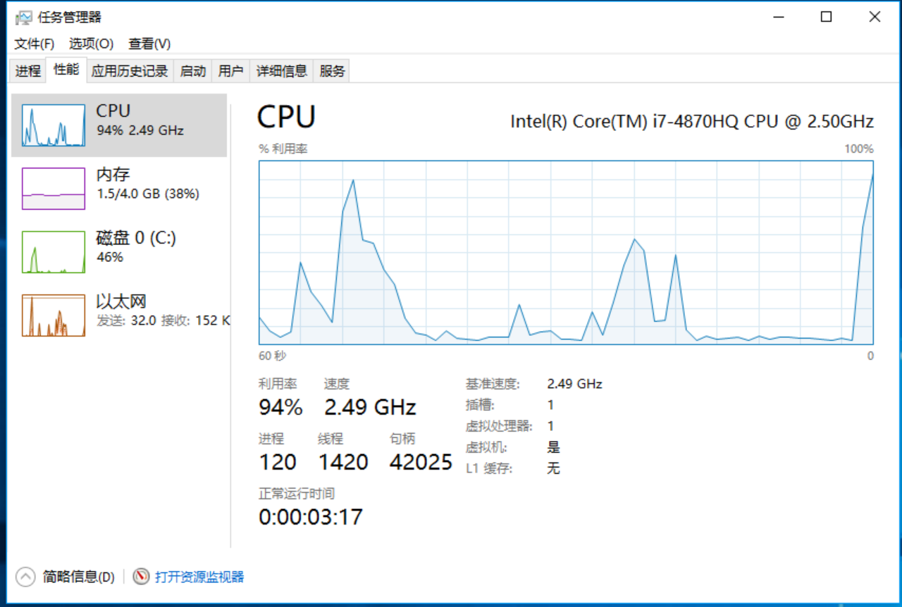
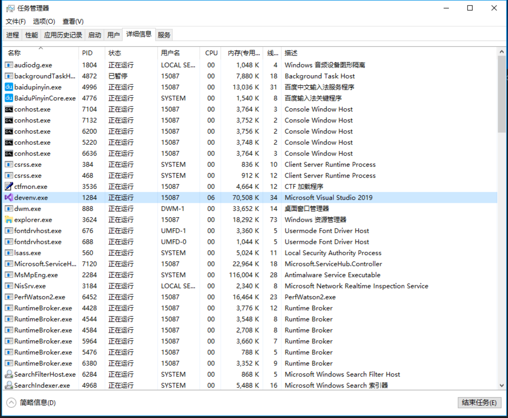

# 第 26 章 线程基础

本章内容：

* <a href="#26_1">Windows 为什么要支持线程</a>
* <a href="#26_2">线程开销</a>
* <a href="#26_3">停止疯狂</a>
* <a href="#26_4">CPU 发展趋势</a>
* <a href="#26_5">CLR 线程和 Windows 线程</a>
* <a href="#26_6">使用专用线程执行异步的计算限制操作</a>
* <a href="#26_7">使用线程的理由</a>
* <a href="#26_8">线程调度和优先级</a>
* <a href="#26_9">前台线程和后台线程</a>
* <a href="#26_10">继续学习</a>

本章将介绍线程的基本概念，帮助开发人员理解线程及其使用。我将解释 Microsoft Windows 为什么引入线程的概念、CPU 发展趋势、CLR 线程和 Windows 线程的关系、线程开销、Windows 如何调度线程以及公开了线程属性的 Microsoft .NET Framework 类。

本书第 V 部分“线程处理” 的各个章节将解释 Windows 和 CLR 如何协同提供一个线程处理架构。希望通过这些内容帮你打下一个良好的基础，学会高效使用线程来设计和构建响应灵敏的、可靠的、可伸缩的应用程序和组件。

## <a name="26_1">26.1 Windows 为什么要支持线程</a>

在计算机的早期岁月，操作系统没有线程的概念。事实上，整个系统只运行着一个执行线程，其中同时包含操作系统代码和应用程序代码。只用一个执行线程的问题在于，长时间运行的任务会阻止其他任务执行。例如，在 16 位 Windows 的那些日子，打印文档的应用程序很容易“冻结”整个机器，造成 OS (操作系统)和其他应用程序停止响应。有些应用程序的 bug 会造成死循环，同样会造成整个机器停止工作。

遇到这个问题，用户只好按 Reset 键或电源开关重启计算机。用户对此深恶痛绝(事实上，他们现在一样会)，因为所有正在运行的应用程序都会终止。更重要的是，这些应用程序正在处理的数据都会无端地丢失。Microsoft 明白 16 位 Windows 不是理想的操作系统。随着计算机工业的持续进步，它不足以使 Microsoft 保持领先地位。所以，它们计划构建一个新的 OS 来满足企业和个人的需要。这个新的 OS 必须健壮、可靠、易于伸缩和安全，而且它必须弥补 16 位 Windows 的许多不足。新的 OS 内核最初通过 Microsoft Windows NT 发布。经过多年的发展，它已进行了大量改进，增加了大量功能。Microsoft 每次发布客户端和服务器 Windows 操作系统的最新版本时，都在其中采用了这个内核的最新版本。

Microsoft 设计这个 OS 内核时，决定在一个 **进程** 中运行应用程序的每个实例。进程实际是应用程序的实例要使用的资源的集合。每个进程都被赋予了一个虚拟地址空间，确保在一个进程中使用的代码和数据无法由另一个进程访问。此外，进程访问不了 OS 的内核代码和数据；所以，应用程序代码破坏不了操作系统代码或数据。由于应用程序代码破坏不了其他应用程序或者 OS 自身，所以用户的计算体验变得更好了。除此之外，系统变得比以往更安全，因为应用程序代码无法访问另一个应用程序或者 OS 自身使用的用户名、密码、信用卡资料或其他敏感信息。

听起来不错，但 CPU 本身呢？应用程序发生死循环会发生什么？如果机器只有一个 CPU，它会执行死循环，不能执行其他任何东西。所以，虽然数据无法被破坏，而且更安全，但系统仍然可能停止响应。 Microsoft 需要修正这个问题，他们拿出的方案就是线程。作为一个 Windows 概念， **线程** 的职责是对 CPU 进行虚拟化。 Windows 为每个进程都提供了该进程专用的线程(功能相当于一个 CPU)。应用程序的代码进入死循环，与那个代码关联的进程会“冻结”，但其他进程(它们有自己的线程)不会冻结，它们会继续执行！

## <a name=“26_2”>26.2 线程开销</a>

线程很强大，因为它们使 Windows 即使在执行长时间运行的任务时也能随时响应。另外，线程允许用户使用一个应用程序(比如“任务管理器”)强制终止似乎已冻结的应用程序(它也有可能正在执行一个长时间运行的任务)。但和一切虚拟化机制一样，线程有空间(内存耗用)和时间(运行时的执行性能)上的开销。

下面更详细地探讨这种开销。每个线程都有以下要素。

* **线程内核对象(thread kernel object)**  
  OS 为系统中创建的每个线程都分配并初始化这种数据结构之一。数据结构包含一组对线程进行描述的属性(本章后面讨论)。数据结果还包含所谓的线程上下文(thread context)。上下文是包含 CPU 寄存器集合的内存块。对于 x86， x64 和 ARM CPU 架构，线程上下文分别使用约 700， 1240 和 350 字节的内存。

* **线程环境块(thread environment block，TEB)**  
  TEB 是在用户模式(应用程序代码能快速访问的地址空间)中分配和初始化的内存块。TEB 耗用 1 个内存页(x86， x64 和 ARM CPU 中是 4 KB)。 TEB 包含线程的异常处理链首(head)。线程进入的每个 `try` 块都在链首插入一个节点(node)；线程退出 `try` 块时从链中删除该节点。此外，TEB 还包含线程的“线程本地存储”数据，以及由 GDI(Graphics Deveice Interface， 图形设备接口)和 OpenGL 图形使用的一些数据结构。

* **用户模式栈(user-mode stack)**  
  用户模式栈存储传给方法的局部变量和实参。它还包含一个地址；指出当前方法返回时，线程应该从什么地方接着执行。Windows 默认为每个线程的用户模式栈分配 1 MB 内存。更具体地说，Windows 只是保留 1 MB 地址空间，在线程实际需要时才会提交(调拨)物理内存。

* **内核模式栈(kernel-mode stack)**  
  应用程序代码向操作系统中的内核模式函数传递实参时，还会使用内核模式栈。出于对安全的考虑，针对从用户模式的代码传给内核的任何实参，Windows 都会把它们从线程的用户模式栈复制到线程的内核模式栈。一经复制，内核就可验证实参的值。由于应用程序代码不能访问内核模式栈，所以应用程序无法更改验证后的实参值。OS 内核代码开始处理复制的值。除此之外，内核会调用它自己内部的方法，并利用内核模式栈传递它自己的实参、存储函数的局部变量以及存储返回地址。在 32 位 Windows 上运行，内核模式栈大小是 12 KB； 64 位 Windows 是 24 KB。

* **DLL 线程连接(attach)和线程分离(detach)通知**  
  Windows 的一个策略是，任何时候在进程中创建线程，都会调用进程中加载的所有非托管 DLL 的 `DllMain` 方法，并向该方法传递 `DLL_THREAD_ATTACH` 标志。类似地，任何时候线程终止，都会调用进程中的所有非托管 DLL 的 `DLLMain` 方法，并向方法传递`DLL_THREAD_DETACH` 标志。有的 DLL 需要获取这些通知，才能为进程中创建/销毁的每个线程执行特殊的初始化或(资源)清理操作。例如， C-Runtime 库 DLL 会分配一些线程本地存储状态。线程使用 C-Runtime 库中包含的函数时需要用到这些状态。

在 Windows 的早期岁月，许多进程最多只加载五六个 DLL。但如今，随便一个进程就可能加载几百个 DLL。就拿目前来说，在我的机器上， Microsoft Visual Studio 在它的进程地址空间加载了大约 470 个 DLL！这意味着每次在 Visual Studio 中新建一个线程，都必须先调用 470 个 DLL函数，然后线程才能开始做它想做的事情。Visual Studio 进程终止时，这 470 个函数还要调用一遍。这严重影响了进程中创建和销毁线程的性能。①

> ① C# 和其他大多数托管编程语言生成的 DLL 没有 `DllMain` 函数。所以，托管 DLL 不会收到 `DLL_THREAD_ATTACH` 和 `DLL_THREAD_DETACH` 通知，这提升了性能。此外，非托管 DLL 可调用 Win32 `DisableThreadLibraryCalls` 函数来决定不理会这些通知。遗憾的是，许多非托管开发人员都不知道有这个函数。

你现在已经知道了创建线程、让它进驻系统以及最后销毁它所需的全部空间和时间开销。但还没完——接着讨论上下文切换。单 CPU 计算机一次只能做一件事件。所以， Windows 必须在系统中的所有线程(逻辑 CPU)之间共享物理 CPU。

Windows 任何时刻只将一个线程分配给一个 CPU。那个线程能运行一个“时间片”(有时也称为“量”或者“量程”，即 quantum)的长度。时间片到期，Windows 就上下文切换到另一个线程。每次上下文切换都要求 Windows 执行以下操作。

1. 将 `CPU` 寄存器的值保存到当前正在运行的线程的内核对象内部的一个上下文结构中。

2. 从现有线程集合中选出一个线程供调度。如果该线程由另一个进程拥有，Windows 在开始执行任何代码或者接触任何数据之前，还必须切换 CPU “看见” 的虚拟地址空间。

3. 将所选上下文结构中的值加载到 `CPU` 的寄存器中。

上下文切换完成后，CPU 执行所选的线程，直到它的时间片到期。然后发生下次上下文切换。Windows 大约每 30 毫秒执行一次上下文切换。上下文切换所产生的开销；也就是说，上下文切换所产生的开销不会换来任何内存或性能上的收益。Windows 执行上下文切换，向用户提供一个健壮的、响应灵敏的操作系统。

现在，假如一个应用程序的线程进入死循环，Windows 会定期抢占(preempt)它，将新线程分配给 CPU，让新线程有机会运行。假定新线程是“任务管理器”的线程，用户就可利用“任务管理器”终止包含了死循环线程的进程。之后，进程会终止，它处理的所有数据会被销毁。但系统中的其他所有进程都继续运行，不会丢失它们的数据，用户当然也不需要重启计算机。所以，上下文切换通过牺牲性能换来了好得多的用户体验。

事实上，上下文切换对性能的影响可能超出你的想象。是的，当 Windows 上下文切换到另一个线程时，会产生一定的性能损失。但是，CPU 现在是要执行一个不同的线程，而之前的线程的代码和数据还在 CPU 的高速缓存(cache)中，这使 CPU 不必经常访问 RAM(它的速度比 CPU 告诉缓存慢的多)。当 Windows 上下文切换到新线程时，这个新线程极有可能要执行不同的代码并访问不同的数据，这些代码和数据不在 CPU 的高速缓存中。因此，CPU 必须访问 RAM 来填充它的告高速缓存，以恢复告诉执行状态。但在 30 毫秒之后，一次新的上下文切换又发生了。

> 重要提示 一个时间片结束时，如果 Windows 决定再次调度同一个线程(而不是切换到另一个线程)，那么 Windows 不会执行上下文切换。相反，线程将继续运行。这显著改进了性能。注意，在设计自己的代码时，上下文切换能避免就要尽量避免。

> 重要提示 线程可自主提前终止其时间片。这经常发生，因为线程经常要等待 I/O 操作(键盘、鼠标、文件、网络等)结束。例如，“记事本”程序的线程经常都会处于空闲状态，什么事情都不做；这个线程是在等待输入。如果用户按键盘上的 J 键，Windows 会唤醒“记事本”线程，让他处理按键操作。“记事本”线程可能花 5 毫秒处理按键，然后调用一个 Win32 函数，告诉 Windows 它准备好处理下一个输入事件。如果没有更多的输入事件，Windows 使“记事本”线程进入等待状态(时间片剩余的部分就放弃了)，使线程在任何 CPU 上都不再调度，直到发生下一次输入事件。这增强了系统的总体性能，因为正在等待 I/O 操作完成的线程不会在 CPU 上调度，所以不会浪费 CPU 时间，而节省出来的时间则可以供 CPU 调度其他线程。

执行上下文切换所需的时间取决于 CPU 架构和速度。而填充 CPU 缓存所需的时间取决于系统中运行的应用程序、CPU 缓存的大小以及其他各种因素。所以，无法为每一次上下文切换的时间开销给出确定值，甚至无法给出估计值。唯一确定的是，要构建高性能应用程序和组件，就应该尽量避免上下文切换。

此外，执行垃圾回收时，CLR 必须挂起(暂停)所有线程，遍历它们的栈来查找根以便对堆中的对象进行标记①，再次遍历它们的栈(有的对象在压缩期间发生了移动，所以要更新它们的根)，再恢复所有线程。所以，减少线程的数量也会显著提升垃圾回收器的性能。每次使用调试器并遇到断点，Windows 都会挂起正在调试的应用程序中的所有线程，并在单步执行或者运行应用程序时恢复所有线程。所以，线程越多，调试体验越差。

> ① “标记”是垃圾回收器的第一个阶段，详见 21.1.2 节 “垃圾回收算法”。 ———— 译注

根据上述讨论，结论是必须尽量避免使用线程，因为它们要耗用大量内存，而且需要相当多的时间来创建、销毁和管理。Windows 在线程之间记性上下文切换，以及在发生垃圾回收的时候，也会浪费不少时间。然而，根据上述讨论，我们还得出了另一个结论，那就是有时必须使用线程，因为它们使 Windows 变得更健壮，响应更灵敏。

应该指出的是，安装了多个 CPU(或者一个多核 CPU)的计算机可以真正同时运行几个线程，这提升了应用程序的可伸缩性(用更少的时间做更多的工作)。Windows 为每个 CPU 内核都分配一个线程，每个内核都自己执行到其他线程的上下文切换。Windows 确保单个线程不会同时在多个内核上调度，因为这会带来巨大的混乱。如今的许多计算机都配备了多个 CPU、超线程 CPU 或者多核 CPU。但在 Windows 最初设计时，单 CPU 计算机才是主流，所以 Windows 设计了线程来增强系统的响应能力和可靠性。今天，线程还被用于增强应用程序的可伸缩性，但只有在多 CPU(多核)计算机上才有可能。

本书剩余各章将讨论如何利用 Windows 和 CLR 提供的各种机制，当代码在多 CPU(多核)计算机上运行时，创建尽量少的线程并保证代码的响应能力和伸缩性。

## <a name="26_3">26.3 停止疯狂</a>

如果只关心性能，那么任何机器最优的线程数就是那台机器的 CPU 数目(从现在开始将 CPU的每个内核都当作一个 CPU)。所以，安装一个 CPU 的机器最好只有一个线程，安装两个 CPU 的机器最好只有两个线程，依次类推。理由非常明显；如果线程数超过了 CPU 的数目，就会产生上下文切换和性能损失。如果每个 CPU 只有一个线程，就不会有上下文切换，线程将全速运行。

然而，Microsoft 设计 Windows 时，决定侧重于可靠性和响应能力，而非侧重于速度和性能。我拥护这个决定：如果今天的应用程序仍然会造成 OS 和其他应用程序“冻结”，我想没有人愿意使用 Windows 或者 .NET Framework。因此，Windows 为每个进程提供了该进程专用的线程来增强系统的可靠性和响应能力。例如，在我的机器上运行“任务管理器”并选择“性能“选项卡，会看到如果 26-1 所示的结果。

  

图 26-1 任务管理器的”性能“选项卡

看来我的机器正在运行 48 个进程，所以可认为机器上至少运行这 48 个线程，因为每个进程都至少有一个线程。但“任务管理器”显示我的机器实际有 683 个线程！这意味着仅仅是线程栈就需要分配 683 MB 内存，而我的机器总共才 3 GB RAM！另外，这还意味着每个进程平均有大约 14.2 个线程，而我的 4 核电脑理想情况下不应该是每进程 4 线程吗？

再来看看 CPU 利用率读数：它显示我的 CPU “忙” 的时间是 6%。这意味着在 94% 的时间里，这 683 个线程什么事情都没做————它们白白霸占着内存；线程未运行时，这些内存是不会使用的。你肯定会问：这些应用程序真的需要这些在 94% 的时间里什么事情都不做的线程吗？答案明显是否定的。要知道哪些进程最浪费，请单击”详细信息“标签，添加”线程“列①，再按降序对这个列进行排序，如图 26-2 所示。

> ① 右击现有的列，选择”选择列“。

  

图 26-2 任务管理器显示进程的详细信息

让你所见，System 创建了 111 个线程，CPU 利用率为 0%。Explorer(资源管理器)创建了 73 个线程，CPU 利用率为 0%。Visual Studio(Devenv.exe)创建了 34 个线程，CPU 利用率为 0%。Microsoft Outlook 创建了 17 个线程，CPU 利用率为 0%；我可以一直列举下去。到底发生了什么事情？

在 Windows 中，进程是十分 ”昂贵“ 的。创建一个进程通常要花几秒钟的时间，必须分配大量内存，这些内存必须初始化， EXE 和 DLL 文件必须从磁盘上加载，等等。相反，在 Windows 中创建线程则十分”廉价“。所以，开发人员决定停止创建进程，改为创建线程。这正是我们看到有这么多线程的原因。但是，虽然线程比进程廉价，它们和其他系统资源相比仍然十分昂贵，所以还是应该省着用，而且要用得恰当。

可以肯定地说，刚才讨论的所有这些应用程序都在以效率低下的方式使用线程。所有这些线程在系统中都没有存在的必要。在应用程序中分配资源是十分正常的一件事件，但分配了又不用，这又算是什么呢？这纯属浪费！另外，为线程栈分配这么多内存，意味着一些更重要的数据(比如用户的文档)获得的内存变少了。①

> ① 为了让你体会到情况有多糟，我忍不住想和你分享另一个例子。请做个试验：打开”记事本“程序(Notepad.exe)，用”任务管理器“查看它包含了多少个线程(这时看到的是 1)。然后，选择”记事本“的”文件“|”打开“菜单来显示通用的”打开“对话框。保持这个对话框的打开状态，在“任务管理器”中查看现在创建了多少个新线程。在我的机器上，仅仅是因为打开了这个对话框，就创建了 14 个额外的线程！事实上，使用通用“打开”和“保存”对话框的每个应用程序都会在其内部创建大量额外的线程，这些线程大多数时候都处于空闲状态。另外，即使对话框关闭，其中大多数线程也不会销毁。

更可怕的是，假如这些进程在用户的“远程桌面服务”会话中运行，而且这台机器有 100 个用户在访问，那么会发生什么？在这种情况下，将会有 100 个 Outlook 实例，每个实例都创建 17 个什么都不干的线程。这 1700 个 “坐吃等死” 的线程每个都有自己的内核对象、TEB、用户模式栈、内核模式栈等。由此浪费的资源将非常可观。必须停止这种疯狂的举动，尤其是如果 Microsoft 想为笔记本用户提供一个好的使用体验的话(许多笔记本都只有 2~4 GB RAM)。本书剩余各章将讲述如何正确设置应用程序，以一种高效的方式使用尽量少的线程。

## <a name="26_4">26.4 CPU 发展趋势</a>

CPU 厂商过去只知道一味地提高 CPU 速度。所以，在旧机器上运行得慢的程序在新机器上一般都会快一些。但 CPU 厂商没有延续这个趋势，因为高速运行的CPU 会产生大量热量。我几年前从一家著名厂商那里购买了一台新款笔记本电脑。这台电脑的固件有一个 bug，造成风扇时转时不转。结果是，用不了多久，CPU 和主板便烧坏了。硬件厂商更换了机器，并“改进”了固件，使风扇能更频繁地工作。遗憾的是，这又造成耗电过大，因为风扇本身也很耗电。

这些问题是今天的硬件厂商必须面对的
