# 第 4 章 类型基础

本章内容：
* <a href="#4_1">所有类型都从 System.Object</a>
* <a href="#4_2">类型转换</a>
* <a href="#4_3">命名空间和程序集</a>
* <a href="#4_4">运行时的相互关系</a>

本章讲述使用类型和 CLR 时需掌握的基础知识。具体地说，要讨论所有类型都具有对的一组基本行为。还将讨论类型安全性、命名空间、程序集以及如何将对象从一种类型转换成另一种类型。本章最后会解释类型、对象、线程栈和托管堆在运行时的相互关系。

## <a name="4_1">4.1 所有类型都从 System.Object 派生</a>

“运行时”要求每个类型最终都从 `System.Object` 类型派生。也就是说，以下两个类型定义完全一致：

```C#
// 隐式派生自 Object
class Emplpyee {
    …
} 

// 显示派生自 Object
class Emplpyee : System.Object {
    …
} 
```

由于所有类型最终都从 `System.Object` 派生，所以每个类型的每个对象都保证了一组最基本的方法。具体地说， `System.Object` 类提供了如表 4-1 所示的公共实例方法。

表 4-1 System.Object 的公共方法
|公共方法|说明|
|:---:|:---:|
|`Equals`|如果两个对象具有相同的值，就返回 `true`。欲知该方法的详情，请参见 5.3.2 节“对象相等性和同一性”|
|`GetHashCode`|返回对象的值的哈希码。如果某个类型的对象要在哈希表集合(比如 `Dictionary`)中作为建使用，类型应重写该方法。方法应该为不同对象提供 *良好分布* 。将这个方法设计到 `Object` 中并不恰当。大多数类型永远不会在哈希表中作为键使用；该方法本该在接口中定义。欲知该方法的详情，请参见 5.4 节“对象哈希码”|
|`ToString`|默认返回类型的完整名称(`this.GetType().FullName`)。但经常重写该方法来返回包含对象状态表示的 `String` 对象。例如，核心类型(如 `Boolean` 和 `Int32`)重写该方法来返回它们的值的字符串表示。另外，经常出于调试的目的而重写该方法；调用后获得一个字符串，显示对象各字段的值。事实上，Microsoft Visual Studio 的调试器会自动调用该函数来显示对象的字符串表示。注意，`ToString` 理论上应察觉与调用线程关联的 `CultureInfo` 并采用相应行动。第 14 章“字符、字符串和文本处理”将更详细地讨论 `ToString`|
|`GetType`|返回从 `Type` 派生的一个类型的实例，指出调用 `GetType` 的那个对象是什么类型。返回的 `Type` 对象可以和反射类配合，获取与对象的类型有关的元数据信息。反射将在第 23 章“程序集加载和反射”讨论。 `GetType` 是非虚方法，目的是防止类重写该方法，隐瞒其类型，进而破坏类型安全性|
> 所谓“良好分布”，是指针对所有输入，`GetHashCode` 生成的哈希值应该在所有整数中产生一个随机的分布。——译注

此外，从 `System.Object` 派生的类型能访问如表 4-2 所示的受保护方法。

表 4-2 System.Object 的受保护方法 
|受保护方法|说明|
|:---:|:---:|
|`MemberwiseClone`|这个非虚方法创建类型的新实例，并将新对象的实例字段设与 `this` 对象的实例字段完全一致。返回对新 *实例* 的引用|
|`Finalize`|在垃圾回收器判断对象应该作为垃圾被回收之后，在对象的内存被实际回收之前，会调用这个虚方法。需要在回收内存前执行清理工作的类型应重写该方法。第 21 章“托管堆和垃圾回收”会更详细地讨论这个重要的方法|
> 作者在这段话里引用了两种不同的“实例”。一种是类的实例，也就是对象；另一种是类中定义的实例字段。所谓“实例字段”，就是指非静态字段，有时也称为“实例成员”。简单地说，实例成员属于类的对象，静态成员属于类。——译注

CLR 要求所有对象都用 `new` 操作符创建。以下代码展示了如何创建一个 `Employee` 对象：

```C#
Employee e = new Employee("ConstructorParam1");
```

以下是 `new` 操作符所做的事情。

1. 计算类型及其所有基类型(一直到 `System.Object`，虽然它没有定义自己的实例字段)中定义的所有实例字段需要的字节数。堆上每个对象都需要一些额外的成员，包括“类型对象指针”(type object pointer)和“同步块索引”(sync block index)。CLR 利用这些成员管理对象。额外成员的字节数要计入对象大小。
> 称为 overhead 成员，或者说“开销成员”。——译注

2. 从托管堆中分配类型要求的字节数，从而分配对象的内存，分配的所有字节都设为零(0).
3. 初始化对象的“类型对象指针”和“同步块索引”成员。
4. 调用类型的实例构造器，传递在 `new` 调用中指定的实参(上例就是字符串"**ConstructorParam1**")。大多数编译器都在构造器中自动生成代码来调用基类构造器。每个类型的构造器都负责初始化该类型定义的实例字段。最终调用 `System.Object` 的构造器，该构造器什么都不做，简单地返回。

`new` 执行了所有这些操作之后，返回指向新建对象一个引用(或指针)。在前面的示例代码中，该引用保存到变量 `e` 中，后者具有 `Employee` 类型。

顺便说一句，没有和 `new` 操作符对应的 `delete` 操作符；换言之，没有办法显示释放为对象分配的内存。 CLR 采用了垃圾回收机制(详情在第 21 章讲述)，能自动检测到一个对象不再被使用或访问，并自动释放对象的内存。

## <a name="4_2">4.2 类型转换</a>

CLR 最重要的特性之一就是类型安全。在运行时，CLR 总是知道对象的类型是什么。调用 `GetType` 方法即可知道对象的确切类型。由于它是非虚方法，所以一个类型不可能伪装成另一个类型。例如， `Employee` 类型不能重写 `GetType` 方法并返回一个 `SuperHero` 类型。

开发人员经常需要将对象从一种类型转换为另种类型。CLR 允许将对象转换为它的(实际)类型或者它的任何基类型。每种编程语言都规定了开发人员具体如何进行这种转型操作。例如，C# 不要求任何特殊语法即可将对象转换为它的任何基类型，因为向基类型的转换被认为是一种安全的隐式转换。然而，将对象转换为它的某个派生类型时， C# 要求开发人员只能进行显示转换，因为这种转换可能在运行时失败。以下代码演示了向基类型和派生类型的转换：

```C#
// 该类型隐式派生自 System.Object
    internal class Employee {
        ···
    }

    public sealed class Program {
        public static void Main(){
            // 不需要转型，因为 new 返回一个 Employee对象，
            // 而 Object 是 Employee 的基类型
            Object o = new Employee();

            // 需要转型，因为 Employee 派生自 Object 
            // 其他语言(比如 Visual Basic)也许不要求像
            // 这样进行强制类型转换
            Employee e = (Employee) o;
        }
    }
```

这个例子展示了你需要做什么，才能让编译器顺利编译这些代码。接着，让我们看看运行时发生的事情。在运行时，CLR 检查转型操作，确定总是转换为对象的实际类型或者它的任何基类型。例如，以下代码虽然能通过编译，但会在运行时抛出 `InvalidCastException` 异常：

```C#
    internal class Employee {
        ···
    }

    internal class Manager : Employee {
        ···
    }

    public sealed class Program {
        public static void Main(){
            // 构造一个 Manager 对象，把它传给 PromoteEmployee，
            // Manager “属于”(IS-A) Employee，所以 PromoteEmployee 能成功运行
            Manager m = new Manager();
            PromoteEmployee(m);

            // 构造一个 DateTime 对象，把它传给 PromoteEmployee。
            // DateTime 不是从 Employee 派生的，所以 PromoteEmployee
            // 抛出 System.InvalidCastException 异常
            DateTime newYears = new DateTime(2020, 1, 1);
            PromoteEmployee(newYears);
        }

        public static void PromoteEmployee(Object o){
            // 编译器在编译时无法准确地获知对象 o
            // 引用的是什么类型，因此编译器允许代码
            // 通过编译。但在运行时，CLR 知道了 o 引用
            // 的是什么类型(在每次执行转型的时候)，
            // 所以它会核实对象的类型是不是 Employee 或者
            // 从 Employee 派生的任何类型
            Employee  e = (Employee) o;
        }
    }
```

`Main` 构造一个 `Manager` 对象并将其传给 `PromoteEmployee`。这些代码能成功编译并运行，因为 `Manager` 最终从 `Object` 派生，而 `PromoteEmployee` 期待的正是一个 `Object`。进入 `PromoteEmployee` 内部之后， CLR 核实对象 `o` 引用的就是一个 `Employee` 对象，或者是从 `Employee` 派生的一个类型的对象。由于 `Manager` 从 `Employee` 派生，所以 CLR 执行类型转换，允许 `PromoteEmployee` 继续执行。

`PromoteEmployee` 返回后，`Main` 构造一个 `DateTime` 对象，将其传给 `PromoteEmployee`。同样地，`DateTime` 从 `Object` 派生，所以编译器会顺利编译调用 `PromoteEmplyoee` 的代码。但进入 `PromoteEmployee` 内部之后， CLR 会检查类型转换，发现 `o` 引用一个 `DateTime`，既不是 `Employee` ，也不是从 `Employee` 派生的任何类型。此时 CLR 会禁止转型，并抛出 `System.InvalidCastException` 异常。

如果 CLR 允许这样的转型，就毫无类型安全性可言了，将出现难以预料的结果——包括应用程序崩溃，以及安全漏洞的出现(因为一种类型能轻松地伪装成另一种类型)。类型伪装是许多安全漏洞的根源，它还会破坏应用程序的稳定性和健壮性。因此，类型安全是 CLR 极其重要的一个特点。

顺便说一句，声明 `PromoteEmployee` 方法的正确方式是将参数类型指定为 `Employee`，而非指定为 `Object`。如果这样修改，该例编译时就能报错，而非等到运行时才报错。我之所以使用 `Object`，是为了演示 C# 编译器和 CLR 如何处理类型转换和类型安全性。

### 使用 C# 的 `is` 和 `as` 操作符来转型

在 C# 语言中进行类型转换的另一种方式是使用 `is` 操作符。 `is` 检查对象是否兼容于指定类型，返回 `Boolean` 值 `true` 或 `false`。注意， `is` 操作符永远不抛出异常，例如以下代码：

```C#
Object o = new Object();
Boolean b1 = (o is Object);    // b1 为 true
Boolean b2 = (o is Employee);  // b2 为 false
```

如果对象引用 `null`，`is` 操作符总是返回 `false`，因为没有可检查其类型的对象。

`is` 操作符通常像下面这样使用：

```C#
if (o is Employee){
    Employee e = (Employee) o;
    // 在 if 语句剩余的部分中使用 e
}
```

在上述代码中， CLR 实际检查两次对象类型。 `is` 操作符首先核实 `o` 是否兼容于 `Employee` 类型。如果是，在 `if` 语句内部转型时， CLR 的类型检查增强了安全性，但无疑会对性能造成一定影响。这是因为 CLR  首先必须判断变量(`o`)引用的对象的实际类型。然后， CLR 必须遍历继承层次结构，用每个基类型去核对指定的类型(`Employee`)。由于这是一个相当常用的编程模式，所以 C# 专门提供了 `as` 操作符，目的就是简化这种代码的写法 ，同时提升其性能。

```C#
Employee e = o as Employee;
if (e != null) {
    // 在 if 语句中使用 e
}
```

在这段代码中，CLR 核实 `o` 是否兼容于 `Employee` 类型；如果是， `as` 返回对同一个对象的非 `null` 引用。如果 `o` 不兼容于 `Employee` 类型， `as` 返回 `null`。注意， `as` 操作符造成 CLR 只校验一次对象类型。`if` 语句只检查 `e` 是否为 `null`；这个检查的速度比校验对象的类型快得多。

`as` 操作符的工作方式与强制类型转换一样，只是它永远不抛出异常——相反，如果对象不能转型，结果就是`null`。 所以，正确做法是检查最终生成的引用是否为 `null`。企图直接使用最终生成的引用会抛出 `System.NullReferenceException` 异常。以下代码对此进行了演示：

```C#
Object o = new Object();     // 新建 Object 对象
Employee e = o as Employee;  // 将 o 转型为 Employee
// 上述转型会失败，不抛出异常，但 e 被设为 null

e.ToString();   // 访问 e 抛出 NullReferenceException 异常
```

为了确定自己理解了上述内容，请完成以下小测验。验证以下两个类定义确实存在：

```C#
internal class B{      // 基类(Base class)
}    

internal class D : B{  // 派生类(Derived class)
}
```

现在检查表 4-3 列出的 C# 代码。针对每一行代码，都用勾号注明该行代码是讲成功编译和执行(OK)，将造成编译时错误(CTE)，还是将造成运行时错误(RTE)。

表 4-3 类型安全性测验
|语句  |OK   |CTE(编译时错误)|RTE(运行时错误)|
|:---:|:---:|:---:|:---:|
|`Object o1 = new Object();`|✔️|||
|`Object o2 = new B();`     |✔️|||
|`Object o3 = new D();`     |✔️|||
|`Object o4 = o3;`          |✔️|||
|`B b1 = new B();`          |✔️|||
|`B b2 = new D();`          |✔️|||
|`D d1 = new D();`          |✔️|||
|`B b3 = new Object();`     ||✔️||
|`D d2 = new Object();`     ||✔️||
|`B b4 = d1;`               |✔️|||
|`D d3 = b2;`               ||✔️||
|`D d4 = (D)d1;`            |✔️|||
|`D d5 = (D)b2;`            |✔️|||
|`D d6 = (D)b1;`            |||✔️|
|`B b5 = (B)o1;`            |||✔️|
|`B b6 = (D)b2;`            |✔️|||

> 注意 C# 允许类型定义转换操作符方法，详细参见 8.5 节“转换操作符方法”。只有在使用转型表达式时才调用这些方法；使用C# `as` 或 `is` 操作符时永远不调用它们。

## <a name="4_3">4.3 命名空间和程序集</a>

**命名空间**对相关的类型进行逻辑分组，开发人员可通过命名空间方便地定位类型。例如， `System.Text` 命名空间定义了执行字符串处理的类型，而 `System.IO` 命名空间定义了执行 I/O 操作的类型。以下代码构造一个 `System.IO.FileStream` 对象和一个 `System.Text.StringBuilder` 对象：

```C#
public sealed class Program {
    public static void Main() {
        System.IO.FileStream fs = new System.IO.FileStream(···);
        System.Text.StringBuilder sb = new System.TExt.StringBuilder();
    }
}
```

像这样写代码很繁琐，应该有一种简单方式直接引用 `FileStream` 和 `StringBuilder` 类型，减少打字量。幸好，许多编译器都提供了某种机制让程序员少打一些字。C# 编译器通过 `using` 指令提供这个机制。以下代码和前面的例子完全一致：

```C#
using System.IO;      // 尝试附加 “System.IO.” 前缀
using System.Text;    // 尝试附加 “System.Text.” 前缀
public sealed class Program {
    public static void Main() {
        FileStream fs = new FileStream(...);
        SringBuilder sb = new StringBuilder();
    }
}
```

对于编译器，命名空间的作用就是为类型名称附加以句点分隔的符号，使名称变得更长，更可能具有唯一性。所以在本例中，编译器将对 `FileStream` 的引用解析为 `System.IO.FileStream`，将对 `StringBuilder` 的引用解析为 `System.Text.StringBuilder`。

C#的 `using` 指令是可选的，如果愿意，完全可以输入类型的完全限定名称。 C#的 `using` 指令指示编译器尝试为类型名称附加不同的前缀，直至找到匹配项。
> 重要提示 CLR 对“命名空间”一无所知。访问类型时， CLR 需要知道类型的完整名称(可能是相当长的、包含句点符号的名称)以及该类型的定义具体在哪个程序集中。这样“运行时”才能加载正确程序集，找到目标类型，并对其进行操作。

在前面的示例代码中，编译器需要保证引用的每个类型都确实存在，而且代码以正确方式使用类型——也就是调用确实存在的方法，向方法传递正确数量的实参，保证实参具有正确类型，正确使用方法返回值，等等。如果编译器在源代码文件或者引用的额任何程序集中找不到具有指定名称的类型，就会在类型名称前附加 `System.IO` 前缀，检查这样生成的名称是否与现有类型匹配。如果任然找不到匹配项，就继续为类型名称附加 `System.Text.`前缀。在前面例子中的两个 `using` 指令的帮助下，只需在代码中输入 `FileStream` 和 `StringBuilder` 这两个简化的类型名称，编译器就会自动将引用展开成 `System.Text.StringBuilder` 。这样不仅能极大减少打字，还增强了代码可读性。

检查类型定义时，编译器必须知道要在什么程序集中检查。第 2 章和第 3 章讲过，这通过 `/reference` 编译器开关实现。编译器扫描引用的所有程序集，在其中查找类型定义。一旦找到正确的程序集，程序集信息和类型信息就嵌入生成的托管模块的元数据中。为了获取程序集信息，必须将定义了被引用类型的程序集传给编译器。C# 编译器自动在 MSCorLib.dll 程序集中查找被引用类型，即时没有显式告诉它这样做。MSCorLib.dll 程序集包含所有核心 Framework 类库(FCL)类型(如 `Object`，`Int32`，`String` 等)的定义。

编译器对待命名空间的方式存在潜在问题：可能两个(或更多)类型在不同命名空间中同名。Microsoft 强烈建议开发人员为类型定义具有唯一性的名称。但有时非不为也，是不能也。“运行时”鼓励组件重用。例如，应用程序可能同时利用了 Microsoft 和 Wintellect 创建的组件。假定两家公司都提供名为 `Widget` 的类型，两个类型做的事情完全不同。由于干涉不了类型命名，所以引用时完全限定名称区分它们。用 `Microsoft.Widget` 引用 Microsoft 产生歧义，C# 编译器报告错误消息：**CS0104：“Widget” 是 “Microsoft.Widget” 和 “Wintellect.Widget”之间的不明确的引用。**

```C#
using Microsoft;     // 尝试附加 “Microsoft.” 前缀
using Wintellect;    // 尝试附加 “Wintellect.” 前缀

public sealed class Program {
    public static void Main() {
        Widget w = new Widget();   // 不明确的引用
    }
}
```

为了消除歧义，必须像下面这样显式告诉编译器要创建哪个 Widget。

```C#
using Microsoft;     // 尝试附加 “Microsoft.” 前缀
using Wintellect;    // 尝试附加 “Wintellect.” 前缀

public sealed class Program {
    public static void Main() {
        Wintellect.Widget w = new Wintellect.Widget();   // 无歧义
    }
}
```

C# `using` 指令的另一种形式允许为类型或命名空间创建别名。如果只想使用命名空间中的少量类型，不想它的所有类型都跑出来“污染”全局命名空间，别名就显得十分方便。以下代码演示了如何用另一个办法解决前例的歧义性问题：

```C#
using Microsoft;     // 尝试附加 “Microsoft.” 前缀
using Wintellect;    // 尝试附加 “Wintellect.” 前缀

// 将 WintellectWidget 符号定义成 Wintellect.Widget 的别名
using WintellectWidget = Wintellect.Widget;

public sealed class Program {
    public static void Main() {
        WintellectWidget w = new WintellectWidget();   // 现在没错误了
    }
}
```

这些消除类型歧义性的方法都十分有用，但有时还需要进一步。假定 Australian Boomerang Company(澳大利亚回旋镖公司，ABC)和 Alaskan Boat Corporation(阿拉斯加船业公司，ABC)都创建了名为 **BuyProduct** 的类型。该类型随同两家公司的程序集发布。两家公司都创建了名为 **ABC** 的命名空间，其中都包含名为 **BuyProduct** 的类型。任何人要开发应用程序来同时购买这两家公司出售的回旋镖和船都会遇到麻烦——除非编程语言提供了某种方式，能通过编程来区分程序集而非仅仅区分命名空间。幸好，C# 编译器提供了名为**外部别名**(extern alias)的功能，它解决了这个虽然极其罕见但仍有可能发生的问题。外部别名还允许从同一个程序集的两个(或更多)不同的版本中访问一个类型。欲知外部别名的详情，请参见 C# 语言规范。

要在库中设计由第三方使用的类型，应该在专门的命名空间中定义这些类型。这样编译器就能轻松消除它们的歧义。事实上，为了降低发生冲突的概率，应该使用自己的完整公司名称(而不是首字母缩写或者其他简称)来作为自己的顶级命名空间名称。参考文档，可以看到 Microsoft 为自己的类型使用了命名空间 “Microsoft”，比如 `Microsoft.CSharp`，`Microsoft.VisualBasic` 和 `Microsoft.Win32`。  

创建命名空间很简单，像下面这样写一个命名空间声明就可以了(以 C# 为例)：

```C#
namespace CompanyName {
    public sealed class A {   // TypeDef: CompanyName.A
    }
    namespace X {
       public sealed class B { ··· }   // TypeDef: CompanyName.X.B
    }
}
```

类定义右侧的注释指出编译器在类型定义元数据表中添加的实际类型名称；这是 CLR 看到的实际类型名称。

一些编译器根本不支持命名空间，还有一些编译器允许自由定义”命名空间“对于语言的含义。在 C# 中，`namespace` 指令的作用只是告诉编译器为源代码中出现的每个类型名称附加命名空间名称前缀，让程序员少打一些字。

>  命名空间和程序集的关系
>> 注意，命名空间和程序集(实现类型的文件)不一定相关。特别是，同一个命名空间中的类型可能在不同程序集中实现。例如，`System.IO.FileSystem` 类型在 MSCorLib.dll 程序集中实现，而 `System.IO.FileSystemWatcher` 类型在 System.dll 程序集中实现。

>> 同一个程序集也可能包含不同命名空间中的类型。例如，`System.Int32` 和 `System.Text.StringBuilder` 类型都在 MSCorLib.dll 程序集中。

>> 在文档中查找类型时，文档会明确指出类型所属的命名空间，以及实现了该类型的程序集。如果 4-1 所示，可以清楚地看到(在”语法“小节的上方)， `ResXFileRef` 类型是 `System.Resources` 命名空间的一部分，在 `System.Windows.Forms.dll` 程序集中实现。为了编译引用了 `ResXFileRef` 类型的代码，要在源代码中添加 `using System.Resources;` 指令，而且要使用 `/r:System.Windows.Forms.dll` 编译器开关。
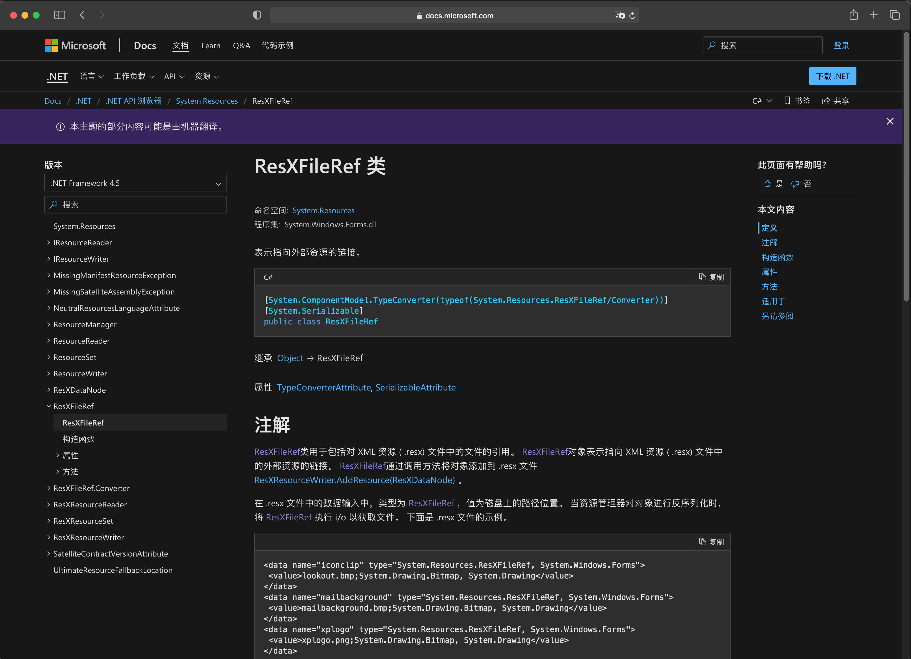
>> 图 4-1 文档显示了类型的命名空间和程序集信息

## <a name="4_4">4.4 运行时的相互关系</a>

本节将解释类型、对象、线程栈和托管堆在运行时的相互关系。此外，还将解释调用静态方法、实例方法和虚方法的区别。首先从一些计算机基础知识开始。虽然下面讨论的东西不是 CLR 特有的，但掌握了这些之后，就有了一个良好的理论基础。接着，就可以将我们的讨论转向 CLR 特有的内容。

图 4-2 展示了已加载 CLR 的一个 Windows 进程。该进程可能有多个线程。线程创建时会分配到 1 MB 的栈。栈空间用于向方法传递参数，方法内部定义的局部变量也在栈上。图 4-2 展示了线程的栈内存(右侧)。栈从高位内存地址向低位内存地址构建。图中线程已执行了一些代码，栈上已经有一些数据了(栈顶部的阴影区域)。现在，假定线程执行的代码要调用 `M1` 方法。  
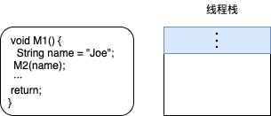  
图 4-2 一个线程的栈，当前准备调用 M1 方法

最简单的方法包含”序幕“(prologue)代码，在方法开始做工作前对其进行初始化；还包含“尾声”(epilogue)代码，在方法做完工作后对其进行清理，以便返回至调用者。 `M1` 方法开始执行时，它的“序幕”代码在线程上分配局部变量 `name` 的内存，如图 4-3 所示。

  
图 4-3 在线程栈上分配 M1 的局部变量

然后 `M1` 调用 `M2` 方法，将局部变量 `name` 局部变量中的地址被压入栈(参见图 4-4 )。`M2` 方法内部使用参数变量 `s` 标识栈位置(注意，有的 CPU 架构用寄存器传递实参以提升性能，但这个区别对于当前的讨论来说并不重要)。另外，调用方法时还会将“返回地址”压入栈。被调用的方法在结束之后应该返回至该位置(同样参见图 4-4)。 

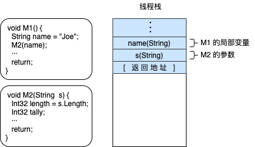  
`M2` 方法开始执行时，它的“序幕”代码在线程栈中为局部变量 `length` 和 `tally` 分配内存，如图 4-5 所示。然后，`M2` 方法内部的代码开始执行。最终， `M2` 抵达它的 `return` 语句，造成 CPU 的指令指针被设置成栈中的返回地址， M2 的栈桢展开(unwind)，恢复成图 4-3 的样子。之后， `M1` 继续执行 `M2` 调用之后的代码， `M1` 的栈桢将准备反映 `M1` 需要的状态。

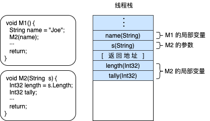  
图 4-5 在线程栈上分配 M2 的局部变量  
> 栈桢(stack frame)代表当前线程的调用栈中的一个方法调用。执行线程的过程中，进行的每个方法调用都会在调用栈中创建并压入一个 `StackFrame`。 —— 译注

> unwind 一般翻译成“展开”，但这并不是一个很好的翻译。wind 和 unwind 源于生活。把线缠到线圈上称为 wind；从线圈上松开称为 unwind。同样地，调用方法时压入栈桢，称为 wind；方法执行完毕，弹出栈桢，称为 unwind。把这几张图的线程栈看成一个线圈，就很容易理解了。 —— 译注

最终，`M1` 会返回到它的调用者。这同样通过将 CPU 的指令指针设置成返回地址来实现(这个返回地址在图中未显示，但它应该刚好在栈中的 `name` 实参上方)， `M1` 的栈桢展开(unwind)，恢复成图 4-2 的样子。之后，调用 `M1` 的方法继续执行 `M1` 调用之后的代码，那个方法的栈桢将准确反映它需要的状态。

现在，让我们围绕 CLR 来调整一下讨论。假定有以下两个类定义：

```C#
internal class Employee {
    public         Int32    GetYearsEmployed()  {···}
    public virtual String   GetProgressReport() {···}
    public static  Employee Lookup(String name) {···}
}

internal sealed class Manager : Employee {
    public override String GetProgressReport()  {···}
}
```

Windows 进程已启动，CLR 已加载到其中，托管堆已初始化，而且已创建一个线程(连同它的 1 MB 栈空间)。线程已执行了一些代码，马上就要调用 `M3` 方法。图 4-6 展示了目前的状态。 `M3` 方法包含的代码演示了 CLR 是如何工作的。平时不这样写代码，因为它们没有做什么正真有用的事情。
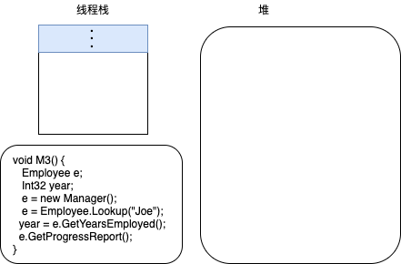  
图 4-6 CLR 已加载到进程中，堆已初始化，线程栈已创建，马上调用 M3 方法

JIT 编译器将 `M3` 的 IL 代码转换成本机 CPU 指令时，会注意到 M3 内部引用的所有类型，包括 `Employee`，`Int32`，`Manager` 以及 `String`(因为 **"Joe"**)。这时 CLR 要确认定义了这些类型的所有程序集都已加载。然后，利用程序集的元数据， CLR 提取与这些类型有关的信息，创建一些数据结构来表示类型本身。图 4-7 展示了为 `Employee` 和 `Manager` 类型对象使用的数据结构。由于线程在调用 `M3` 前已执行了一些代码，所以不妨假定 `Int32` 和 `String` 类型对象已经创建好了(这是极有可能的，因为它们都是很常用的类型)，所以图中没有显示它们。

稍微讨论一下这些类型对象。本章前面讲过，堆上所有对象都包含两个额外成员：类型对象指针(type object pointer)和同步块索引(sync block index)。如图所示， `Employee` 和 `Manager` 类型对象都有这两个成员。定义类型时，可在类型内部定义静态数据字段。为这些静态数据字段提供支援的字节在类型对象自身中分配。每个类型对象最后都包含一个方法表。在方法表中，类型定义的每个方法都有对应的记录项。第 1 章已讨论过该方法表。由于 `Employee` 类型定义了 3 个方法(`GetYearsEmployed`，`GetProgressReport` 和 `Lookup`)，所以 `Employee` 的方法表有 3 个记录项。`Manager` 类型只定义了 1 个方法(`GetProgressReport` 的重写版本)，所以 `Manager` 的方法表只有 1 个记录项。  
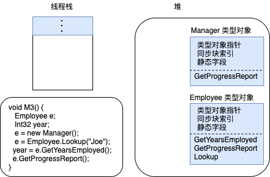  
图 4-7 Employee 和 Manager 类型对象在 M3 被调用时创建  

当 CLR 确认方法需要的所有类型对象都已创建，`M3` 的代码已经编译之后，就允许线程执行 `M3` 的本机代码。 `M3` 的“序幕”代码执行时必须在线程栈中为局部变量分配内存，如果 4-8 所示。顺便说一句，作为方法"序幕"代码的一部分， CLR 自动将所有局部变量初始化为 `null` 或 `0`(零)。然而，如果代码试图访问未显式初始化的局部变量，C# 会报告错误消息：**使用了未赋值的局部变量**。
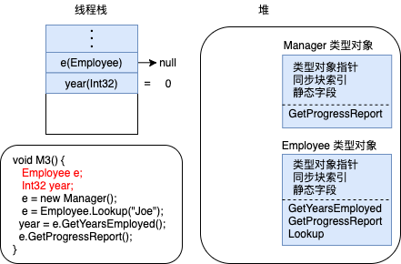  
图 4-8 在线程栈上分配 M3 的局部变量

然后， `M3`执行代码构造一个 `Manager` 对象。这造成在托管堆创建 `Manager` 类型的一个实例(也就是一个 `Manager` 对象)，如图 4-9 所示。可以看出，和所有对象一样， `Manager` 对象也有类型对象指针和同步块索引。该对象还包含必要的字节来容纳 `Manager` 类型定义的所有实例数据字段，以及容纳由 `Manager` 的任何基类(本例就是 `Employee` 和 `Object`)定义的所有实例数据字段。任何时候在堆上新建对象， CLR 都自动初始化内部的“类型对象指针”成员来引用和对象对应的类型对象(本例就是 `Manager` 类型对象)。此外，在调用类型的构造器(本质上是可能修改某些实例数据字段的方法)之前， CLR 会先初始化同步块索引，并将对象的所有实例字段设为 `null` 或 `0`(零)。 `new` 操作符返回 `Manager` 对象的内存地址，该地址保存到变量 `e` 中(`e` 在线程栈上)。  
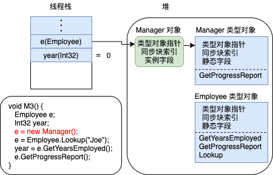  
图 4-9 分配并初始化 Manager 对象

`M3` 的下一行代码调用 `Employee` 的静态方法 `Lookup`。调用静态方法时， CLR 会定位与定义静态方法的类型对应的类型对象。然后，JIT 编译器在类型对象的方法表中查找与被调用方法对应的记录项，对方法进行进行 JIT 编译(如果需要的话)，再调用 JIT 编译好的代码。本例假定 `Employee` 的 `Lookup` 方法要查询数据库来查找 Joe。 再假定数据库指出 Joe 是公司的一名经理，所以在内部， `Lookup` 方法在堆上构造一个新的 `Manager` 对象，用 Joe 的信息初始化它，返回该对象的地址。该地址保存到局部变量 `e` 中。这个操作的结果如图 4-10 所示。
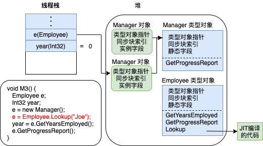  
图 4-10 Employee 的静态方法 Lookup 为 Joe 分配并初始化 Manager 对象  

注意， `e` 不再引用第一个 `Manager` 对象。事实上，由于没有变量引用该对象，所以它是未来垃圾回收的主要目标。垃圾回收机制将自动回收(释放)该对象占用的内存。

`M3` 的下一行代码调用 `Employee` 的非虚实例方法 `GetYearsEmployed`。调用非虚实例方法时，JIT 编译器会找到与“发出调用的那个变量(`e`)的类型(`Employee`)”对应的类型对象(`Employee` 类型对象)。这时的变量 `e` 被定义成一个 `Employee`。如果 `Employee` 类型没有定义在调用的那个方法，JIT 编译器会回溯类层次结构(一直回溯到 `Object`)，并在沿途的每个类型中查找该方法。之所以能这样回溯，是因为每个类型对象都有一个字段引用了它的基类型，这个信息在图中没有显示。  

然后，JIT 编译器在类型对象的方法表中查找引用了被调用方法的记录项，对方法进行 JIT 编译(如果需要的话)，再调用 JIT 编译好的代码。本例假定 `Employee` 的 `GetYearsEmployed` 方法返回 `5`，因为 Joe 已被公司雇用 5 年。这个整数保存到局部变量 `year` 中。这个操作的结果如图 4-11 所示。  
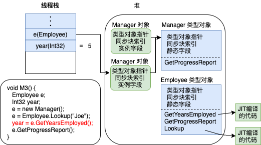  
图 4-11 Employee 的非虚实例方法 GetYearsEmployed 调用后返回 5

`M3` 的下一行代码调用 `Employee` 的虚实例方法 `GetProgressReport` 。调用虚实例方法时，JIT 编译器要在方法中生成一些额外的代码；方法每次调用都会执行这些代码。这些代码首先检查发出调用的变量，并跟随地址来到发出调用的对象。变量 `e` 当前引用的是代表“Joe”的 `Manager` 对象。然后，代码检查对象内部的“类型对象指针”成员，该成员指向对象的实际类型。然后，代码在类型对象的方法表中查找引用了被调用方法的记录项，对方法进行 JIT 编译(如果需要的话)，再调用 JIT 编译好的代码。由于目前 `e` 引用了一个 `Manager` 对象，所以会调用 `Manager` 的 `GetProgressReport` 实现。这个操作的结果如图 4-12 所示。  
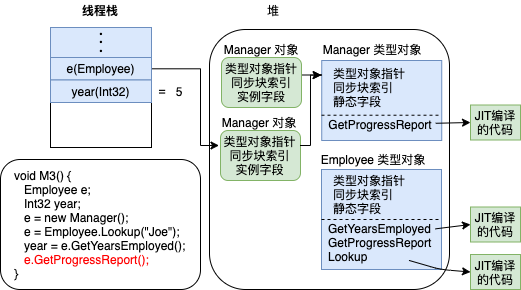  
图 4-12 调用 Employee 的虚实例方法 GetProgressReport，最终执行 Manager 重写的版本

注意，如果 `Employee` 的 `Lookup` 方法发现 Joe 是 `Employee` 而不是 `Manager`，`Lookup` 会在内部构造一个 `Employee` 对象，它的类型对象指针将引用 `Employee` 类型对象。这样最终执行的就是 `Employee` 的 `GetProgressReport` 实现，而不是 `Manager` 的。

至此，我们已经讨论了源代码、IL 和 JIT 编译的代码之间的关系。还讨论了线程栈、实参、局部变量以及这些实参和变量如何引用托管堆上的对象。还知道对象含有一个指针指向对象的类型对象(类型对象中包含静态字段和方法表)。还讨论了 JIT 编译器如何决定静态方法、非虚实例方法以及虚实例方法的调用方式。理解这一切之后，可以深刻地认识 CLR 的工作方式。以后在建构、设计和实现类型、组件以及应用程序时，这些知识会带来很大帮助。结束本章之前，让我们深入探讨一下 CLR 内部发生的事情。

注意 `Employee` 和 `Manager` 类型对象都包含“类型对象指针”成员。这是由于类型对象本质上也是对象。CLR 创建类型对象时，必须初始化这些成员。初始化成什么呢？你肯定会这样问。CLR 开始在一个进程中进行时，会立即为 MSCorLib.dll 中定义的 `System.Type` 类型创建一个特殊的类型对象。 `Employee` 和 `Manager` 类型对象都是该类型的“实例”。因此，它们的类型对象指针成员会初始化成对 `System.Text` 类型对象的引用，如图 4-13 所示。  
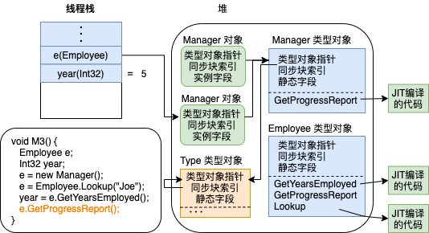  
图 4-13 Employee 和 Manager 类型对象是 System.Type 类型的实例  

当然， `System.Text` 类型对象本身也是对象，内部也有“类型对象指针”成员。这个指针指向什么？它指向它本身，因为 `System.Type` 类型对象本身是一个类型对象的“实例”。现在，我们总算理解了 CLR 的整个类型系统及其工作方式。顺便说一句， `System.Object` 的 `GetType` 方法返回存储在指定对象的“类型对象指针”成员中的地址。也就是说， `GetType` 方法返回指向对象的类型对象的指针。这样就可判断系统中任何对象(包括类型对象本身)的真实类型。

