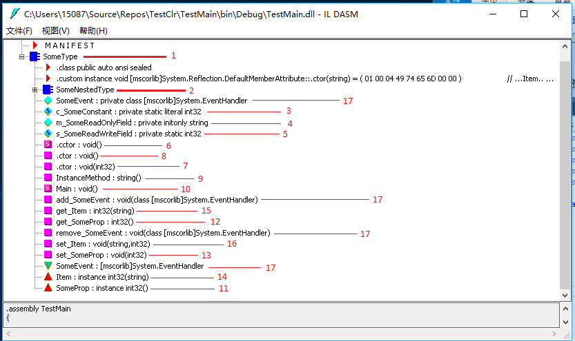
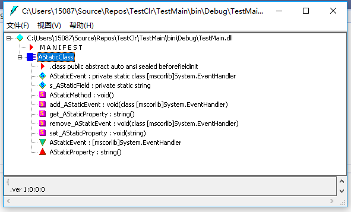

# 第 6 章 类型和成员基础

本章内容  
* <a href="#6_1">类型的各种成员</a>
* <a href="#6_2">类型的可见性</a>
* <a href="#6_3">成员的可访问性</a>
* <a href="#6_4">静态类</a>
* <a href="#6_5">分部类、结构和接口</a>
* <a href="#6_6">组件、多态和版本控制</a>

第 4 章和第 5 章重点介绍了类型以及所有类型的所有实例都支持的一组操作，并指出所有类型都可划分为引用类型或值类型。在本章及本部分后续的章节，将解释如何在类型中定义各种成员，从而设计出符合需要的类型。第 7 章 ~ 第 11 章将详细讨论各种成员。

## <a name="6_1">6.1 类型的各种成员</a>

类型中可定义 0 个或多个以下种类的成员。

* **常量** 常量是指出数据值恒定不变的符号。这种符号使代码更易阅读和维护。常量总与类型关联，不于类型的实例关联。常量逻辑上总是静态成员。相关内容在第 7 章“常量和字段”讨论。

* **字段** 字段表示只读或可读的数据值。字段可以是静态的；这种字段被认为是*类型*状态的一部分。字段也可以是实例(非静态)；这种字段被认为是*对象*状态的一部分。强烈建议将字段声明为私有，防止类型或对象的状态被类型外部的代码破坏。相关内容在第 7 章讨论。

* **实例构造器** 实例构造器是将新*对象*的实例字段初始化为良好初始状态的特殊方法。相关内容在第 8 章“方法”讨论。

* **类型构造器** 类型构造器是将*类型*的静态字段初始化为良好初始状态的特殊方法。相关内容在第 8 章讨论。

* **方法** 方法是更改或查询类型或对象状态的函数。作用于类型称为静态方法，作用于对象称为实例方法。方法通常要读写类型或对象的字段。相关内容在第 8 章讨论。

* **操作符重载** 操作符重载实际是方法，定义了当操作符作用于对象时，应该如何操作该对象。由于不是所有编程语言都支持操作符重载，所以操作符重载方法不是“公共语言规范”(Common Language Specification， CLS)的一部分。相关内容在第 8 章讨论。

* **转换操作符** 转换操作符是定义如何隐式或显式将对象从一种类型转型为另一种类型的方法。和操作符重载方法一样，并不是所有编程语言都支持转换操作符，所以不是 CLS 的一部分。相关内容在第 8 章讨论。

* **属性** 属性允许用简单的、字段风格的语法设置或查询类型或对象的逻辑状态，同时保证状态不被破坏。作用于类型称为静态属性，作用于对象称为实例属性。属性可以无参(非常普遍)，也可以有多个参数(相当少见，但集合类用得多)。相关内容在第 10 章 “属性”讨论。

* **事件** 静态事件允许类型向一个或多个静态或实例方法发送通知。实例(非静态)事件允许对象向一个或多个静态或实例方法发送通知。引发事件通常是为了响应提供事件的类型或对象的状态的改变。事件包含两个方法，允许静态或实例方法登记或注销对该事件的关注。除了这两个方法，事件通常还用一个委托字段来维护已登记的方法集。相关内容在第 11 章“事件”讨论。

* **类型** 类型可定义其他嵌套类型。通常用这个办法将大的、复杂的类型分解成更小的构建单元(building block)以简化实现。

再次声明，本章总之并非详细描述各种成员，而是帮你打好基础，阐明这些成员的共性。

无论什么编程语言，编译器都必须能处理源代码，为上述每种成员生成元数据和 IL 代码。所有编程语言生成的元数据格式完全一致。这正是 CLR 成为“公共语言运行时” 的原因。元数据是所有语言都生成和使用的公共信息。这是由于有了元数据，用一种语言写的代码才能无缝访问用另一种语言写的代码。

CLR 还利用公共元数据格式决定常量、字段、构造器、方法、属性和事件在运行时的行为。简单地说，元数据是整个 Microsoft .NET Framework 开发平台的关键，它实现了编程语言、类型和对象的无缝集成。

以下 C# 代码展示了一个类型定义，其中包含所有可能的成员。代码能通过编译(有一些警告)，但不能代表你平常创建的类型。大多数方法没有实用价值，仅仅是为了示范编译器如何将类型及其成员转换成元数据。再次说明，后面几章会逐一对这些成员进行讨论。

```C#
using System;

public sealed class SomeType {                             // 1
    
    // 嵌套类
    private class SomeNestedType { }                       // 2
    // 常量、只读和静态可读/可写字段
    private const Int32 c_SomeConstant = 1;                // 3 

    private readonly String m_SomeReadOnlyField = "2";     // 4
    private static Int32 s_SomeReadWriteField = 3;         // 5

    // 类型构造器
    static SomeType() { }                                  // 6

    // 实例构造器
    public SomeType(Int32 x) { }                           // 7
    public SomeType() { }                                  // 8

    // 实例方法和静态方法
    private String InstanceMethod() { return null; }       // 9
    public static void Main() { }                          // 10
    
    // 实例属性
    public Int32 SomeProp {                                // 11
        get { return 0; }                                  // 12
        set { }                                            // 13
    }

    // 实例有参属性(索引器)
    public Int32 this[String s] {                          // 14
        get { return 0; }                                  // 15
        set { }                                            // 16
    }

    // 实例事件
    public event EventHandler SomeEvent;                   // 17
}
```

编译这个类型，用 ILDasm.exe 查看元数据，将看到如图 6-1 所示的输出。  
  
图 6-1 用 ILDasm.exe 查看 SomeType 的元数据

注意，源代码中定义的所有成员都造成编译器生成元数据。事实上，有的成员还造成编译器生成额外的成员和额外的元数据。例如，事件成员(17)造成编译器生成一个字段、两个方法和一些额外的元数据。目前不理解这些内容没有关系。但在学习后面几章时，希望你能回头看看这个例子，体会成员是如何定义的，它们对编译器生成的元数据有何影响。

## <a name="6_2">6.2 类型的可见性</a>

要定义文件范围的类型(而不是将类型定义嵌套到另一个类型中)时，可将类型的可见性指定为 `public` 或 `internal`。`public`类型不仅对定义程序集中的所有代码可见，还对其他程序集中的代码可见。`internal` 类型则仅对定义程序集中的所有代码可见，对其他程序集中的代码不可见。定义类型时不显示指定可见性，C# 编译器会帮你指定为 `internal`(限制比`public`大)。下面是几个例子。

```C#
using System;

// 以下类型的可见性为 public，既可由本程序集中的代码访问，
// 也可由其他程序集中的代码访问
public class ThisIsAPublicType { ... }

// 以下类型的可见性为 internal，只可由本程序集中的代码访问
internal class ThisIsAnInternalType { ... }

// 由于没有显式声明类型的可见性，所以以下类型的可见性为 internal
class ThisIsAlsoAnInternalType { ... }
```

#### 友元程序集

假定下述情形：某公司的团队 TeamA 在某个程序集中定义了一组工具类型(utility type)，并希望公司的另一个团队 TeamB 的成员使用这些类型。但由于各种原因，比如时间安排、地理位置、不同的成本中心或报表结构，这两个团队不能将他们的所有类型都生成到一个程序集中；相反，每个团队都生成都要生成自己的程序集。

为了使团队 TeamB 的程序集能使用团队 TeamA 的类型，TeamA 必须将他们的所有工具类型定义为 `public`。但这意味着工具类型对所有程序集公开。就连另一家公司的开发人员也能写代码使用它们。这不是公司所希望的。这些工具类型也许做出了一些预设，而 TeamB 写代码时会确保这些预设成立。我们希望 TeamB 访问这些类型。CLR 和 C# 通过 **友元程序集**(friend assembly)提供这方面的支持。用一个程序集中的代码对另一个程序集中的内部类型进行单元测试时，友元程序集功能也能派上用场。

生成程序集时，可用 `System.Runtime.CompilerServices` 命名空间中的 `InternalsVisibleTo` 特性标明它认为是“友元”的其他程序集。该特性获取标识友元程序集名称和公钥的字符串参数(传给该特性的字符串绝不能包含版本、语言文化和处理器架构)。注意当程序集认了“友元”之后，友元程序集就能访问该程序集中的所有 `internal` 类型，以及这些类型的 `internal` 成员。下例展示一个程序集如何将两个强命名程序集 “Wintellect” 和 “Microsoft” 指定为友元程序集：

```C#
using System;
using System.Runtime.CompilerServices;   // 为了 InternalsVisibleTo 特性

// 当前程序集中的 internal 类型可由以下两个程序集中
// 的任何代码访问(不管什么版本或语言文化)
[assembly:InternalsVisibleTo("Wintellect, PublicKey=12345678...90abcdef")]
[assembly:InternalsVisibleTo("Microsoft, PublicKey=b77a5c56...1934e089")]

internal sealed class SomeInternalType { ... }
internal sealed class AnotherInternalType { ... }
```

从友元程序集访问上述程序集的 `internal` 类型很容易。例如，下面展示了公钥为 “12345678...90abcdef”的友元程序集“Wintellect”如何访问上述程序集的 `internal` 类型 `SomeInternalType`。

```C#
using System;

internal sealed class Foo {
    private static Object SomeMethod() {
        // 这个“Wintellect” 程序集能访问另一个程序集的 internal 类型，
        // 就好像那时 public 类型
        SomeInternalType sit = new SomeInternalType();
        return sit;
    }
}
```

由于程序集中的类型的 `internal` 成员能从友元程序集访问，所以要慎重考虑类型成员的可访问性，以及要将哪些程序集声明为友元。注意 C# 编译器在编译友元程序集(不含`InternalsVisibleTo` 特性的程序集)时要求使用编译器开关 **/out:<*file*>**。使用这个编译器开关的原因在于，编译器需要知道准备编译的程序集的名称，从而判断生成的程序集是不是友元程序集。你或许以为 C# 编译器能自己判断，因为平时都是它自己确定输出文件名。但事实上，在代码结束编译之前，C# 编译器是不知道输出文件名的。因此，使用 **/out:<*file*>**编译器开关能极大增强编译性能。

同样地，如果使用C# 编译器的 **/t:module** 开关来编译模块(而不是编译成程序集)，而且该模块将成为某个友元程序集的一部分，那么还需要使用 C# 编译器的 **/moduleassemblyname:<*string*>** 开关来编译该模块，它告诉编译器该模块将成为哪个程序集的一部分，使编译器设置模块中的代码，使它们能访问另一个程序集中的 `internal` 类型。

## <a name="6_3">6.3 成员的可访问性</a>

定义类型的成员(包括嵌套类型)时，可指定成员的**可访问性**。在代码中引用成员时，成员的可访问性指出引用是否合法。CLR 自己定义了一组可访问性修饰符，但每种编程语言在向成员应用可访问性时，都选择了自己的一组术语以及相应的语法。例如，CLR 使用 `Assembly` 表明成员对同一程序集内的所有代码可见，而 C# 对应的术语是 `internal`。

表 6-1 总结了 6 个应用于成员的可访问性修饰符。从第一行到最后一行，按照从限制最大(`Private`)到限制最小(`Public`)的顺序排列。  

表 6-1 成员的可访问性
|CLR术语|C#术语|描述|
|:---:|:---:|:----:|
|`Private`| `private`|成员只能由定义类型或任何嵌套类型中的方法访问|
|`Family`|`protected`|成员只能由定义类型、任何嵌套类型或者不管在什么程序集中的派生类型中的方法访问|
|`Family and Assembly`|(不支持)|成员只能由定义类型、任何嵌套类型或者同一程序集中定义的任何派生类型中的方法访问|
|`Assembly`|`internal`|成员只能由定义程序集中的方法访问|
|`Family or Assembly`|`protected internal`|成员可由任何嵌套类型、任何派生类型(不管在什么程序集)或者定义程序集中的任何方法访问|
|`Public`|`public`|成员可由任何程序集的任何方法访问|

当然，任何成员要想被访问，都必须在可见的类型中定义。例如，如果程序集 AssemblyA 定义了含有一个 `public` 方法的 `internal` 类型，则程序集 AssemblyB 中的代码不能调用该 `public` 方法，因为 `internal` 类型对 AssemblyB 来说不可见。

编译代码时，编程语言的编译器检查代码是不是正确引用了类型和成员。如果代码不正确地引用了类型或成员，编译器会生成一条合适的错误消息。另外，在运行时将 IL 代码编译成本机 CPU 指令时，JIT 编译器也会确保对字段和方法的引用合法。例如，JIT 编译器如果检测到代码不正确地访问私有字段或方法，将分别抛出 `FieldAccessException` 或 `MethodAccessException` 异常。

通过对 IL 代码进行验证，可确保被引用成员的可访问性在运行时得到正确兑现——即使语言的编译器忽略了对可访问性的检查。另外极有可能发生的情况是：语言编译器编译的代码会访问另一个程序集中的另一个类型的 `public` 成员，但到运行时却加载了程序集的不同版本，新版本中的 `public` 成员变成了 `protected` 或 `private` 成员。

在 C# 中，如果没有显式声明成员的可访问性，编译器通常(但并不总是)默认选择 `private`(限制最大的那个)。CLR 要求接口类型的所有成员都具有 `public` 可访问性。C# 编译器知道这一点，因此禁止开发人员显式指定接口成员的可访问性；编译器自动将所有成员的可访问性设为 `public`。

> 更多信息 参考 C# 语言规范的“Declared Accessibility”(已声明可访问性)一节，完整地了解可在 C# 中向类型和成员应用哪些可访问性，以及如何根据声明的上下文来选择默认的可访问性。

你也许注意到了，CLR 提供了称为 `Family and Assembly` 的可访问性。但 C# 不支持。C# 开发团队认为这种可访问性基本没有，所以决定放弃。

派生类型重写重写基类型定义的成员时，C# 编译器要求原始成员和重写成员具有相同的可访问性。也就是说，如果基类成员是 `protected` 的，派生类中的重写成员也必须是 `protected` 的。但这是 C# 的限制，不是 CLR 的。从基类派生时，CLR 允许放宽但不允许收紧成员的可访问性限制。例如，类可重写基类定义的 `protected` 方法，将重写方法设为 `public`(放宽限制)。但不能重写基类定义的 `protected` 方法，将重写方法设为 `private`(收紧限制)。之所以不能在派生类中收紧对基类方法的访问，是因为 CLR 承诺派生类总能转型为基类，并获取对基类方法的访问权。如果允许派生类收紧限制，CLR 的承诺就无法兑现了。

##  <a name="6_4">6.4 静态类</a>

有一些永远不需要实例化的类，例如 `Console`，`Math`，`Environment` 和 `ThreadPool`。这些类只有 `static` 成员。事实上，这种类唯一的作用就是组合一组相关的成员。例如， `Math` 类就定义了一组执行数学运算的方法。在 C# 中，要用 `static` 关键字定义不可实例化的类。该关键字只能应用于类，不能应用于结构(值类型)。因为 CLR 总是允许值类型实例化，这是没办法阻止的。

C# 编译器对静态类进行了如下限制。

* 静态类必须直接从基类 `System.Object` 派生，从其他任何基类派生都没有意义。继承只适用于对象，而你不能创建静态类的实例。
* 静态类不能实现任何接口，这是因为只有使用类型的实例时，才可调用类的接口方法。
* 静态类只能定义静态成员(字段、方法、属性和事件)，任何实例成员都会导致编译器报错。
* 静态类不能作为字段、方法参数或局部变量使用，因为它们都代表引用了实例的变量，而这是不允许的。编译器检测到任何这样的用法都会报错。

下面是一个定义了静态成员的静态类。代码虽能通过编译(有一个警告)，但该类没有做任何有意义的事情。

```C#
using System;
public static class AStaticClass {
    public static void AStaticMethod() { }

    public static String AStaticProperty {
        get { return s_AStaticField; }
        set { s_AStaticField = value; }
    }

    private static String s_AStaticField;

    public static event EventHandler AStaticEvent;
}
```

将上述代码编译成库(DLL)程序集，用 ILDasm.exe 查看会得到如图 6-2 所示的结果。如你所见，使用关键字 `static` 定义类，将导致 C# 编译器将该类标记为 `abstract` 和 `sealed`。另外，编译器不在类型中生成实例构造器方法，你在图 6-2 中看不到实例构造器(.ctor)方法。  
  
图 6-2 ILDasm.exe 表明静态类在元数据中是抽象密封类

## <a name="6_5">6.5 分部类、结构和接口</a>

本节要讨论分部类、结构和接口。`partial` 关键字告诉 C# 编译器；类、接口或接口的定义源代码可能要分散到一个或多个源代码文件中。将类型源代码分散到多个文件的原因有三。

* **源代码控制**  
  假定类型定义包含大量源代码，一个程序员把它从源代码控制系统中签出(check out)以进行修改。没有其他程序员能同时修改这个类型，除非之后执行合并(merge)。使用 `partial` 关键字可将类型的代码分散到多个源代码文件中，每个文件都可单独签出，多个程序员能同时编辑类型。

* **在同一个文件中将类或结构分解成不同的逻辑单元**
  我有时会创建一个类型来提供多个功能，使类型能提供完整解决方案。为简化实现，有时会在一个源代码文件中重复声明同一个分部类型。然后，分部类型的每个部分都实现一个功能，并配以它的全部字段、方法、属性、事件等。这样就可方便地看到组合以提供一个功能的全体成员，从而简化编码。与此同时，可以方便地将分部类型的一部分注释掉，以便从类中删除一个完整的功能，代之以另一个实现(通过分部类型的一个新的部分)。

* **代码拆分**
  在 Microsoft Visual Studio 中创建新项目时，一些源代码文件会作为项目一部分自动创建。这些源代码文件包含模板，能为项目开个好头。使用 Visual Studio 在设计图面上拖放空间时，Visual Studio 自动生成源代码，并将代码拆分到不同的源代码文件中。这提高了开发效率。很久以前，生成的代码是直接放到当前正在处理的那个源代码文件中的。这样做的问题在于，如果不小心编辑了一下生成的代码，设计器行为就可能失常。从 Visual Studio 2005 开始，新建窗体、控件等的时候，Visual Studio 自动创建两个源代码文件：一个用于你的代码，另一个用于设计器生成的代码。由于设计器的代码在单独的文件中，所以基本上杜绝了不小心编辑到它的可能。

要将 `partial` 关键字应用于所有文件中的类型。这些文件编译到一起时，编译器会合并代码，在最后的.exe 或 .dll 程序文件(或 .netmodule 模块文件)中生成单个类型。“分部类型”功能完全由 C# 编译器实现，CLR 对该功能一无所知，这解释了一个类型的所有源代码文件为什么必须使用相同编程语言，而且必须作为一个编译单元编译到一起。

## <a name="6_6">6.6 组件、多态和版本控制</a>

面向对象编程(Object-Oriented Programming，OOP)已问世多年。它在上个世纪 70 年代末、80 年代初首次投入应用时，应用程序规模还非常小，而且使应用程序运行起来所需的全部代码都由同一家公司编写。当然，那时确实有操作系统，应用程序也确实使用了操作系统的一些功能，但和今天的操作系统相比，那时的操作系统所提供的功能是在是太少了。

如今软件变得相当复杂，而且用户希望应用程序提供更丰富的功能，如 GUI、菜单、鼠标输入、手写板输入、打印输出、网络功能等。正是由于这个原因，操作系统和开发平台在这几年中取得了迅猛发展。另外，应用程序对的开发也必须分工。不能再像以前那样，一个或几个开发人员就能写出一个应用程序需要的全部代码。这样做要么不可能，要么效率太低。现在的应用程序一般都包含了由许多不同的公司生成的代码。这些代码通过面向对象编程机制契合到一起。

**组件软件编程**(Component Sfoteware Programming, CSP)正是 OOP 发展到极致的成果。下面列举组件的一些特点。

* 组件(.NET Framework 称为程序集)有“已经发布”的意思。
* 组件有自己的标识(名称、版本、语言文化和公钥)
* 组件永远维持自己的标识(程序集中的代码永远不会静态链接到另一个程序集中；.NET 总是使用动态链接)。
* 组件清楚指明它所依赖的组件(引用元数据表)。
* 组件应编档它的类和成员。C# 语言通过源代码内的 XML 文档和编译器的 **/doc** 命令行开关提供这个功能。
* 组件必须指定它需要的安全权限。CLR 的代码访问安全性(Code Access Security， CAS)机制提供这个功能。
* 组件要发布在任何“维护版本”中都不会改变的接口(对象模型)。“维护版本”(servicing version)代表组件的新版本，它向后兼容组件的原始版本。通常，“维护版本”包含bug修复、安全补丁或者一些小的功能增强。但在“维护版本”中，不能要求任何新的依赖关系，也不能要求任何附加的安全权限。

如最后一点所述，CSP 有很大一部分涉及版本控制。组件随着时间而改变，并根据不同的时间来发布。版本控制使 CSP 的复杂性上升到了 OOP 无法企及的高度。(在 OOP 中，全部代码都由一家公司编写和测试，并作为一个整体发布。)本节将重点放在组件的版本控制上。

.NET Framework 中的版本号包含 4 个部分；主版本号(major version)、次版本号(minor version)、内部版本号(build number)和修订号(revision)。例如，版本号为 1.2.3.4 的程序集，其主版本号为 1，次版本号为 2，内部版本号为 3，修订号 4。major/minor 部分通常代表程序集的一个连续的、稳定的功能集，而build/revision 部分通常代表对这个功能集的一次维护。

假定某公司发布了版本号为 2.7.0.0 的程序集。之后，为了修复该组件的 bug，他们可以生成一个新的程序集，并只改动版本号的 build/revision 部分，比如 2.7.1.34。这表明该程序集是维护版本，向后兼容原始版本(2.7.0.0)。

另一方面，假定该公司想生成程序集的新版本，而且由于发生了重大变化，所以不准备向后兼容程序集的原始版本。在这种情况下，公司实际是要创建全新组件，major/minor 版本号(比如 3.0.0.0)应该和原来的组件不同。
> 注意 此处只是说明应该如何看待版本号。遗憾的是，CLR 不以这种方式看待版本号。现在，CLR 将版本号看成是固定值，如果某个程序集依赖版本号为1.2.3.4 的另 个程序集，CLR 只会尝试加载版本号为 1.2.3.4 的程序集(除非设置了绑定重定向)。

前面讨论了如何使用版本号更新组件的标识，从而反映出组件的新版本。下面要讨论如何利用 CLR 和编程语言(比如C#)提供的功能来自动适应组件可能发生的变化。

将一个组件(程序集)中定义的类型作为另一个组件(程序集)中的一个类型的基类使用时，便会发生版本控制问题。显然，如果基类的版本(被修改得)低于派生类，派生类的行为也会改变，这可能造成类的行为失常。在多态情形中，由于派生类型会重写基类型定义的虚方法，所以这个问题显得尤其突出。

C#提供了 5 个能影响组件版本控制的关键字，可将它们应用于类型以及/或者类型成员。这些关键字直接对应 CLR 用于支持组件版本控制的功能。表 6-2 总结了与组件版本控制相关的 C# 关键字，并描述了每个关键字如何影响类型或者类型成员的定义。

表 6-2 C# 关键字及其对组件版本控制的影响  
|C#关键字|类型|方法/属性/事件|常量/字段|
|:---:|:---:|:---:|:----:|
|`abstract`|表示不能构造该类型的实例|表示为了构造派生类型的实例，派生类型必须重写并实现这个成员|(不允许)|
|`virtual`|(不允许)|表示这个成员可由派生类型重写|(不允许)|
|`override`|(不允许)|表示派生类型正在重写基类型的成员|(不允许)|
|`sealed`|表示该类型不能用作基类型|表示这个成员不能被派生类型重写，只能将该关键字应用于重写虚方法的方法|(不允许)|
|`new`|应用于嵌套类型、方法、属性、事件、常量或字段时，表示该成员与基类中相似的成员无任何关系|

6.6.3 节“对类型进行版本控制时的虚方法的处理”将演示这些关键字的作用和用法。但在讨论版本控制之前，先要讨论一下 CLR 实际如何调用虚方法。

### 6.6.1 CLR 如何调用虚方法、属性和事件

本节重点是方法，但我们的讨论也与虚属性和虚事件密切相关。属性和事件实际作为方法实现，本书后面会用专门的章来讨论它们。

方法代表在类型或类型的实例上执行某些操作的代码。在类型上执行操作，称为**静态方法**；在类型的实例上执行操作，称为**非静态方法**。所有方法都有名称、签名和返回类型(可为`void`)。CLR 允许类型定义多个同名方法，只要每个方法都有一组不同的参数或者一个不同的返回类型。所以，完全能定义两个同名、同参数的方法，只要两者返回类型不同。但除了 IL 汇编语言，我没有发现任何利用了这一“特点”的语言。大多数语言(包括C#)在判断方法的唯一性时，除了方法名之外，都只以参数为准，方法返回类型会被忽略。(C#在定义转换操作符方法时实际上放宽了此限制，详见第 8 章。)

以下 `Employee` 类定义了 3 种不同的方法：

```C#
internal class Employee {
    // 非虚实例方法
    public         Int32    GetYearsEmployed() { ... }
    
    // 虚方法(虚暗示实例)
    public virtual String   GetProgressReport() { ... }

    // 静态方法
    public static  Employee Lookup(String name) { ... }
}
```

编译上述代码，编译器会在程序集的方法定义表中写入 3 个记录项，每个记录项都用一组标志(flag)指明方法是实例方法、虚方法还是静态方法。

写代码调用这些方法，生成调用代码的编译器会检查方法定义的标志(flag)，判断应如何生成 IL 代码来正确调用方法。CLR 提供两个方法调用指令。

* `call`  
  该 IL 指令可调用静态方法、实例方法和虚方法。用 `call` 指令调用静态方法，必须指定方法的定义类型。用 `call` 指令调用实例方法或虚方法，必须指定引用了对象的变量。`call`指令假定该变量不为`null`。换言之，变量本身的类型指明了方法的定义类型。如果变量的类型没有定义该方法，就检查基类型来查找匹配方法。`call`指令经常用于以非虚方式调用虚方法。
  
* `callvirt`  
  该 IL 指令可调用实例方法和虚方法，不能调用静态方法。用 `callvirt` 指令调用实例方法或虚方法，必须指定引用了对象的变量。用 `callvirt` 指令调用非虚实例方法，变量的类型指明了方法的定义类型。用 `callvirt` 指令调用虚实例方法，CLR 调查发出调用的对象的实际类型，然后以多态方式调用方法。为了确定类型，发出调用的变量绝不能是 `null`。换言之，编译这个调用时，JIT 编译器会生成代码来验证变量的值是不是`null`。如果是， `callvirt` 指令的执行速度比 `call` 指令稍慢。注意，即使 `callvirt` 指令调用的是非虚实例方法，也要执行这种`null`检查。
  
  现在综合运用上述知识，看看 C# 如何使用这些不同的 IL 指令：
  
```C#
using System;

public sealed class Program { 
    public static void Main() {
        Console.WriteLine();        // 调用静态方法

        Object o = new Object();
        o.GetHashCode();            // 调用虚实例方法 
        o.GetType();                // 调用非虚实例方法
    } 
}
```

编译上述代码，查看最后得到的 IL，结果如下：

```C#
.method public hidebysig static void  Main() cil managed {
  .entrypoint
  // Code size 26 (0x1a)
  .maxstack  1
  .locals init (object o)
  IL_0000: call void System.Console::WriteLine() 
  IL_0005: newobj instance void System.Object::.ctor() 
  IL_000a: stloc.0
  IL_000b: ldloc.0
  IL_000c: callvirt instance int32 System.Object::GetHashCode() 
  IL_0011: pop
  IL_0012: ldloc.0
  IL_0013: callvirt instance class System.Type System.Object::GetType() 
  IL_0018: pop
  IL_0019: ret
} // end of method Program::Main
```

注意，C# 编译器用 `call` 指令调用 `Console` 的 `WriteLine` 方法。这在意料之中，因为 `WriteLine` 是静态方法。接着用`callvirt` 指令调用 `GetHashCode`，这也在意料之中，因为 `GetHashCode` 是虚方法。最后，C# 编译器用 `callvirt` 指令调用 `GetType` 方法。这就有点出乎意料了，因为 `GetType` 不是虚方法，所以在 JIT 编译好的代码中，会直接以非虚方式调用 `GetType`。

那么，为什么 C#编译器不干脆生成 `call` 指令呢？答案是C#团队认为，JIT编译器应生成代码来验证发出调用的对象不为 `null`。这意味着对非虚实例方法的调用要稍微慢一点。这也意味着以下C# 代码将抛出 `NullReferenceException` 异常。注意，在另一些编程语言中，以下代码能正常工作。

```C#
using System;

public sealed class Program {
    public Int32 GetFive() { return 5; }
    public static void Main(){
        Program p = null;
        Int32 x = p.GetFive();    // 在 C# 中抛出 NullReferenceException 异常
    }
}
```

上述代码理论上并无问题。变量`p`确实为`null`，但在调用非虚方法(`GetFive`)时，CLR 唯一需要知道的就是`p`的数据类型(`Program`)。如果真的调用`GetFive`，`this`实参值是`null`。由于`GetFive` 方法内部并未使用该实参，所以不会抛出 `NullReferenceException` 异常。但由于C# 编译器生成 `callvirt` 而不是 `call` 指令，所以上述代码抛出了 `NullReferenceException` 异常。
> 重要提示 将方法定义为非虚方法后，将来永远都不要把它更改为虚方法。这是因为某些编译器会用 `call` 而不是 `callvirt` 调用非虚方法。如果方法从非虚变成虚，而引用代码没有重新编译，会以非虚方式调用虚方法，造成应用程序行为无法预料。用 C# 写的引用代码不会出问题，因为C# 用 `callvirt` 指令调用所有实例方法。但如果引用代码是用其他语言写的，就可能出问题。

编译器有时用 `call` 而不是 `callvirt` 调用虚方法。虽然刚开始有点难以理解，但以下代码证明了有时真的需要这样做：

```C#
internal class SomeClass {
    // ToString 是基类 Object 定义的虚方法
    public override String ToString() {

        // 编译器使用 IL 指令 'call',
        // 以非虚方式调用 Object 的 ToString 方法

        // 如果编译器用 'callvirt' 而不是 'call'，
        // 那么该方法将递归调用自身，直至栈溢出
        return base.ToString();
    }    
}
```

调用虚方法 `base.ToString` 时，C# 编译器生成 `call` 指令来确保以非虚方式调用基类的 `ToString` 方法。这是必要的，因为如果以虚方式调用 `ToString` ，调用会递归执行，直至线程栈溢出，这显然不是你所期望的。

编译器调用值类型定义的方法时倾向于使用 `call` 指令，因为值类型时密封的。这意味着即使值类型含有虚方法也不用考虑多态性，这使调用更快。此外，值类型实例的本质保证它永不为 `null`，所以永远不抛出 `NullReferenceException` 异常。最后，如果以虚方式调用值类型中的虚方法，CLR 要获取对值类型的类型对象的引用，以便引用(类型对象中的)方法表，这要求对值类型装箱。装箱对堆造成更大压力，迫使进行更频繁的垃圾回收，使性能受到影响。

无论用 `call` 还是 `callvirt` 调用实例方法或虚方法，这些方法通常接收隐藏的 `this` 实参作为方法第一个参数。`this` 实参引用要操作的对象。

设计类型时应尽量减少虚方法数量。首先，调用虚方法的速度比调用非虚方法慢。其次，JIT编译器不能内嵌(inline)虚方法，这进一步影响性能。第三，虚方法使组件版本控制变得更脆弱，详情参见下一节。第四，定义基类型时，经常要提供一组重载的简便方法(convenience method)。如果希望这些方法是多态的，最好的办法就是使最复杂的方法成为虚方法，使所有重载的简便方法成为非虚方法。顺便说一句，遵循这个原则，还可在改善组件版本控制的同时，不至于对派生类型产生负面影响。下面是一个例子：  

```C#
public class Set {
    private Int32 m_length = 0;

    // 这个重载的简便方法是非虚的
    public Int32 Find(Object value) {
        return Find(value, 0, m_length);
    }

    // 这个重载的简便方法是非虚的
    public Int32 Find(Object value, Int32 startIndex) {
        return Find(value, startIndex, m_length - startIndex);
    }

    // 功能最丰富的方法是虚方法，可以被重写
    public virtual Int32 Find(Object value, Int32 startIndex, Int32 endIndex)
    {
        // 可被重写的实现放在这里···
    }

    // 其他方法放在这里
}
```

### 6.6.2 合理使用类型的可见性和成员的可访问性

使用 .NET Framework 时，应用程序是由多个公司生产的多个程序集所定义的类型构成的。这意味着开发人员对所用的组件以及其中定义的类型几乎没有什么控制权。开发人员通常无法访问源代码(甚至可能不知道组件用什么编程语言创建)，而且不同组件的版本发布一般都基于不同的时间表。除此之外，由于多态和受保护成员，基类开发人员必须信任派生类开发人员所写的代码。当然，派生类的开发人员也必须信任从基类继承的代码。设计组件和类型时，应慎重考虑这些问题。

本节描述了设计类型时应如何思考这些问题，具体就是如何正确设置类型的可见性和成员的可访问性来取得最优结果。

首先，定义新类型时编译器应默认生成密封类，使它不能作为基类使用。但是，包括 C# 编译器在内的许多编译器都默认生成非密封类，只是允许开发人员使用关键字 `sealed` 将类显式标记为密封。我认为现在的编译器使用了错误的默认设定。不过，亡羊补牢，为时不晚，希望将来的编译器能改正这一错误。密封类之所以比非密封类更好，有以下三个方面的原因。

* **版本控制**  
  如果类最初密封，将来可在不破坏兼容性的前提下更改为非密封。但如果最初非密封，将来就不可能更改密封，因为这将中断派生类。另外，如果非密封类定义了非密封虚方法，必须在新版本的类中保持虚方法调用顺序，否则可能中断派生类。

* **性能**  
  如上一节所述，调用虚方法在性能上不及调用非虚方法，因为 CLR 必须在运行时查找对象的类型，判断要调用的方法由哪个类型定义。但是，如果 JIT 编译器看到使用密封类型的虚方法调用，就可采用非虚方式调用虚方法，从而生成更高效的代码。之所以能这么做，是因为密封类自然不会有派生类。例如，在下面的代码中，JIT 编译器可采用非虚方式调用虚方法 `ToString`:
  
  ```C#
  using System;
  public sealed class Point {
      private Int32 m_x, m_y;

      public Point(Int32 x, Int32 y) { m_x = x; m_y = y; }

      public override String ToString() {
          return String.Format("({0}, {1})", m_x, m_y);
      }

      public static void Main() {
          Point p = new Point(3, 4);

          // C# 编译器在此生成 callvirt 指令，
          // 但 JIT 编译器将优化这个调用，并生成代码来非虚地调用 ToString。这
          // 是因为 p 的类型是 Point，而 Point
          // 是密封类
          Console.WriteLine(p.ToString());
      }
  }
  ```

* **安全性和可预测性**  
  类必须保护自己的状态，不允许被破坏。当类处于非密封状态时，只要它的任何数据字段或者在内部对这些字段进行处理的方法是可以访问的，而且不是私有的，派生类就能访问和更改基类的状态。另外，派生类既可重写基类的虚方法，也可直接调用这个虚方法在基类中的实现。一旦将某个方法、属性或事件设为 `virtual`，基类就会丧失对它的行为和状态的部分控制权。所以，除非经过了认真考虑，否则这种做法可能导致对象的行为变得不可预测，还可能留下安全隐患。

密封类的问题是可能给类型的用户造成巨大的不便。有时，开发人员希望从现有类型派生出一个类，在其中添加额外字段或状态信息来满足自己应用程序的需要。他们甚至希望在派生类中定义辅助方法(helper method)或简便方法(convenience method)来操纵这些额外的字段。虽然 CLR 没有提供机制允许你用辅助方法或字段扩展已生成的类型，但可利用 C# 的扩展方法(第 8 章)模拟辅助方法，还可利用 `ConditionalWeakTable` 类(第 21 章)模拟跟踪状态。

以下是我自己定义类时遵循的原则。

* 定义类时，除非确定要将其作为基类，并允许派生类对它进行特化，否则总是显式地指定为 `sealed` 类。如前所述，这与 C#以及其他许多编译器的默认方式相反。另外，我默认将类指定为 `internal` 类，除非我希望在程序集外部公开这个类。幸好，如果不显式指定类型的可见性，C# 编译器默认使用的就是 `internal`。如果我真的要定义一个可由其他人继承的类，同时不希望允许特化，那么我会重写并密封继承的所有虚方法。

> 特化(specialization)是指继承了基类的东西不算，还对这些东西进行特殊处理。 —— 译注

* 类的内部，我总是毫不犹豫地将数据字段定义为 `private`。幸好，C#默认就将字段标记为`private`。事实上，我情愿 C# 强制所有字段都标记为 `private`，根本不允许`protected`，`internal`和`public`等等。状态一旦公开，就极易产生问题，造成对象的行为无法预测，并留下安全隐患。即使只将一些字段声明为 `internal` 也会如此。即使在单个程序集中，也很难跟踪引用了一个字段的所有代码，尤其是假如代码由几个开发人员编写，并编译到同一个程序集中。

* 在类的内部，我总是将自己的方法、属性和事件定义为 `private` 和非虚。幸好，C#默认也是这样的。当然，我会将某个方法、属性和事件定义为 `public`，以便公开类型的某些功能。我会尽量避免将上述任何成员定义为 `protected`或`internal`，因为这会使类型面临更大的安全风险。即使迫不得已，我也会尽量选择 `protected` 或 `internal`。`virtual` 永远最后才考虑，因为虚成员会放弃许多控制，丧失独立性，变得彻底依赖于派生类的正确行为。

* OOP 有一条古老的格言，大意是当事情变得过于复杂时，就搞更多的类型出来。当算法的实现开始变得复杂时，我会定义一些辅助类型来封装独立的功能。如果定义的辅助类型只由一个“超类型”使用，我会在“超类型”中嵌套这些辅助类型。这样除了可以限制范围，还允许嵌套的辅助类型中的代码引用“超类型”中定义的私有成员。但是，Visual Studio 的代码分析工具(FxCopCmd.exe)强制执行了一条设计规则，即对外公开的嵌套类型必须在文件或程序集范围中定义，不能在另一个类型中定义。之所以会有这个规则，是因为一些开发人员觉得引用嵌套类型时，所用的语法过于繁琐。我赞同该规则，自己绝不会定义公共嵌套类型。

### 6.6.3 对类型进行版本控制时的虚方法的处理

如前所述，在组件软件编程(Component Software Programming, CSP)环境中，版本控制是非常重要的问题。那一章解释了强命名程序集，并讨论了管理员如何确保应用程序绑定到和生成/测试时一样的程序集。但是，还有其他版本控制问题会造成源代码兼容性问题。例如，如果类型要作为基类型使用，增加或修改它的成员时务必非常小心。下面来看一些例子。

假定 CompanyA 定义了 `Phone` 类型：

```c#
namespace CompanyA {
    public class Phone {
        public void Dial() {
            Console.WriteLine("Phone.Dial");
            // 在这里执行拨号操作
        }
    }
}
```

再假定 CompanyB 定义了 `BetterPhone` 类型，使用 CompanyA 的 `Phone` 类型作为基类型：

```C#
namespace CompanyB {
    public class BetterPhone : CompanyA.Phone {
        public void Dial() {
            Console.WriteLine("BetterPhone.Dial");
            EstablishConnection();
            base.Dial();
        }

        protected virtual void EstablishConnection() {
            Console.WriteLine("BetterPhone.EstablishConnection");
            // 在这里执行建立连接的操作
        }
    }
}
```

CompanyB 编译上述代码时，C#编译器生成以下警告消息：  
`warning CS0108:"CompanyB.BetterPhone.Dial()"隐藏了继承的成员"CompanyA.Phone.Dial()"。如果是有意隐藏，请使用关键字 new`

该警告告诉开发人员 `BetterPhone` 类正在定义个 `Dial` 方法，它会隐藏 `Phone` 类定义的 `Dial`。新方法可能改变 `Dial` 的语义(这个语义是 CompanyA 最初创建 `Dial` 方法时定义的)。

编译器就潜在的语言不匹配问题发出警告，这是一个令人欣赏的设计。编译器甚至贴心地告诉你如何消除这条警告，办法是在 `BetterPhone` 类中定义 `Dial` 时，在前面加一个 `new` 关键字。以下是改正的 `BetterPhone` 类：

```C#
namespace CompanyB {
    public class BetterPhone : CompanyA.Phone {

        // 新的 Dial 方法变得与 Phone 的 Dial 方法无关了
        public new void Dial() {
            Console.WriteLine("BetterPhone.Dial");
            EstablishConnection();
            base.Dial();
        }

        protected virtual void EstablishConnection() {
            Console.WriteLine("BetterPhone.EstablishConnection");
            // 在这里执行建立连接的操作
        }
    }
}
```

现在，CompanyB 能在其应用程序中使用 `BetterPhone.Dial`。以下是 CompanyB 可能写的一些示例代码：

```C#
public sealed class Program {
    public static void Main() {
        CompanyB.BetterPhone phone = new Company.BetterPhone();
        phone.Dial();
    }
}
```

运行上述代码，输出结果如下所示：

```cmd
BetterPhone.Dial
BetterPhone.EstablishConnection
Phone.Dial
```

输出符合 CompanyB 的预期。调用 `Dial` 方法时，会调用由 `BetterPhone` 类定义的新 `Dial`。在新 `Dial` 中，先调用虚方法 `EstablishConnection`，再调用基类型 `Phone`中的 `Dial` 方法。

现在，假定几家公司计划使用 CompanyA 的 `Phone` 类型。再假定这几家公司都认为在 `Dial` 方法中建立连接的主意非常好。CompanyA 收到这个反馈，决定对 `Phone` 类进行修订： 

```C#
namespace CompanyA {
    public class Phone {
        public void Dial() {
            Console.WriteLine("Phone.Dial");
            EstablishConnection();
            // 在这里执行拨号操作
        }

        protected virtual void EstablishConnection() {
            Console.WriteLine("Phone.EstablishConnection");
            // 在这里执行建立连接的操作
        }
    }
}
```

现在，一旦 CompanyB 编译它的 `BetterPhone` 类型(从 CompanyA 的新版本 `Phone`派生)，编译器将生成以下警告消息：  
`warning CS0114:"CompanyB.BetterPhone.EstablishConnection()" 将隐藏继承的成员"CompanyA.Phone.EstablishConnection()"。若要使当前成员重写该实现，请添加关键字 override。否则，添加关键字 new。`  

编译器警告 `Phone` 和 `BetterPhone` 都提供了 `EstablishConnection` 方法，而且两者的语义可能不一致。只是简单地重新编译`BetterPhone` ，可能无法获得和使用第一个版本的 `Phone` 类型时相同的行为。

如果CompanyB 认定 `EstablishConnection` 方法在两个类型中的语义不一致，CompanyB 可以告诉编译器使用 `BetterPhone` 类中定义的`Dial` 和 `EstablishConnection` 方法，它们与基类型 `Phone` 中定义的 `EstablishConnection`方法没有关系。CompanyB 可以为 `EstablishConnection` 方法添加 `new` 关键字来告诉编译器这一点。

```C#
namespace CompanyB {
    public class BetterPhone : CompanyA.Phone {

        // 保留关键字 new，指明该方法与基类型的 Dial 方法没有关系
        public new void Dial() {
            Console.WriteLine("BetterPhone.Dial");
            EstablishConnection();
            base.Dial();
        }

        // 为这个方法添加关键字 new，指明该方法与基类型的
        // EstablishConnection 方法没有关系
        protected new virtual void EstablishConnection() {
            Console.WriteLine("BetterPhone.EstablishConnection");
            // 在这里执行建立连接的操作
        }
    }
}
```

在这段代码中，关键字 `new` 告诉编译器生成元数据，让 CLR 知道 `BetterPhone` 类型的 `EstablishConnection` 方法应被视为由 `BetterPhone` 类型引入的新函数。这样 CLR 就知道 `Phone` 和 `BetterPhone` 这两个类中的方法无任何关系。

执行相同的应用程序代码(签名列出的 `Main` 方法中的代码)，输出结果如下所示：

```Cmd
BetterPhone.Dial
BetterPhone.EstablishConnection
Phone.Dial
Phone.EstablishConnection
```

这个输出表明，在 `Main` 方法中调用 `Dial`，调用的是 `BetterPhone` 类定义的新 `Dial` 方法。后者调用了同样由 `BetterPhone` 类定义的虚方法 `EstablishConnection`。`BetterPhone` 的 `EstablishConnection` 方法返回后， 将调用 `Phone` 的 `Dial` 方法调用了`EstablishConnection`，但由于 `BetterPhone` 的 `EstablishConnection` 使用 `new` 进行了标识，所以不认为 `BetterPhone` 的 `EstablishConnection` 是对 `Phone` 的虚方法 `EstablishConnection`的重写。最终结果是，`Phone` 的 `Dial` 方法调用了 `Phone` 的 `EstablishConnection` 方法——这正是我们所期望的。

> 注意 如果编译器像原生 C++ 编译器那样默认将方法视为重写，`BetterPhone` 的开发者就不能使用 `Dial` 和 `EstablishConnection` 方法名了。这极有可能造成整个源代码 base 的连锁反应，破坏源代码和二进制兼容性。这种波及面太大的改变是我们不希望的，尤其是中大型的项目。但是，如果更改方法名只会造成源代码发生适度更新，就应该更改方法名，避免 `Dial` 和 `EstablishConnection` 方法的两种不同的含义使开发人员产生混淆。

还有一个办法是，`CompanyB` 可以获得 `CompanyA` 的新版本 `Phone` 类型，并确定 `Dial` 和 `EstablishConnection` 在 `Phone` 中的语义正好是他们所希望的。这种情况下，`CompanyB` 可通过完全移除 `Dial` 方法来修改他们的 `BetterPhone` 类型。另外，由于 `CompanyB` 现在希望告诉编译器，`BetterPhone` 的 `EstablishConnection` 方法和 `Phone` 的 `EstablishConnection` 方法是相关的，所以必须移除`new` 关键字。但是，仅仅移除 `new` 关键字还不够，因为编译器目前还无法准确判断 `BetterPhone` 的 `EstablishConnection` 方法的意图。为了准确表示意图，`CompanyB` 的开发人员还必须将 `BetterPhone`的`EstablishConnection`方法由`virtual`改变为`override`。以下代码展示了新版本的 `BetterPhone` 类。

```C#
namespace CompanyB {
    public class BetterPhone : CompanyA.Phone {

        // 删除 Dial 方法(从基类继承 Dial)

        // 移除关键字 'new'，将关键字 'virtual' 修改为 'override'，
        // 指明该方法与基类的 EstablishConnection 方法的关系
        protected override void EstablishConnection() {
            Console.WriteLine("BetterPhone.EstablishConnection");
            // 在这里执行建立连接的操作
        }
    }
}
```

执行相同的应用程序代码(前面列出的 `Main` 方法中的代码)，输出结果如下所示：

```cmd
Phone.Dial
BetterPhone.EstablishConnection
```

该输出结果表明，在 `Main` 中调用 `Dial` 方法，调用的是由 `Phone` 定义、并由 `BetterPhone` 继承的 `Dial` 方法。然后，当 `Phone` 的`Dial` 方法调用虚方法 `EstablishConnection` 时，实际调用的是 `BetterPhone` 类的 `EstablishConnection`方法，因为它重写了由`Phone`定义的虚方法`EstablishConnection`。
