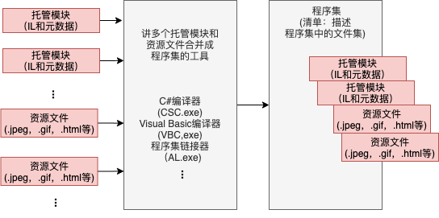
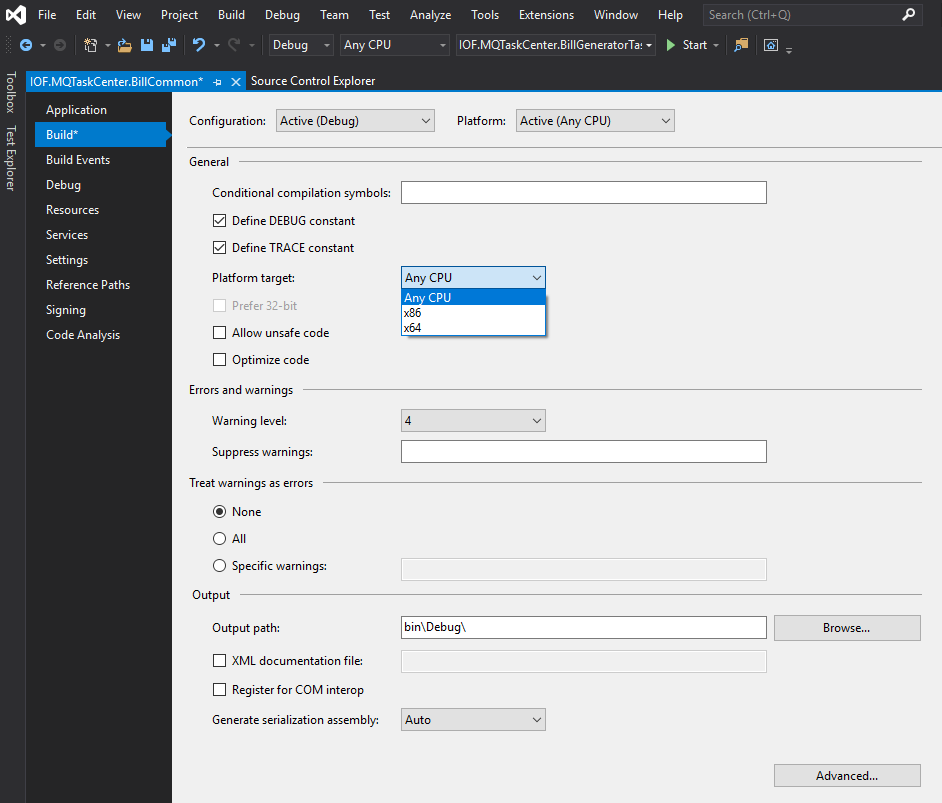
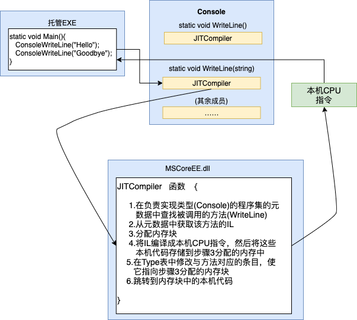
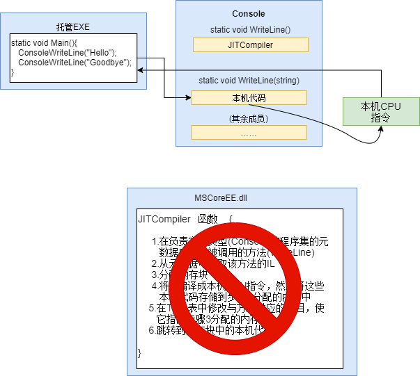

# 第一章 CLR的执行模型
本章内容：  
* <a href="#1_1">将源代码编译成托管模块</a>
* <a href=”#1_2“>将托管模块合并成程序集</a>
* <a href="#1_3">加载公共语言运行时</a>
* <a href="#1_4">执行程序集的代码</a>
* 本机代码生成器：NGen.exe
* Framework类库入门
* 通用类型系统
* 公共语言规范（CLS）
* 与非托管代码的互操作性

Microsoft .NET Framework引入许多新概念、技术和术语。本章概述了.NET Framework如何设计，介绍了Framework包含的一些新技术，并定义了今后要用到的许多术语。还要展示如何将源代码生成为一个应用程序，或者生成为一组可重新分发的组件(文件)——这些组件(文件)中包含类型(类和结构等)。最后，本章解释了应用程序如何执行。

## <a name="1_1">1.1 将源代码编译成托管模块</a>
决定将.NET Framework作为自己的开发平台之后，第一步便是决定要生成什么类型的应用程序或组件。假定你已完成了这个小细节；一切均已合计好，规范已经写好，可以着手开发了。

现在，必须决定要使用哪一种编程语言。这通常是一个艰难的抉择，因为不同的语言各有长处。例如，非托管C/C++可对系统进行低级控制。可完全按自己的想法管理内存，必要时能方便地创建线程。另一方面，使用Microsoft Visual Basic 6.0可以快速生成UI应用程序，并可以方便地控制COM对象和数据库。

顾名思义，**公共语言运行时(Common Language Runtime，CLR)**是一个可由多种编程语言使用的“运行时”。CLR的核心功能(比如内存管理、程序集加载、安全性、异常处理和线程同步)可由面向CLR的所有语言使用。例如，“运行时”使用异常来报告错误;因此，面向它的任何语言都能通过异常来报告错误。另外，“运行时”允许创建线程，所以面向它的任何语言都能创建线程。
> CLR 早期文档中翻译为“公共语言运行库”，但“库”一词很容易让人误解，所以本书翻译为“公共语言运行时”，或简称为“运行时”。为了和“程序运行的时候”区分，“运行时”在作为名词时会添加引号。 ——译注

事实上，在运行时，CLR根本不关心开发人员用哪一种语言写源代码。这意味着在选择编程语言时，应选择最容易表达自己意图的语言。可用任何编程语言开发代码，只要编译器是面向CLR的。

既然如此，不同编程语言的优势何在呢？事实上，可将编译器视为语法检查器和“正确代码”分析器。它们检测源代码，确定你写的一切都有意义，并输出对你的意图进行描述的代码。不同编程语言允许用不同的语法来开发。不要低估这个选择的价值。例如，对于数学和金融应用程序，使用[APL语法](https://baike.baidu.com/item/APL语言标准)来表达自己的意图，相较于使用[Perl](https://www.perl.org/)语法来表达同样的意图，可以节省许多开发时间。

Microsoft 创建好了几个面向“运行时”的语言编译器，其中包括：C++/[CLI](https://baike.baidu.com/item/%E5%91%BD%E4%BB%A4%E8%A1%8C%E7%95%8C%E9%9D%A2/9910197?fromtitle=CLI&fromid=2898851&fr=aladdin)、C#(发音是“C sharp”)、Visual Basic、F#(发音是“F sharp”)、[Iron Python](https://ironpython.net/)、[Iron Ruby](http://ironruby.net/)以及一个[“中间语言”(Intermediate Language,IL)](https://baike.baidu.com/item/%E4%B8%AD%E9%97%B4%E8%AF%AD%E8%A8%80/3784203?fromtitle=IL&fromid=2748286&fr=aladdin)汇编器。除了Microsoft，另一些公司、学院和大学也创建了自己的编译器，也能面向CLR生成代码。我所知道的有针对下列语言的编译器：[Ada](https://baike.baidu.com/item/Ada/5606819),APL,[Caml](http://caml.inria.fr/),[COBOL](https://baike.baidu.com/item/COBOL%E8%AF%AD%E8%A8%80/12789101?fromtitle=COBOL&fromid=1641359&fr=aladdin),[Eiffel](https://baike.baidu.com/item/Eiffel/10445704?fr=aladdin),[Forth](https://baike.baidu.com/item/Forth%E8%AF%AD%E8%A8%80/5598633?fr=aladdin),[Fortran](https://baike.baidu.com/item/FORTRAN%E8%AF%AD%E8%A8%80/295590?fr=aladdin),[Haskell](https://baike.baidu.com/item/Haskell/1152799?fr=aladdin),Lexico,[LISP](https://baike.baidu.com/item/lisp%E8%AF%AD%E8%A8%80/2840299?fr=aladdin),[LOGO](https://baike.baidu.com/item/LOGO%E8%AF%AD%E8%A8%80/5881905?fr=aladdin),[Lua](https://baike.baidu.com/item/lua/7570719?fr=aladdin),[Mercury](https://baike.baidu.com/item/mercury/19275312?fr=aladdin),[ML](https://baike.baidu.com/item/ML%E8%AF%AD%E8%A8%80/7526775?fr=aladdin),[Mondrian](https://baike.baidu.com/item/Mondrian/4892855?fr=aladdin),[Oberon](https://www.bbsmax.com/A/ZOJP1emK5v/),[Pascal](https://baike.baidu.com/item/Pascal/241171?fr=aladdin),[Perl](https://baike.baidu.com/item/Perl%E8%AF%AD%E8%A8%80/1346108?fr=aladdin),[PHP](https://baike.baidu.com/item/PHP/9337?fr=aladdin),[Prolog](https://baike.baidu.com/item/%E9%80%BB%E8%BE%91%E7%BC%96%E7%A8%8B%E8%AF%AD%E8%A8%80/20864034?fromtitle=Prolog&fromid=8379187&fr=aladdin),
[RPG](https://baike.baidu.com/item/RPG%E8%AF%AD%E8%A8%80/7524487?fr=aladdin),[Scheme](https://baike.baidu.com/item/Scheme/8379129?fr=aladdin),[Smalltalk](https://baike.baidu.com/item/Smalltalk%E8%AF%AD%E8%A8%80/22381841?fr=aladdin)和[Tcl/Tk](https://baike.baidu.com/item/Tcl%2FTk/3123738?fr=aladdin).

图1-1展示了编译源代码文件的过程。如图所示，可用支持CLR的任何语言创建源代码文件，然后用对应的编译器检查语法和分析源代码。无论选择哪个编译器，结果都是**托管模块(managed module)**。托管模块是标准的32位Microsoft Windows可移植执行体(PE32)文件，它们都需要CLR才能执行。顺便说一句，托管程序集总是利用Windows的数据执行保护(Data Execution Prevention,DEP)和地址空间布局随机化(Address Space Layout Randomization,ASLR),这两个功能旨在增强整个系统的安全性。
> PE 是Portable Executable(可移植执行体)的简称。

  
图1-1 将源代码编译成托管模块

表1-1总结了托管模块的各个组成部分。
表1-1 托管模块的各个部分  
| 组成部分 | 说明 |
|:-----:|:-------:|
|PE32或PE32+头|标准Windows PE文件头，类似于“公共对象文件格式”（Common Object File Format，COFF）头。如果这个头使用PE32格式，文件能在Windows的32位或64位版本上运行。如果这个头使用PE32+格式，文件只能在Windows的64位版本上运行。这个头还表示了文件类型，包括GUI，CUI或者DLL，并包含一个时间标记来指出文件的生成时间。对于只包含IL代码的模块，PE32(+)头的大多数信息会被忽视。如果是包含本机(native)CPU代码的模块，这个头包含与本机CPU代码有关的信息|
|CLR头|包含使这个模块成为托管模块的信息(可由CLR和一些实用程序进行解释)。头中包含要求的CLR版本，一些标志(flag)，托管模块入口方法(Main方法)的MethodDef元数据token以及模块的元数据、资源、强名称、一些标志及其他不太重要的数据项的位置/大小
|元数据|每个托管模块都包含元数据表。主要有两种表：一种表描述源代码中定义的类型和成员，另一种描述源代码引用的类型和成员|
|IL(中间语言)代码|编译器编译源代码时生成的代码。在运行时，CLR将IL编译成本机CPU指令|

本机代码编译器(native code compilers)生成的是面向特定CPU架构(比如x86，x64或ARM)的代码。相反，每个面向CLR的编译器生成的都是IL(中间语言)代码。(本章稍后会详细讨论IL代码。）IL代码有时称为**托管代码(managed code)**，因为CLR管理它的执行。

除了生成IL，面向CLR的每个编译器还要在每个托管模块中生成完整的元数据(metadata)。元数据简单地说就是一个数据表集合。一些数据表描述了模块中定义了什么(比如类型及其成员)，另一些描述了模块引用了什么(比如导入的类型及其成员)。**元数据是一些老技术的超集**。这些老技术包括COM的“数据库”(Type Library)和“接口定义语言”(Interface Definition Language，IDL)文件。但CLR元数据远比它们全面。另外，和类型库及IDL不同，元数据总是与包含IL代码的文件关联。事实上，元数据总是嵌入和代码相同的EXE/DLL文件中，这使两者密不可分。由于编译器同时生成元数据和代码，把它们绑定一起，并嵌入最终生成的托管模块，所以元数据和它描述的IL代码永远不会失去同步。

元数据有多种用途，下面仅列举一部分。  
* 元数据避免了编译时对原生C/C++头和库文件的需求，因为在实现类型/成员的IL代码文件中，已包含有关引用类型/成员的IL代码文件中，已包含有关引用类型/成员的全部信息。编译器直接从托管模块读取元数据。
* Microsoft Visual Studio用元数据帮助你写代码。“智能感知”(IntelliSense)技术会解析元数据，告诉你一个类型提供了那些方法、属性、事件和字段。对于方法，还能告诉你需要的参数。
* CLR的代码验证过程使用元数据确保代码只执行“类型安全”的操作。(稍后就会讲到验证。)
* 元数据允许将对象的字段序列化到内存块，将其发送给另一台机器，然后反序列化，在远程机器上重建对象状态。
* 元数据允许垃圾回收器跟踪对象生存期。垃圾回收器能判断任何对象的类型，并从元数据知道那个对象中的那些字段引用了其他对象。

第2章 “生成、打包、部署和管理应用程序及类型”将更详细地讲述元数据。

Microsoft 的C#，Visual Basic，F#和IL汇编器总是生成包含托管代码(IL)和托管数据(可进行垃圾回收的数据类型)的模块。为了执行包含托管代码以及/或者托管数据的模块，最终用户必须在自己的计算机上安装好CLR(目前作为.NET Framework的一部分提供)。这类似于为了运行MFC或者Visual Basic 6.0应用程序，用户必须安装Microsoft Foundation Class(MFC)库或者Visual Basic DLL。

Microsoft 的C++编译器默认生成包含非托管(native)代码的EXE/DLL模块，并在运行时操作非托管数据(native内存)。这些模块不需要CLR即可执行。然而，通过指定/**CLR**命令行开关，C++编译器就能生成包含托管代码的模块。当然，最终用户必须安装CLR才能执行这种代码。在前面提到的所有Microsoft编译器中，C++编译器是独一无二的，只有它才允许开发人员同时写托管和非托管代码，并生成到同一个模块中。它也是唯一允许开发人员在源代码中同时定义托管和非托管数据类型的Microsoft编译器。Microsoft C++编译器的灵活性是其他编译器无法比拟的，因为它允许开发人员在托管代码中使用原生 C/C++代码，时机成熟后再使用托管类型。

## <a name=”1_2“>1.2 将托管模块合并成程序集</a>
CLR实际不和模块工作。它和程序集工作。**程序集**(assembly)是抽象概念，初学者很难把握它的精髓。首先，程序集是一个或多个模块/资源问价的逻辑性分组。其次，程序集是重用、安全性以及版本控制的最小单元。取决于你选择的编译器或工具，既可生成单文件程序集，也可生成多文件程序集。在CLR的世界中，程序集相当于”组件“。

第2章会深入探讨程序集，这里不打算花费太多笔墨。只想提醒一句：利用”程序集“这种概念性的东西，一组文件可作为一个单独的实体来对待。

图 1-2 有助于你理解程序集。图中一些托管模块和资源(或数据)文件准备交由一个工具处理。工具生成代表文件逻辑分组的一个PE32(+)文件。实际发生的事情是，这个PE32(+)文件包含一个名为**清单**(manifest)的数据块。清单也是元数据表的集合。这些表描述了构成程序集的文件、程序集中的文件所实现的公开导出的类型【所谓公开导出的类型，就是程序集中定义的public类型，它们在程序集内部外部均可见
。】以及与程序集关联的资源或数据文件。   

  
图 1-2 将托管模块合并成程序集

编译器默认将生成的托管模块转换成程序集。也就是说，C#编译器生成的是含有清单的托管模块。清单指出程序集只由一个文件构成。所以，对于只有一个托管模块而且无资源(或数据)文件的项目，程序集就是托管模块，生成过程中无需执行任何额外的步骤。但是，如果希望将一组文件合并到程序集中，就必须掌握更多的工具(比如程序集链接器 AL.exe)及其命令行选项。第2章将解释这些工具和选项。

对于一个可重用的、可保护的、可版本控制的最贱，程序集把它的逻辑表示和物理表示区分开。具体如何用不同的文件划分代码和资源，这完全取决于个人。例如，可以将很少用到的类型或资源放到单独的文件中，并把这些文件作为程序集的一部分。取决于运行时的需要，可从网上下载这些单独的文件。如果文件永远用不上，则永远不会下载。这样不仅节省磁盘空间，还缩短了安装时间。利用程序集，可以在不同的地方部署文件，同时仍然将所有文件作为一个整体来对待。

在程序集的模块中，还包含与引用的程序集有关的信息(包括他们的版本号)。这些信息使程序集能够**自描述**(self-describing)。也就是说，CLR 能判断为了执行程序集中的代码，程序集的直接依赖对象(immediate dependency)是什么。不需要在注册表或 Active Directory Domain Services(ADDS)中保存额外的信息。由于无需额外信息，所以和非托管组件相比，程序集更容易部署。

## <a name="1_3">1.3 加载公共语言运行时</a>
生成的每个程序集既可以是可执行应用程序，也可以是DLL(其中含有一组由可执行程序使用的类型)。当然，最终是由 CLR 管理这些程序集中的代码的执行。这意味着目标机器必须安装好.NET Framework。Microsoft 创建了一个重分发包(redistribution package),允许将.Net Framework免费分发并安装到用户的计算机上。一些版本的Windows在发售时就已经打包好了.NET Framework。

要知道是否已安装.NET Framework， 只需检查%SystemRoot%\System32 目录中的MSCorEE.dll文件。存在该文件，表明.NET Framework 已安装。然而，一台机器可能同时安装好几个版本的.NET Framework。要了解安装了哪些版本的.NET Framework，请检查以下目录的子目录：
``` file
%SystemRoot%\Microsoft.NET\Framework
%SystemRoot%\Microsoft.NET\Framework64
```

.NET Framework SDK提供了名为CLRVer.exe的命令行实用程序，能列出机器上安装的所有CLR版本。还能列出机器中正在运行的进程使用的CLR版本号，方法是使用 **-all**命令行开关，或指定目标进程ID。

学习CLR具体如何加载之前，稍微花些时间了解Windows的32位和64位版本。如果程序集文件只包含类型安全的托管代码，代码在32位和64位Windows上都能正常工作。在这两种Windows上运行，源代码无需任何改动。事实上，编译器最终生成的EXE/DLL文件在 Windows的 x86和x64 版本上都能正常工作。此外，Windows Store应用或类库能在Windows RT机器(使用ARM CPU)上运行。也就是说，只要机器上安装了对应版本的.NET Framework，文件就能运行。

极少数情况下，开发人员希望代码只在一个特定版本的Windows上运行。例如，要使用不安全的代码，或者要和面向一种特定CPU架构的非托管代码进行互操作，就可能需要这样做。为了帮助这些开发人员，C#编译器提供了一个/**platform** 命令行开关选项。这个开关允许指定最终生成的程序集只能在运行32位 Windows 版本的 x86 机器上使用，只能在运行64位 Windows 的 x64机器上使用，或者只能在运行32位Windows RT 的ARM机器上使用。不指定具体平台的话，默认选项就是**anycpu**，表明最终生成的程序集能在任何版本的Windows 上运行。Visual Studio 用户要想设置目标平台，可以打开项目的属性页，从”生成“选项卡的”目标平台“列表中选择一个选项，如果1-3所示。
  
图1-3 使用 Visual Studio 设置目标平台  

取决于/**platform** 开关选项，C#编译器生成的程序集包含的要么是PE32头，要么是PE32+头。除此之外，编译器还会在头中指定要求什么CPU架构(如果使用默认值**anycpu**，则代表任意CPU架构)。Microsoft 发布了SDK 命令行实用程序 DumpBin.exe 和 CorFlags.exe，可用它们检查编译器生成的托管模块所嵌入的信息。

可执行文件运行时， Windows检查文件头，判断需要32位还是64位地址空间。PE32文件在32位或64位地址空间中均可运行，PE32+文件则需要64位地址空间。Windows 还会检查头中嵌入的CPU架构信息，确保当前计算机的CPU符合要求。最后，WIndows的64位版本通过WoW64(Windows on Windows64)技术运行32位Windows应用程序。

表1-2总结了两方面的信息。其一，为C#编译器指定不同/**platform**命令行开关将得到哪种托管模块。其二 ，应用程序在不同版本的Windows上如何运行。  
| /platform 开关| 生成的托管模块 | x86 Windows | x64 Windows | ARM Windows RT |
|:---:|:---:|:---:|:---:|:---:|
|anycpu(默认)|PE32/任意CPU架构|作为32位应用程序运行|作为64位应用程序运行|作为32位应用程序运行|
|anycpu32bitpreferred|PE32/任意CPU架构|作为32位应用程序运行|作为WoW64应用程序运行|作为32位应用程序运行|
|x86|PE32/x86|作为32位应用程序运行|作为WoW64应用程序运行|不运行|
|x64|PE32+/x64|不运行|作为64位应用程序运行|不运行|
|ARM|PE32/ARM|不运行|不运行|作为32位应用程序运行|  

Windows检查EXE文件头，决定是创建32位还是64位进程之后，会在进程地址空间加载MSCorEE.dll的 x86,x64或ARM版本。如果是Windows的x86或ARM版本，MSCorEE.dll的x86版本在`%SystemRoot%\System32` 目录中。如果是Windows的x64版本，MSCorEE.dll的x86版本在`%SystemRoot%\SysWow64` 目录中，64位版本则在`%SystemRoot%\System32` 目录中(为了向后兼容)。然后，进程的主线程调用MSCorEE.dll中定义的一个方法。这个方法初始化CLR，加载EXE程序集，再调用其入口方法(**Main**)。随机，托管应用程序启动并运行。【可在代码中查询**Environment** 的 **Is64BitOperatingSystem**属性，判断是否在64位 Windows 上运行。还可查询**Environment** 的 **Is64BitProcess** 属性，判断是否在64位地址空间中运行。】  

> 注意 Microsoft C#编译器 1.0 或 1.1 版本生成的程序集包含的是PE32头，而且未明确指定CPU架构，但在加载时，CLR认为这些程序集只用于x86。对于可执行文件，这增强了应用程序与64位系统的兼容能力，因为可执行文件将在WoW64中加载，为进程提供和Windows 的32位 x86版本非常相似的环境。  

## <a name="1_4">1.4 执行程序集的代码</a>
如前所述，托管程序集同时包含元数据和IL。IL 是与CPU无关的机器语言，是 Microsoft 在请教了外面的几个商业及学术性语言/编译器的作者之后，费尽心思开发出来的。IL 比大多数CPU机器语言都高级。IL 能访问和操作对象类型，并提供了指令来创建和初始化对象、调用对象上的虚方法以及直接操作数组元素。甚至提供了抛出和捕捉异常的指令来实现错误处理。可将IL 视为一种面向对象的机器语言。

开发人员一般用C#，Visual Basic 或F#等高级语言进行编程。它们的编译器将生成IL。然而，和其他任何机器语言一样，IL也能使用汇编语言编写，Microsoft 甚至专门提供了名为ILAsm.exe的IL 汇编器和名为ILDasm.exe的IL反编译器。  

注意，高级语言通常只公开了CLR全部功能的一个子集。然而，IL汇编语言允许开发人员访问CLR的全部功能。所以，如果你选择的编程语言隐藏了你迫切需要的一个CLR功能，可以换用IL 汇编语言或者提供了所需功能的另一种编程语言来写那部分代码。  

>重要提示 在我看来，允在在不同编程语言之间方便地切换，同时又保持紧密集成，这是CLR的一个很出众的特点。遗憾的是，许多开发人员都忽视了这一点。例如，C# 和 Visual Basic 等语言能很好地执行I/O操作，APL语言能很好地执行高级工程或金融计算。通过CLR，应用程序的I/O部分可用C#编写，工程计算部分则换用APL编写。CLR在这些语言之间提供了其他技术无法媲美的集成度，使”混合语言编程“成为许多开发项目一个值得慎重考虑的选择。  

要知道 CLR 具体提供了那些功能，唯一的办法就是阅读 CLR 文档。本书致力于讲解CLR的功能，以及C#语言如何公开这些功能。对于C#没有公开的CLR功能，本书也进行了说明。相比之下，其他大多数书籍和文章都是从一种语言的角度讲解CLR，造成大多数开发人员误以为CLR只提供了他们选用的那一种语言所公开的那一部分功能。不过，只要用一种语言就能达到目的，这种误解不一定是坏事。

为了执行方法，首先必须把方法的IL转换成本机(naive)CPU 指令。这是 CLR 的JIT(just-in-time或者”即时“)编译器的职责。

图1-4展示了一个方法首次调用时发生的事情。  

  
图1-4 方法的首次调用

就在 **Main**方法执行之前，CLR会检测出 **Main**的代码引用的所有类型。这导致CLR分配一个内部数据结构来管理对引用类型的访问。图1-4的**Main** 方法引用了一个 **Console**类型，导致CLR分配一个内部结构。在这个内部数据结构中，**Console** 类型定义的每个方法都有一个对应的记录项。【本书将entry翻译成”记录项“，其他译法还有条目、入口等等。虽然某些entry包含了一个地址，所以相当于一个指针，但并非所有entry都是这样的。在其他entry中，还可能包含了文件名、类型名、方法名和位标志等信息。 ——译注】。每个记录项都含有一个地址，根据此地址即可找到方法的实现。对这个结构初始化时，CLR将每个及录项都设置成(指向)包含在CLR内部的一个未编档函数。我将该函数称为**JITCompiler**。

**Main** 方法首次调用 **WriteLine**时，**JITCompiler**函数会被调用。**JITCompiler**函数负责将方法的IL 代码编译成本机CPU指令。由于IL 是”即时“(just in time)编译的，所以通常将CLR的这个组件称为JITter或者 **JIT编译器**。

> 注意 如果应用程序在Windows的x86版本或者WoW64中运行，JIT编译器将生成x86指令。作为64位应用程序在Windows的x64版本中运行，将生成x64指令。在Windows的ARM版本中运行，将生成ARM指令。

**JITCompiler** 函数被调用时，它知道要调用的是哪个方法，以及具体是什么类型定义了该方法。然后，**JITCompiler** 会在定义(该类型的)程序集的元数据中查找被调用方法的IL。接着，**JITCompiler** 验证IL代码，并将IL 代码编译成本机CPU指令。本机CPU指令保存到动态分配的内存块中。然后，**JITCompiler** 回到CLR 为**类型**创建的**内部数据结构**，找到与被调用方法对应的那条记录，修改最初对**JITCompiler** 的引用，使其指向内存块(其中包含了刚才编译好的本机CPU指令)的地址。最后，**JITCompiler** 函数跳转到内存块中的代码。这些代码正是**WriteLine** 方法(获取单个**String** 参数的那个版本)的具体实现。代码执行完毕并返回时，会回到**Main** 中的代码，并象往常一样继续执行。

现在， **Main** 要第二次调用 **WriteLine**。这一次，由于已对**WriteLine** 的代码进行了验证和编译，所以会直接执行内存块中的代码，完全跳过 **JITCompiler** 函数。 **WriteLine** 方法执行完毕后，会再次回到**Main**。图1-5展示了第二次调用**WriteLine**时发生的事情。
  
图 1-5 方法的第二次调用
方法仅在首次调用时才会有一些性能损失。以后对该方法的所有调用都以本机代码的形式全速运行，无需重新验证IL并把它编译成本机代码。

**JIT**编译器将本机CPU指令存储到动态内存中。这意味着一旦应用程序终止，编译好的代码也会被丢弃。所以，将来再次运行应用程序，或者同时启动应用程序的两个实例(使用两个不同的操作系统进程)，JIT编译器必须再次将IL编译成本机指令。对于某些应用程序，这可能显著增加内存耗用。相比之下，本机(native)应用程序的只读代码页可由应用程序正在运行的所有实例共享。

对于大多数应用程序，JIT编译造成的性能损失并不显著。大多数应用程序都反复调用相同的方法。应用程序运行期间，这些方法只会对性能造成一次性的影响。另外，在**方法内部**花费的时间很有可能比花在调用方法上的时间多得多。

还要注意，CLR 的JIT 编译器会对本机代码进行优化，这类似于非托管C++编译器的后端所做的事情。同样，可能花较多时间生成优化代码。但和没有优化时相比，代码优化后性能更佳。
|编译器开关设置|C#IL代码质量|JIT本机代码质量|
|:--:|:---:|:---:|
|/optimize-/debug-(默认)|未优化|有优化|
|/optimize-/debug(+/full/pdbonly)|未优化|有优化|
|/optimize+/debug(-/+/full/pdbonly)|有优化|有优化|
两个C#编译器开关会影响代码优化：**/optimize** 和 **/debug**。下面总了这些开关对 C#编译器生成的IL 代码的质量的影响，以及对JIT编译器生成的本机代码的质量的影响。
