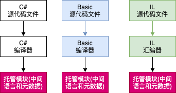

# 第一章 CLR的执行模型
本章内容：  
* <a href="#1_1">将源代码编译成托管模块</a>
* 将托管模块合并成程序集
* 加载公共语言运行时
* 执行程序集的代码
* 本机代码生成器：NGen.exe
* Framework类库入门
* 通用类型系统
* 公共语言规范（CLS）
* 与非托管代码的互操作性

Microsoft .NET Framework引入许多新概念、技术和术语。本章概述了.NET Framework如何设计，介绍了Framework包含的一些新技术，并定义了今后要用到的许多术语。还要展示如何将源代码生成为一个应用程序，或者生成为一组可重新分发的组件(文件)——这些组件(文件)中包含类型(类和结构等)。最后，本章解释了应用程序如何执行。

## <a name="1_1">1.1 将源代码编译成托管模块</a>
决定将.NET Framework作为自己的开发平台之后，第一步便是决定要生成什么类型的应用程序或组件。假定你已完成了这个小细节；一切均已合计好，规范已经写好，可以着手开发了。

现在，必须决定要使用哪一种编程语言。这通常是一个艰难的抉择，因为不同的语言各有长处。例如，非托管C/C++可对系统进行低级控制。可完全按自己的想法管理内存，必要时能方便地创建线程。另一方面，使用Microsoft Visual Basic 6.0可以快速生成UI应用程序，并可以方便地控制COM对象和数据库。

顾名思义，公共语言运行时(Common Language Runtime，CLR)是一个可由多种编程语言使用的“运行时”。CLR的核心功能(比如内存管理、程序集加载、安全性、异常处理和线程同步)可由面向CLR的所有语言使用。例如，“运行时”使用异常来报告错误;因此，面向它的任何语言都能通过异常来报告错误。另外，“运行时”允许创建线程，所以面向它的任何语言都能创建线程。
> CLR 早期文档中翻译为“公共语言运行库”，但“库”一词很容易让人误解，所以本书翻译为“公共语言运行时”，或简称为“运行时”。为了和“程序运行的时候”区分，“运行时”在作为名词时会添加引号。 ——译注

事实上，在运行时，CLR根本不关心开发人员用哪一种语言写源代码。这意味着在选择编程语言时，应选择最容易表达自己意图的语言。可用任何编程语言开发代码，只要编译器是面向CLR的。

既然如此，不同编程语言的优势何在呢？事实上，可将编译器视为语法检查器和“正确代码”分析器。它们检测源代码，确定你写的一切都有意义，并输出对你的意图进行描述的代码。不同编程语言允许用不同的语法来开发。不要低估这个选择的价值。例如，对于数学和金融应用程序，使用[APL语法](https://baike.baidu.com/item/APL语言标准)来表达自己的意图，相较于使用[Perl](https://www.perl.org/)语法来表达同样的意图，可以节省许多开发时间。

Microsoft 创建好了几个面向“运行时”的语言编译器，其中包括：C++/[CLI](https://baike.baidu.com/item/%E5%91%BD%E4%BB%A4%E8%A1%8C%E7%95%8C%E9%9D%A2/9910197?fromtitle=CLI&fromid=2898851&fr=aladdin)、C#(发音是“C sharp”)、Visual Basic、F#(发音是“F sharp”)、[Iron Python](https://ironpython.net/)、[Iron Ruby](http://ironruby.net/)以及一个[“中间语言”(Intermediate Language,IL)](https://baike.baidu.com/item/%E4%B8%AD%E9%97%B4%E8%AF%AD%E8%A8%80/3784203?fromtitle=IL&fromid=2748286&fr=aladdin)汇编器。除了Microsoft，另一些公司、学院和大学也创建了自己的编译器，也能面向CLR生成代码。我所知道的有针对下列语言的编译器：[Ada](https://baike.baidu.com/item/Ada/5606819),APL,[Caml](http://caml.inria.fr/),[COBOL](https://baike.baidu.com/item/COBOL%E8%AF%AD%E8%A8%80/12789101?fromtitle=COBOL&fromid=1641359&fr=aladdin),[Eiffel](https://baike.baidu.com/item/Eiffel/10445704?fr=aladdin),[Forth](https://baike.baidu.com/item/Forth%E8%AF%AD%E8%A8%80/5598633?fr=aladdin),[Fortran](https://baike.baidu.com/item/FORTRAN%E8%AF%AD%E8%A8%80/295590?fr=aladdin),[Haskell](https://baike.baidu.com/item/Haskell/1152799?fr=aladdin),Lexico,[LISP](https://baike.baidu.com/item/lisp%E8%AF%AD%E8%A8%80/2840299?fr=aladdin),[LOGO](https://baike.baidu.com/item/LOGO%E8%AF%AD%E8%A8%80/5881905?fr=aladdin),[Lua](https://baike.baidu.com/item/lua/7570719?fr=aladdin),[Mercury](https://baike.baidu.com/item/mercury/19275312?fr=aladdin),[ML](https://baike.baidu.com/item/ML%E8%AF%AD%E8%A8%80/7526775?fr=aladdin),[Mondrian](https://baike.baidu.com/item/Mondrian/4892855?fr=aladdin),[Oberon](https://www.bbsmax.com/A/ZOJP1emK5v/),[Pascal](https://baike.baidu.com/item/Pascal/241171?fr=aladdin),[Perl](https://baike.baidu.com/item/Perl%E8%AF%AD%E8%A8%80/1346108?fr=aladdin),[PHP](https://baike.baidu.com/item/PHP/9337?fr=aladdin),[Prolog](https://baike.baidu.com/item/%E9%80%BB%E8%BE%91%E7%BC%96%E7%A8%8B%E8%AF%AD%E8%A8%80/20864034?fromtitle=Prolog&fromid=8379187&fr=aladdin),
[RPG](https://baike.baidu.com/item/RPG%E8%AF%AD%E8%A8%80/7524487?fr=aladdin),[Scheme](https://baike.baidu.com/item/Scheme/8379129?fr=aladdin),[Smalltalk](https://baike.baidu.com/item/Smalltalk%E8%AF%AD%E8%A8%80/22381841?fr=aladdin)和[Tcl](https://baike.baidu.com/item/TCL%E8%AF%AD%E8%A8%80/8377624?fr=aladdin)/Tk.

图1-1展示了编译源代码文件的过程。如图所示，可用支持CLR的任何语言创建源代码文件，然后用对应的编译器检查语法和分析源代码。无论选择哪个编译器，结果都是**托管模块(managed module)**。托管模块是标准的32位Microsoft Windows可移植执行体(PE32)文件，它们都需要CLR才能执行。顺便说一句，托管程序集总是利用Windows的数据执行保护(Data Execution Prevention,DEP)和地址空间布局随机化(Address Space Layout Randomization,ASLR),这两个功能旨在增强整个系统的安全性。
> PE 是Portable Executable(可移植执行体)的简称。

  
图1-1 将源代码编译成托管模块

