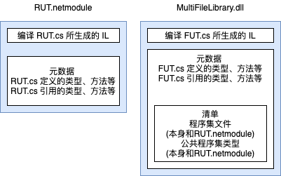
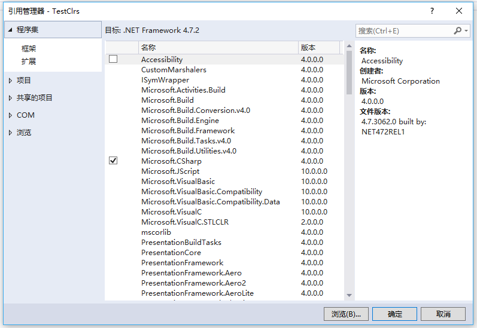
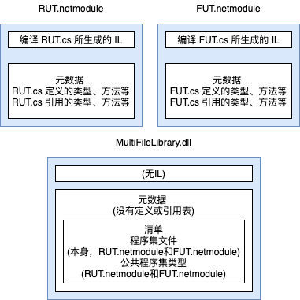
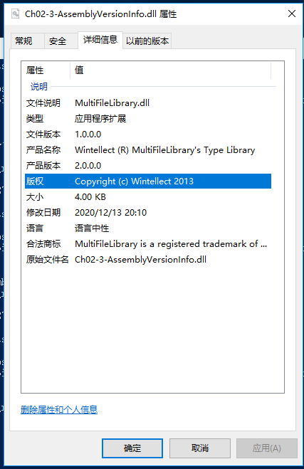
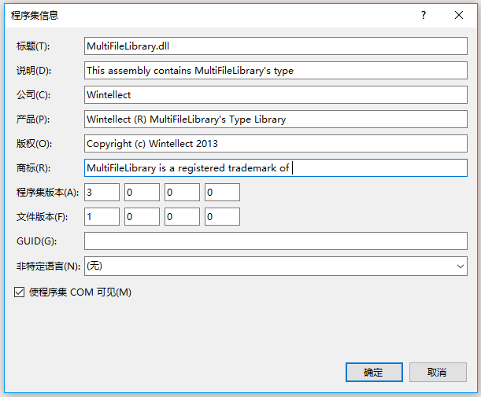

# 第 2 章 生成、打包、部署和管理应用程序及类型

本章内容：
* <a href="#2_1">.NET Framework 部署目标</a>
* <a href="#2_2">将类型生成到模块中</a>
* <a href="#2_3">元数据概述</a>
* <a href="#2_4">将模块合并成程序集</a>
* <a href="#2_5">程序集版本资源信息</a>
* <a href="#2_6">语言文化</a>
* <a href="#2_7">简单应用程序部署(私有部署的程序集)</a>
* <a href="#2_8">简单管理控制(配置)</a>

在解释如何为 Microsoft .Net Framework 开发程序之前，首先讨论一下生成、打包和部署应用程序及其类型的步骤。本章重点解释如何生成仅供自己的应用程序使用的程序集。第 3 章“共享程序集和强命名程序集”将讨论更高级的概念，包括如何生成和使用程序集，使其中包含的类型能由多个应用程序共享。这两章会谈及管理员能采用什么方式来影响应用程序及其类型的执行。

当今的应用程序都由多个类型构成，这些类型通常是由你的和 Microsoft 创建的。除此之外，作为一个新兴产业，组件厂商们也纷纷着手构建一些专用类型，并将其出售给各大公司，以缩短软件项目的开发时间。开发这些类型时，如果使用的语言是面向 CLR 的，这些类型就能无缝地共同工作。换言之，用一种语言写的类型可以将另一个类型作为自己的基类使用，不用关心基类用什么语言开发。

本章将解释如何生成这些类型，并将其打包到文件中以进行部署。另外，还会提供一个简短的历史回顾，帮助开发人员理解 .NET Framework 希望解决的某些问题。

## <a name="2_1">2.1 .NET Framework 部署目标</a>

Windows 多年来一直因为不稳定和过于复杂而口碑不佳。不管对它的评价对不对，之所以造成这种状况，要归咎于几方面的原因。首先，所有应用程序都使用来自 Microsoft 或其他厂商的动态链接库(Dynamic-Link Library,DLL)，由于应用程序要执行多个厂商的代码，所以任何一段代码的开发人员都不能百分之百保证别人以什么方式使用这段代码。虽然这种交互可能造成各种各样的麻烦，但实际一般不会出太大问题，因为应用程序在部署前会进行严格测试和调试。

但对于用户，当一家公司决定更新其软件产品的代码，并将新文件发送给他们时，就可能出问题。新文件理论上应该向后兼容以前的文件，但谁能对此保证呢？事实上，一家厂商更新代码时，经常都不可能重新测试和调试之前发布的所有应用程序，无法保证自己的更改不会造成不希望的结果。

很多人都可能遭遇过这样的问题：安装新应用程序时，它可能莫名其妙破坏了另一个已经安装好的应用程序。这就是所谓的“DLL hell”。这种不稳定会对普通计算机用户带来不小的困扰。最终结果是用户必须慎重考虑是否安装新软件。就像我个人来说，有一些重要的应用程序是平时经常都要用到的，为了避免对它们产生不好的影响，我不会冒险去”尝鲜“。

造成 Windows 口碑不佳的第二个原因是安装的复杂性，如今，大多数应用程序在安装时都会影响到系统的全部组件。例如，安装一个应用程序会将文件复制到多个目录，更新注册表设置，并在桌面和”开始“菜单上安装快捷方式。问题是，应用程序不是一个孤立的实体。应用程序备份不易，因为必须复制应用程序的全部文件以及注册表中的相关部分。除此之外，也不能轻松地将应用程序从一台机器移动到另一台机器。只有再次运行安装程序，才能确保所有文件和注册表设置的正确性。最后，即使卸载或移除了应用程序，也免不了担心它的一部分内容仍潜伏在我们的机器中。

第三个原因涉及到安全性。应用程序安装时会带来各种文件，其中许多是由不用的公司开发的。此外， Web 应用程序经常悄悄下载一些代码(比如 ActiveX 控件)，用户根本注意不到自己打的机器上安装了这些代码。如今，这种代码能够执行任何操作，包括删除文件或者发送电子邮件。用户完全有理由害怕安装新的应用程序，因为它们可能造成各种各样的危害。考虑到用户的感受，安全性必须集成到系统中，使用户能够明确允许或禁止各个公司开发的代码访问自己的系统资源。

阅读本章和下一章可以知道， .NET Framework 正常尝试彻底解决 DLL hell 的问题。另外， .NET Framework 还在很大程度上解决了应用程序状态在用户硬盘上四处分散的问题。例如，和 COM 不同，类型不再需要注册表中的设置。但遗憾的是，应用程序还是需要快捷方式。安全性方面，.NET Framework 包含称为”代码访问安全性“(Code Access Security)的安全模型。 Windows 安全性基于用户身份，而代码访问安全性允许宿主设置权限，控制加载的组件能做的事情。像 Microsoft SQL Server 这样的宿主应用程序只能将少许权限授予代码，而本地安装的(自宿主)应用程序可获得完全信任(全部权限)。以后会讲到，.NET Framework 允许用户灵活地控制那些东西能够安装，那些东西能够运行。他们对自己机器的控制上升到一个前所未有的高度。

## <a name="2_2">2.2 将类型生成到模块中</a>

本节讨论如何将包含多个类型的源代码文件转变为可以部署的文件。先看下面这个简单的应用程序。

```C#
public sealed class Program {
  public static void Main(){
      System.Console.WriteLine("Hi");
  }
}
```

该应用程序定义了 `Program` 类型，其中有名为 `Main` 的 `public static` 方法。`Main` 中引用了另一个类型 `System.Console`。 `System.Console` 是 Microsoft 实现好的类型，用于实现这个类型的各个方法的IL 代码存储在 `MSCorLib.dll` 文件中。总之，应用程序定义了一个类型，还使用了其他公司提供的类型。

为了生成这个示例应用程序，请将上述代码放到一个源代码文件中(假定为Program.cs)，然后再命令行执行以下命令： 

>`csc.exe /out:Program.exe /t:exe /r:MSCorLib.dll Program.cs`  

这个命令行指示 C# 编译器生成名为 Program.exe 的可执行文件 (`/out:Prpgram.exe`)。生成的文件是 Win32 控制台应用程序类型 (`/t\[arget\]:exe`)。  

C# 编译器处理源文件时，发现代码引用了 `System.Console`类型的 `WriteLine` 方法。此时，编译器要核实该类型确实存在，它确实有 `WriteLine` 方法，而且传递的实参与方法形参匹配。由于该类型在 C# 源代码中没有定义，所以要顺利通过编译，必须向 C# 编译器提供一组程序集，使它能解析对外部类型的引用。在上述命令行中，我添加了 `/r[eference]:MSCorLib.dll` 开关，告诉编译器在 `MSCorLib.dll` 程序集中查找外部类型。

`MSCorLib.dll` 是特殊文件，它包含所有核心类型，包括 `Byte`，`Char`，`String`，`Int32` 等等。事实上，由于这些类型使用得如此频繁，以至于 C# 编译器会自动引用 `MSCorLib.dll` 程序集。换言之，命令行其实可以简化成下面这样(省略`/r`开关)：  

>`csc.exe /out:Program.exe /t:exe Program.cs`  

此外，由于`/out:Program.exe` 和 `/t:exe` 开关是 C# 编译器的默认规定，所以能继续简化成以下形式：  

>`csc.exe Program.cs`

如果因为某个原因不想 C# 编译器自动引用 `MSCorLib.dll` 程序集，可以使用`/nostdlib` 开关。 Microsoft 生成`MSCorLib.dll` 程序集自身时便使用了这个开关。例如，用以下命令行编译 `Program.cs` 会报错，因为它使用的 `System.Console` 类型是在`MSCorLib.dll`中定义的：  

>`csc.exe /out:Program.exe /t:exe /nostdlib Program.cs`

现在更深入地思考一下 C# 编译器生成的 `Program.exe` 文件。这个文件到底是什么？首先，它是标准PE (可移植执行体，Potable Executable)文件。这意味着运行 32 位或 64 位 Windows 的计算机能加载它，并通过执行某些操作。 Windows 文件支持三种应用程序。生成控制台用户界面(Console User Interface，CUI)应用程序使用`/t:exe` 开关；生成图形用户界面(Graphical User Interface，GUI)应用程序使用`/t:winexe` 开关；生成 Windows Store 应用使用 `/t:appcontainerexe` 开关。

### 响应文件

结束对编译器开关的讨论之前，让我们花点时间了解一下**响应文软**，响应文件是包含一组编译器命令行开关的文本文件。执行 CSC.exe 时，编译器打开响应文件，并使用其中包含的所有开关，感觉就像是这些开关直接在命令行上传递给 CSC.exe。要告诉编译器使用响应文件，在命令行中，请在 @ 符号之后指定响应文件的名称。例如，假定响应文件 MyProject.rsp 包含以下文本：  

```cmd
/out:MyProject.exe
/tartget:winexe
```

 为了让 CSC.exe 使用这些设置，可以像下面这样调用它：

 >`csc.exe @MyProject.rsp CodeFile1.cs CodeFile2.cs`

这就告诉了C# 编译器输出文件的名称和要创建哪种类型的应用程序。可以看出，响应文件能带来一些便利，不必每次编译项目时都手动指定命令行参数。

C# 编译器支持多个响应文件。除了在命令行上显式指定的文件，编译器还会自动查找名为 CSC.rsp 的文件。 CSC.exe运行时，会在 CSC.exe 所在的目录查找全局 CSC.rsp文件。想应用于自己所有项目的设置应放到其中。编译器汇总并使用所有响应文件中的设置。本地和全局响应文件中的某个设置发生冲突，将以本地设置为准。类似地，命令行上显示指定的设置将覆盖本地响应文件中的设置。

.NET Framework 安装时会在`%SystemRoot%\Microsoft.NET\Framework(64)\vX.X.X` 目录中安装默认全局 CSC.rsp 文件(X.X.X是你安装的 .NET Framework 的版本号)。这个文件的最新版本包含以下开关:

> 我搜的`C:\Program Files (x86)\MSBuild\14.0\Bin`

```rsp
# Copyright (c)  Microsoft.  All Rights Reserved.  Licensed under the Apache License, Version 2.0.  See License.txt in the project root for license information.

# This file contains command-line options that the C#
# command line compiler (CSC) will process as part
# of every compilation, unless the "/noconfig" option
# is specified. 

# Reference the common Framework libraries
/r:Accessibility.dll
/r:Microsoft.CSharp.dll
/r:System.Configuration.dll
/r:System.Configuration.Install.dll
/r:System.Core.dll
/r:System.Data.dll
/r:System.Data.DataSetExtensions.dll
/r:System.Data.Linq.dll
/r:System.Data.OracleClient.dll
/r:System.Deployment.dll
/r:System.Design.dll
/r:System.DirectoryServices.dll
/r:System.dll
/r:System.Drawing.Design.dll
/r:System.Drawing.dll
/r:System.EnterpriseServices.dll
/r:System.Management.dll
/r:System.Messaging.dll
/r:System.Runtime.Remoting.dll
/r:System.Runtime.Serialization.dll
/r:System.Runtime.Serialization.Formatters.Soap.dll
/r:System.Security.dll
/r:System.ServiceModel.dll
/r:System.ServiceModel.Web.dll
/r:System.ServiceProcess.dll
/r:System.Transactions.dll
/r:System.Web.dll
/r:System.Web.Extensions.Design.dll
/r:System.Web.Extensions.dll
/r:System.Web.Mobile.dll
/r:System.Web.RegularExpressions.dll
/r:System.Web.Services.dll
/r:System.Windows.Forms.dll
/r:System.Workflow.Activities.dll
/r:System.Workflow.ComponentModel.dll
/r:System.Workflow.Runtime.dll
/r:System.Xml.dll
/r:System.Xml.Linq.dll
```

由于全局 CSC.rsp 文件引用了列出的所有程序集，所以不必使用 C# 编译器的 `/reference` 开关显示引用这些程序集。这个响应文件为开发人员带来了极大的方便，因为可以直接使用 Microsoft 发布的各个程序集中定义的类型和命名空间，不必每次编译时都指定 `/reference` 编译器开关。

引用所有这些程序集对编译器的速度有一点影响。但是，如果源代码没有引用上述任何程序集定义的类型和成员，就不会影响最终的程序集文件，也不会影响程序的执行性能。

当然，要进一步简化操作，还可在全局 CSC.rsp 文件中添加自己的开关。但这样一来，在其他机器上重现代码的生成环境就比较困难了：在每台用于生成的机器上，都必须以相同方式更新 CSC.rsp。 另外，指定 `/noconfig` 命令开关，编译器将忽略本地和全局 CSC.rsp 文件。

## <a name="2_3">元数据概述</a>

现在，我们知道了创建的是什么类型的 PE 文件。但是， Program.exe 文件中到底有什么？托管 PE 文件由 4 部分构成：PE32(+)头、CLR头、元数据以及 IL。PE32(+)头是 Windows 要求的标准信息。CLR 头是一个小的信息块，是需要 CLR 的模块(托管模块)特有的。这个头包含模块生成时所面向的 CLR 的 major(主)和 minor(次)版本号；一些标志(flag)；一个 **MethodDef** token(稍后详述)，该 token 指定了模块的入口方法(前提是该模块是CUI、GUI 或 Windows Store 执行体)；一个可选的强名称数字签名(将在第3章讨论)。最后，CLR 头还包含模块内部的一些元数据表的大小和偏移量。可以查看 `CorHdr.h` 头文件定义的 `IMAGE_COR20_HEADER` 来了解 CLR 头的具体格式。

元数据是有几个表构成的二级制数据块。有三种表，分别是定义表(definition table)、引用表(reference table)和清单表(manifest table)。表 2-1 总结了模块元数据块中常用的定义表。  

  表 2-1 常用的数据定义表
|元数据定义表名称|说明|
|:---:|:---:|
|ModuleDef|总是包含对模块进行标识的一个记录项。该记录项包含模块文件名和扩展名(不含路径)，以及模块版本ID(形式为编译器创建的GUID)。这样可在保留原始名称记录的前提下自由重命名文件。但强烈反对重命名文件，因为可能妨碍 CLR 在运行时正确定位程序集|
|TypeDef|模块定义的每个类型在这个表中都有一个记录项。每个记录项都包含类型的名称、基类型、一些标志(`public`，`private`等)以及一些索引，这些索引指向 MethodDef 表中该类型的方法、FieldDef 表中该类型的字段、PropertyDef 表中该类型的属性以及 EventDef 表中该类型的事件|
|MethodDef|模块定义的每个方法在这个表中都有一个记录项。每个记录项都包含方法的名称、一些标志(`private`，`public`，`virtual`，`abstract`，`static`，`final` 等)、签名以及方法的 IL 代码在模块中的偏移量。每个记录项还引用了 ParamDef 表中的一个记录项，后者包括与方法参数有关的更多信息|
|FieldDef|模块定义的每个字段在这个表中都有一个记录项。每个记录项都包含标志(`private`，`public`等)、类型和名称|
|ParamDef|模块定义的每个参数在这个表中都有一个记录项。每个记录项都包含标志(`in`，`out`，`retval` 等)、类型和名称|
|EventDef|模块定义的每个事件在这个表中都有一个记录项。每个记录项都包含标志和名称|

编译器编译源代码时，代码定义的任何东西都导致在表 2-1 列出的某个表中创建一个记录项。此外，编译器还会检测源代码引用的类型、字段、方法、属性和事件，并创建相应的元数据表记录项。在创建的元数据中包含一组引用表，它们记录了所引用的内容。表 2-2 总结了常用的引用元数据表。

表 2-2 常用的引用元数据表
|引用元数据表名称|说明|
|:---:|:---:|
|AssemblyRef|模块引用的每个程序集在这个表中都有一个记录项。每个记录项都包含*绑定*该程序集所需的信息：程序集名称(不含路径和扩展名)、版本号、语言文化(culture)以及公钥 token(根据发布者的公钥生成的一个小的哈希值，标识了所引用程序集的发布者)。每个记录项还包含一些标志(flag)和一个哈希值。该哈希值本应作为所引用程序集的二进制数据的校验和来使用。但是，目前 CLR 完全忽略该哈希值，未来的 CLR 可能同样如此 (bind 在文档中有时翻译成“联编“，binder 有时翻译成”联编程序“，本书采用”绑定“和”绑定器“。——译注)|
|ModuleRef|实现该模块所引用的类型的每个 PE 模块在这个表中都有一个记录项。每个记录项都包含模块的文件名和扩展名(不含路径)。可能是别的模块实现了你需要的类型，这个表的作用便是建立同那些类型的绑定关系|
|TypeRef|模块引用的每个类型在这个表中都有一个记录项。每个记录项都包含类型的名称和一个引用(指向类型的位置)。如果类型在另一个类型中实现，引用指向一个 TypeRef 记录项。如果类型在同一个模块中实现，引用指向一个 ModuleDef 记录项。如果类型在调用程序集内的另一个模块中实现，引用指向一个 ModuleRef 记录项。如果类型在不同的程序集中实现，引用指向一个 AssemblyRef 记录项|
|MemberRef|模块引用的每个成员(字段和方法，以及属性方法和事件方法)在这个表中都有一个记录项。每个记录项都包含成员的名称和签名，并指向对成员进行定义的那个类型的 TypeRef 记录项|

除了表 2-1 和表 2-2 所列的，还有其他许多定义表和引用表。但是，我的目的只是让你体会一下编译器在生成的元数据中添加的各种信息。前面提到还有清单(manifest)元数据表，它们将于本章稍后讨论。

可用多种工具检查托管 PE 文件中的元数据。我个人喜欢使用 ILDasm.exe ，即 IL Disassembler(IL 反汇编器)。要查看元数据表，请执行以下命令行：  

> `ILDasm Program.exe`

ILDasm.exe 将运行并加载 Program.exe 程序集。要采用一种美观的、容易阅读的方式查看元数据，请选择”视图“|”元信息“|”显示!“菜单项(或直接按 Ctrl+M 组合键)。随后会显示以下信息：  

```txt
===========================================================
ScopeName : Ch02-1-SimpleProgram.exe
MVID      : {EE1268E9-583A-4AE3-9404-B3439DA8AEB8}
===========================================================
Global functions
-------------------------------------------------------

Global fields
-------------------------------------------------------

Global MemberRefs
-------------------------------------------------------

TypeDef #1 (02000002)
-------------------------------------------------------
	TypDefName: Program  (02000002)
	Flags     : [Public] [AutoLayout] [Class] [Sealed] [AnsiClass] [BeforeFieldInit]  (00100101)
	Extends   : 01000006 [TypeRef] System.Object
	Method #1 (06000001) [ENTRYPOINT]
	-------------------------------------------------------
		MethodName: Main (06000001)
		Flags     : [Public] [Static] [HideBySig] [ReuseSlot]  (00000096)
		RVA       : 0x00002050
		ImplFlags : [IL] [Managed]  (00000000)
		CallCnvntn: [DEFAULT]
		ReturnType: Void
		No arguments.

	Method #2 (06000002) 
	-------------------------------------------------------
		MethodName: .ctor (06000002)
		Flags     : [Public] [HideBySig] [ReuseSlot] [SpecialName] [RTSpecialName] [.ctor]  (00001886)
		RVA       : 0x0000205e
		ImplFlags : [IL] [Managed]  (00000000)
		CallCnvntn: [DEFAULT]
		hasThis 
		ReturnType: Void
		No arguments.


TypeRef #1 (01000001)
-------------------------------------------------------
Token:             0x01000001
ResolutionScope:   0x23000001
TypeRefName:       System.Runtime.CompilerServices.CompilationRelaxationsAttribute
	MemberRef #1 (0a000001)
	-------------------------------------------------------
		Member: (0a000001) .ctor: 
		CallCnvntn: [DEFAULT]
		hasThis 
		ReturnType: Void
		1 Arguments
			Argument #1:  I4

TypeRef #2 (01000002)
-------------------------------------------------------
Token:             0x01000002
ResolutionScope:   0x23000001
TypeRefName:       System.Runtime.CompilerServices.RuntimeCompatibilityAttribute
	MemberRef #1 (0a000002)
	-------------------------------------------------------
		Member: (0a000002) .ctor: 
		CallCnvntn: [DEFAULT]
		hasThis 
		ReturnType: Void
		No arguments.

TypeRef #3 (01000003)
-------------------------------------------------------
Token:             0x01000003
ResolutionScope:   0x23000001
TypeRefName:       System.Diagnostics.DebuggableAttribute
	MemberRef #1 (0a000003)
	-------------------------------------------------------
		Member: (0a000003) .ctor: 
		CallCnvntn: [DEFAULT]
		hasThis 
		ReturnType: Void
		1 Arguments
			Argument #1:  ValueClass DebuggingModes

TypeRef #4 (01000004)
-------------------------------------------------------
Token:             0x01000004
ResolutionScope:   0x01000003
TypeRefName:       DebuggingModes

TypeRef #5 (01000005)
-------------------------------------------------------
Token:             0x01000005
ResolutionScope:   0x23000001
TypeRefName:       System.Runtime.Versioning.TargetFrameworkAttribute
	MemberRef #1 (0a000004)
	-------------------------------------------------------
		Member: (0a000004) .ctor: 
		CallCnvntn: [DEFAULT]
		hasThis 
		ReturnType: Void
		1 Arguments
			Argument #1:  String

TypeRef #6 (01000006)
-------------------------------------------------------
Token:             0x01000006
ResolutionScope:   0x23000001
TypeRefName:       System.Object
	MemberRef #1 (0a000006)
	-------------------------------------------------------
		Member: (0a000006) .ctor: 
		CallCnvntn: [DEFAULT]
		hasThis 
		ReturnType: Void
		No arguments.

TypeRef #7 (01000007)
-------------------------------------------------------
Token:             0x01000007
ResolutionScope:   0x23000001
TypeRefName:       System.Console
	MemberRef #1 (0a000005)
	-------------------------------------------------------
		Member: (0a000005) WriteLine: 
		CallCnvntn: [DEFAULT]
		ReturnType: Void
		1 Arguments
			Argument #1:  String

Assembly
-------------------------------------------------------
	Token: 0x20000001
	Name : Ch02-1-SimpleProgram
	Public Key    :
	Hash Algorithm : 0x00008004
	Version: 0.0.0.0
	Major Version: 0x00000000
	Minor Version: 0x00000000
	Build Number: 0x00000000
	Revision Number: 0x00000000
	Locale: <null>
	Flags : [none] (00000000)
	CustomAttribute #1 (0c000001)
	-------------------------------------------------------
		CustomAttribute Type: 0a000001
		CustomAttributeName: System.Runtime.CompilerServices.CompilationRelaxationsAttribute :: instance void .ctor(int32)
		Length: 8
		Value : 01 00 08 00 00 00 00 00                          >                <
		ctor args: (8)

	CustomAttribute #2 (0c000002)
	-------------------------------------------------------
		CustomAttribute Type: 0a000002
		CustomAttributeName: System.Runtime.CompilerServices.RuntimeCompatibilityAttribute :: instance void .ctor()
		Length: 30
		Value : 01 00 01 00 54 02 16 57  72 61 70 4e 6f 6e 45 78 >    T  WrapNonEx<
                      : 63 65 70 74 69 6f 6e 54  68 72 6f 77 73 01       >ceptionThrows   <
		ctor args: ()

	CustomAttribute #3 (0c000003)
	-------------------------------------------------------
		CustomAttribute Type: 0a000003
		CustomAttributeName: System.Diagnostics.DebuggableAttribute :: instance void .ctor(value class DebuggingModes)
		Length: 8
		Value : 01 00 07 01 00 00 00 00                          >                <
		ctor args: ( <can not decode> )

	CustomAttribute #4 (0c000004)
	-------------------------------------------------------
		CustomAttribute Type: 0a000004
		CustomAttributeName: System.Runtime.Versioning.TargetFrameworkAttribute :: instance void .ctor(class System.String)
		Length: 73
		Value : 01 00 1a 2e 4e 45 54 46  72 61 6d 65 77 6f 72 6b >   .NETFramework<
                      : 2c 56 65 72 73 69 6f 6e  3d 76 34 2e 35 01 00 54 >,Version=v4.5  T<
                      : 0e 14 46 72 61 6d 65 77  6f 72 6b 44 69 73 70 6c >  FrameworkDispl<
                      : 61 79 4e 61 6d 65 12 2e  4e 45 54 20 46 72 61 6d >ayName .NET Fram<
                      : 65 77 6f 72 6b 20 34 2e  35                      >ework 4.5       <
		ctor args: (".NETFramework,Version=v4.5")


AssemblyRef #1 (23000001)
-------------------------------------------------------
	Token: 0x23000001
	Public Key or Token: b7 7a 5c 56 19 34 e0 89 
	Name: mscorlib
	Version: 4.0.0.0
	Major Version: 0x00000004
	Minor Version: 0x00000000
	Build Number: 0x00000000
	Revision Number: 0x00000000
	Locale: <null>
	HashValue Blob:
	Flags: [none] (00000000)


User Strings
-------------------------------------------------------
70000001 : ( 2) L"Hi"


Coff symbol name overhead:  0
===========================================================
===========================================================
===========================================================
```

幸好 ILDasm 处理元数据表，恰当合并了信息，避免我们分析原始表。例如，可以看到当 ILDasm 显示一个 TypeDef 记录项时，会在第一个 TypeRef 记录项时，会在第一个 TypeDef 项之前显示对应的成员定义信息。

不用完全理解上面显示的一切。重点是 Program.exe 包含名为 **Program** 的 TypeDef。 **Program**是公共密封类，从 `System.Object` 派生(`System.Object`是引用的另一个程序集中类型)。**Program** 类型还定义了两个方法：`Main` 和 `.ctor`(构造器)。

`Main` 是公共静态方法，用 IL 代码实现(有的方法可能用本机 CPU 代码实现，比如 x86 代码)。**Main**返回类型是 **void**，无参。构造器(名称始终是`.ctor`)是公共方法，也用 IL 代码实现。构造器返回类型是 `void`，无参，有一个 `this`指针(指向调用方法时构造对象的内存)。

强烈建议多试验一下 ILDasm。它提供了丰富的信息。你对自己看到的东西理解得越多，对 CLR 及其功能的理解就越好。本书后面会大量地用到 ILDasm。

为增加趣味性，来看看 Program.exe 程序集的统计信息。在 ILDasm 中选择”视图“|”统计“，会显示以下信息：

```file
 File size            : 4096
 PE header size       : 512 (496 used)    (12.50%)
 PE additional info   : 1491              (36.40%)
 Num.of PE sections   : 3
 CLR header size     : 72                 ( 1.76%)
 CLR meta-data size  : 872                (21.29%)
 CLR additional info : 0                  ( 0.00%)
 CLR method headers  : 2                  ( 0.05%)
 Managed code         : 21                ( 0.51%)
 Data                 : 2048              (50.00%)
 Unaccounted          : -922              (-22.51%)

 Num.of PE sections   : 3
   .text    - 1536
   .rsrc    - 1536
   .reloc   - 512

 CLR meta-data size  : 872
   Module        -    1 (10 bytes)
   TypeDef       -    2 (28 bytes)      0 interfaces, 0 explicit layout
   TypeRef       -    7 (42 bytes)
   MethodDef     -    2 (28 bytes)      0 abstract, 0 native, 2 bodies
   MemberRef     -    6 (36 bytes)
   CustomAttribute-    4 (24 bytes)
   Assembly      -    1 (22 bytes)
   AssemblyRef   -    1 (20 bytes)
   Strings       -   307 bytes
   Blobs         -   164 bytes
   UserStrings   -     8 bytes
   Guids         -    16 bytes
   Uncategorized -   167 bytes

 CLR method headers : 2
   Num.of method bodies  - 2
   Num.of fat headers    - 0
   Num.of tiny headers   - 2

 Managed code : 21
   Ave method size - 10
```

从中可以看出文件大小(字节数)以及文件各部分大小(字节数和百分比)。对于这个如此小的 Program.exe 应用程序，PE 头和元数据占了相当大的比重。事实上，IL 代码只有区区 20 个字节。当然，随着应用程序规模的增大，它会重用大多数类型以及对其他类型和程序集的引用，元数据和头信息在整个文件中的比重越来越小。  

> 注意 顺便说一下， ILDasm.exe 的一个 bug  会影响显示的文件长度，尤其不要相信 Unaccounted 信息。

## <a name="2_4">2.4 将模块合并成程序集</a>

上一节讨论的Program.exe 并非只是含有元数据的 PE 文件，它还是 **程序集(assembly)**。程序集是一个或多个类型定义文件及资源文件的集合。在程序集的所有文件中，有一个文件容纳了**清单**(manifest)。清单也是一个元数据表集合，表中主要包含作为程序组成部分的那些文件的名称。此外，还描述了程序集的版本、语言文化、发布者、公开导出的类型以及构成程序集的所有文件。

CLR 操作的是程序集。换言之， CLR 总是首先加载包含”清单“元数据表的文件，再根据”清单“来获取程序集中的其他文件的名称。下面列出了程序集的重要特点。

* 程序集定义了可重用的类型。
* 程序集用一个版本号标记。
* 程序集可以关联安全信息。

除了包含清单元数据表的文件，程序集其他单独的文件并不具备上述特点。

类型为了顺利地进行打包、版本控制、安全保护以及使用，必须放在作为程序集一部分的模块中。程序集大多数时候只有一个文件，就像前面的Program.exe 那样。然后，程序集还可以多个文件构成：一些是含有元数据的 PE 文件，另一些是.gif或.jpg 这样的资源文件。为便于理解，可将程序集视为一个逻辑 EXE 或 DLL。

Microsoft 为什么引入 ”程序集“ 的概念？这是因为使用程序集，可重用类型的逻辑表示与物理表示就可以分开。例如，程序集可能包含多个类型。可以将常用类型放到一个文件中，不常用类型放到另外一个文件中。如果程序集要从 Internet 下载并部署，那么对于含有不常用类型的文件，假如客户端永远不使用那些类型，该文件就永远不会下载到客户端。例如，擅长制作 UI 控件的一家独立软件开发商(Independent Software Vendor， ISV)可选择在单独的模块中实现 *Active Accessibility 类型(以满足 Microsoft 徽标认证授权要求)*。这样一来，只要需要额外”无障碍访问“功能的用户才需要下载该模块。  

> Microsoft Active Accessibility 是一种基于 COM 的技术，能够为应用程序和 Active Accessibility 客户端提供标准、一致的机制来交换信息。宗旨是帮助残障人士更有效地使用计算机。——译注

为了配置应用程序去下载程序集文件，可在应用程序配置文件中指定 **codeBase** 元素(详见第 3 章)。在 **codeBase** 元素定义的 URL 所指向的位置，可找到程序集的所有文件。视图加载程序集的一个文件时， CLR 获取 **codeBase** 元素的 URL，检查机器的下载缓存，判断文件是否存在。如果是，直接加载文件。如果不是，CLR 去 URL 指向的位置将文件下载到缓存。 如果还是找不到文件， CLR 在运行时抛出 `FileNotFoundException` 异常。

我想指出使用多文件程序集的三点理由。  
* 不同的类型用不同的文件，使文件能以“增量”方式下载(就像前面在 Internet 下载的例子中描述的那样)。另外，将类型划分到不同的文件中，可以对购买和安装的应用程序进行部分或分批打包/部署。

* 可在程序集中添加资源或数据文件。例如，假定一个类型的作用是计算保险信息，需要访问精算表才能完成计算。在这种情况下，不必在自己的源代码中嵌入精算表。相反，可以使用一个工具(比如稍后要讨论的程序集链接器 AL.exe)，使数据文件成为程序集的一部分。顺便说一句，数据文件可为任意格式——包括文本文件、Microsoft Office Excel 电子表格文件以及 Microsoft Office Word 表格等——只要应用程序知道如何解析。

* 程序集包含的各个类型可以用不同的编程语言来实现。例如，一些类型可以用 C# 实现，一些用 Visual Basic 实现，其他则用其他语言实现。编译用 C# 写的类型时，编译器会生成一个模块。编译用 Visual Basic 写的类型时，编译器会生成另一个模块。然后可以用工具将所有模块合并成单个程序集。其他开发人员在使用这个程序集时，只知道这个程序集包含了一系列类型，根本不知道、也不用知道这些类型分别是用什么语言写的。顺便说一句，如果愿意，可以对每个模块都运行 [ILDasm.exe](https://docs.microsoft.com/zh-cn/dotnet/framework/tools/ildasm-exe-il-disassembler)，获得相应的 IL 源代码文件。然后运行 [ILAsm.exe](https://docs.microsoft.com/zh-cn/dotnet/framework/tools/ilasm-exe-il-assembler)，将所有 IL 源代码文件都传给它。随后， ILAsm.exe 会生成包含全部类型的单个文件。该技术的前提是源代码编译器能生成纯 IL 代码。

> **重要提示** 总之，程序集是进行重用、版本控制和应用安全性设置的基本单元。它允许将类型和资源文件划分到单独的文件中。这样一来，无论你自己，还是你的程序集的用户，都可以决定打包和部署哪些文件。一旦 CLR 加载含有清单的文件，就可确定在程序集的其他文件中，具体是哪一些文件包含应用程序引用的类型和资源。程序集的用户(其他开发人员)只需知道含有清单的那个文件的名称。这样一来，文件的具体划分方式在程序集的用户那里就是完全透明的。你以后可以自由更改，不会干扰应用程序的行为。  
如果多个类型能共享相同的版本号和安全性设置，建议将所有这些类型放到同一个文件中，而不是分散到多个文件中，更不要分散到多个程序集中。这是出于对性能的考虑。每次加载文件或程序集， CLR 和 Windows 都要花费一定的时间来查找、加载并初始化程序集。需要加载的文件/程序集的数量越少，性能越好，因为加载较少的程序集有助于减小工作集(working set)，并缓解进程地址空间的碎片化。最后，NGen.exe 处理较大的文件时可以进行更好的优化。

生成程序集要么选择现有的 PE 文件作为“清单”的宿主，要么创建单独的 PE 文件并只在其中包含清单。表 2-3 展示了将托管模块转换成程序集的清单元数据表。  
  表 2-3 清单元数据表
|清单元数据表名称|说明|
|:---:|:---:|
|AssemblyDef|如果模块标识的是程序集，这个元数据表就包含单一记录项来列出程序集名称(不含路径和扩展名)、版本(major，minor，build 和 reversion)、语言文化(culture)、一些标志(flag)、哈希算法以及发布者公钥(可为 `null`)|
|FileDef|作为程序集一部分的每个 PE 文件和资源文件在这个表中都有一个记录项(清单本身所在的文件除外，该文件在 AssemblyDef 表的单一记录中列出)。在每个记录项中，都包含文件名和扩展名(不含路径)、哈希值和一些标志(flags)。如果程序集只包含它自己的文件，*FileDef表将无记录*|
|ManifestResourceDef|作为程序集一部分的每个资源在这个表中都有一个记录项。记录项中包含资源名称、一些标志(如果在程序集外部可见，就为 `public`；否则为 `private`)以及 FileDef 表的一个索引(指出资源或流包含在哪个文件中)。如果资源不是独立文件(比如.jpg 或者 .gif 文件)，那么资源就是包含在 PE 文件中的流。对于嵌入资源，记录项还包含一个偏移量，指出资源流在 PE 文件中的起始位置|
|ExportedTypesDef|从程序集的所有 PE 模块中导出的每个 `public` 类型在这个表中都有一个记录项。记录项中包含类型名称、FileDef 表的一个索引(指出类型由程序集的哪个文件实现)以及 TypeDef 表的一个索引。注意，为节省空间，从清单所在文件导出的类型不再重复，因为可通过元数据的 TypeDef 表获取类型信息|
> 所谓“如果程序集只包含它自己的文件”，是指程序集只包含它的主模块，不包含其他非主模块和资源文件。1.2 节已经说过，程序集是一个抽象概念，是一个或者多个模块文件和资源文件组成的逻辑单元，其中必定包含有且只有一个后缀为.exe 或者 .dll 的主模块文件。——译注  

由于有了清单的存在，程序集的用户不必关心程序集的划分细节。另外，清单也使程序集具有了自描述性(self-describing)。另外，在包含清单的文件中，一些元数据信息描述了哪些文件是程序集的一部分。但是，那些文件本身并不包含元数据来指出它们是程序集的一部分。  
> 注意 包含清单的程序集文件还有一个 AssemblyRef 表。程序集全部文件引用的每个程序集在这个表中都一个记录项。这样一来，工具只需打开程序集的清单，就可知道它引用的全部程序集，而不必打开程序集的其他文件。同样地， AssemblyRef 表的存在加强了程序集的自描述性。

指定一下任何命令行开关，C# 编译器都会生成程序集： `/t[arget]:exe`，`/t[arget]:winexe`，`/t[arget]:appcontainerexe`，`/t[arget]:library`，或者 *`/t[arget]:winmdobj`*。所有这些开关都会造成编译器生成含有清单元数据表的 PE 文件。这些开关分别生成了 CUI 执行体、GUI 执行体， Windows Store 执行体、类库或者 WINMD 库。  
> 若使用 `/t[arget]:winmdobj` ，生成的.winmdobj 文件必须传给 WinMDExp.exe 工具进行处理，以便将程序集的公共 CLR 类型作为 **Windows Runtime** 类型公开。 WinMDExp.exe 工具根本不会碰 IL 代码。

除了这些开关，C# 编译器还支持 `/t[arget]:module` 开关。这个开关指示编译器生成一个不包含清单元数据表的 PE 文件。这样生成的肯定是一个 DLL PE 文件。CLR 要想访问其中的任何类型，必须先将该文件添加到一个程序集中。使用 `/t:module` 开关时，C# 编译器默认为输出文件使用 .netmodule 扩展名。

> 重要提示 遗憾的是，不能直接从 Microsoft Visual Studio 集成开发环境(IDE)中创建多文件程序集。只能用命令行工具创建多文件程序集。

可通过许多方式将模块添加到程序集。如果用 C# 编译器生成含清单的 PE 文件，可以使用 `/addmodule` 开关。为了理解如何生成多文件程序集，假定有两个源代码文件。
* RUT.cs，其中包含不常用类型。
* FUT.cs，其中包含常用类型。

下面将不常用类型编译到一个单独的模块。这样一来，如果程序集的用户永远不使用不常用类型，就不需要部署这个模块。  
>`csc /t:module RUT.cs`

上述命令行造成 C# 编译器创建名为 RUT.netmodule 文件。这是一个标准的 DLL PE 文件，但是，CLR 不能单独加载它。

接着将常用类型编译到另一个模块。该模块将成为程序集清单的宿主，因为这些类型会经常用到。事实上，由于该模块现在代表整个程序集，所以我将输出文件的名称改为 MultiFileLibrary.dll ，而不是默认的 FUT.dll。

>`csc /out:MultiFileLibrary.dll /t:library /addmodule:RUT.netmodule FUT.cs`  

上述命令行指示 C# 编译器编译 FUT.cs 来生成 MultiFileLibrary.dll。由于指定了 `/t:library` 开关，所以生成的是含有清单元数据表的 DLL PE 文件。 `/addmodule:RUT.netmodule` 开关告诉编译器 RUT.netmodule 文件是程序集的一部分。具体地说， `/addmodule` 开关告诉编译器将文件添加到 FileDef 清单元数据表，并将 RUT.netmodule 的公开导出类型添加到 ExportedTypesDef 清单元数据表。

编译器最终创建图 2-1 所示的两个文件。清单在右边的模块中。  
  
  图 2-1  含有两个托管模块的多文件程序集，清单在其中一个模块中

RUT.netmodule 文件包含编译 RUT.cs 所生成的 IL 代码。该文件还包含一些定义元数据表，描述了 RUT.cs 定义的类型、方法、字段、属性、事件等。还包含一些引用元数据表，描述了 RUT.cs 引用的类型、方法等。MultiFileLibrary.dll 是一个单独的文件。与 RUT.netmodule 相似，MultiFileLibrary.dll 包含编译 FUT.cs 所生成的 IL 代码以及类似的定义与引用元数据表。然而，MultiFileLibrary.dll 还包含额外的清单元数据表，这使 MultiFileLibrary.dll 成为了程序集。清单元数据表描述了程序集的所有文件(MultiFileLibrary.dll 本身和 RUT.netmodule)。清单元数据表还包含从 MultiFileLibrary.dll 和 RUT.netmodule 导出的所有公共类型。

> **注意** 清单元数据表实际并不不包含从清单所在的 PE 文件导出的类型。这是一项优化措施，旨在减少 PE 文件中的清单信息量。因此，上述说法“清单元数据表还包含从 MultiFileLibrary.dll 和 RUT.netmodule 导出的所有公共类型”并非百分之百准确。不过，这种说法确实精准地反映了清单在逻辑意义上公开的内容。

生成 MultiFileLibrary.dll 程序集之后，接着可用 ILDasm.exe 检查元数据的清单表，验证程序集文件确实包含了对 RUT.netmodule 文件的类型的引用。FileDef 和 ExportedTypesDef 元数据表的内容如下所示。

```file
File #1 (26000001)
-------------------------------------------------------
	Token: 0x26000001
	Name : Ch02-3-RUT.netmodule
	HashValue Blob : 7c cb 12 a5 81 66 2b f8  86 78 e5 df e3 74 e0 1f  55 56 d4 f4 
	Flags : [ContainsMetaData]  (00000000)


ExportedType #1 (27000001)
-------------------------------------------------------
	Token: 0x27000001
	Name: ARarelyUsedType
	Implementation token: 0x26000001
	TypeDef token: 0x02000002
	Flags     : [Public] [AutoLayout] [Class] [Sealed] [AnsiClass] [BeforeFieldInit]  (00100101)
```

可以看出， RUT.netmodule 文件已被视为程序集的一部分，它的 token 是 `0x26000001`。在 ExportedTypesDef 表中可以看到一个公开导出的类型，名为 `ARarelyUsedType`。该类型的实现 token 是 `0x27000001`，表明类型的 IL 代码包含在 RUT.netmodule 文件中。

客户端代码必须使用 `/r[eference]:MultiFileLibrary.dll` 编译器开关生成，才能使用 MultiFileLibrary.dll 程序集的类型。该开关指示编译器在搜索外部类型时加载 MultiFileLibrary.dll 程序集以及 FileDef 表中列出的所有文件。要求程序集的所有文件都已安装，而且能够访问。删除 RUT.netmodule 文件导致 C# 编译器会报告以下错误：`fatal error CS0009:未能打开元数据文件“c:\MultifileLibrary.dll” —— “导入程序集 “c:\MultiFileLibrary.dll”的模块”RUT.netmodule“时出错 —— 系统找不到指定的文件。”`  
> 注意 以下内容供技术宅参考。元数据 token 是一个 4 字节的值。其中，高位字节指明 token 的类型(0x01=TypeRef，0x02=TypeDef，0x23=AssemblyRef， 0x26=File(文件定义)，0x27=ExportedType)。要获取完整列表，请参见 .NET Framework SDK 包含的 `CorHdr.h` 文件中的 `CorTokenType` 枚举类型。token 的三个低位字节指明对应的元数据表中的行。例如，0x26000001 这个实现 token 引用的是 File 表的第一行。大多数表的行从 1 而不是 0 开始编号。 TypeDef 表的行号实际从2 开始。

这意味着为了生成新程序集，所引用的程序集中的所有文件都必须存在。

客户端代码执行时会调用方法。一个方法首次调用时，CLR 检测作为参数、返回值或者局部变量而被方法引用的类型。然后，CLR 尝试加载所引用程序集中含有清单的文件。如果要访问的类型恰好在这个文件中， CLR 会执行其内部登记工作，允许使用该类型。如果清单指出被引用的类型在不同的文件中， CLR 会尝试加载需要的文件，同样执行内部登记，并允许使用该类型。注意，CLR 并非一上来就加载所有可能用到的程序集。只有在调用的方法确实引用了未加载程序集中对的类型时，才会加载程序集。换言之，为了让应用程序运行起来，并不要求被引用程序集的所有文件都存在。

### 2.4.1 使用 Visual Studio IDE 将程序集添加到项目中

用 Visual Studio IDE 创建项目时，想引用的所有程序集都必须添加到项目中。为此，请打开解决方案资源管理器，右击想添加引用的项目，选择“添加引用”来打开“引用管理器”对话框，如图 2-2 所示。  
   
图 2-2 Visual Studio 的引用管理器  

从列表中选择想让项目引用的程序集。如果程序集不在列表中，就单击“浏览”按钮，选择目标程序集(含清单的文件)并添加程序集引用。利用“解决方案”选项，当前项目可以引用同一个解决方案中的另一个项目创建的程序集。“COM”选项允许从托管源代码中访问一个非托管COM 服务器，这是通过 Visual Studio 自动生成的一个托管代理类实现的。利用“项目”选项，可以选择最近添加到其他项目的程序集。

按照 *[http://msdn.microsoft.com/en-us/library/wkze6zky(v=vs.110).aspx](https://docs.microsoft.com/en-us/visualstudio/ide/how-to-add-or-remove-references-by-using-the-reference-manager?view=vs-2019)* 的指令进行操作，可以使自己的程序集出现在“引用管理器”中。

### 2.4.2 使用程序集链接器

除了使用 C#编译器，还可以使用“程序集链接器”使用程序 [AL.exe](https://docs.microsoft.com/zh-cn/dotnet/framework/tools/al-exe-assembly-linker) 来创建程序集。如果程序集要包含由不同编译器生成的模块(而且这些编译器不支持与 C# 编译器的 `/addmodule` 开关等价的机制)，或者在生成时不清楚程序集的打包要求，程序集链接器就显得相当有用。还可用 AL.exe 生成只含资源的程序集，也就是所谓的**附属程序集(satellite assembly)**，它们通常用于本地化。本章稍后会讨论附属程序集的问题。

AL.exe 实用程序能生成 EXE 文件，或者生成只包含清单(对其他模块中的类型进行描述)的 DLL PE 文件。为了理解 AL.exe 的工作原理，让我们改变一下 MultiFileLibrary.dll 程序集的生成方式：  

```cmd
csc /t:module RUT.cs
csc /t:module FUT.cs
al /out:MultiFileLibrary.dll /t:library FUT.netmodule RUT.netmodule
```

 图 2-3 展示了执行这些命令后生成的文件。  
   
 图 2-3 由三个托管模块构成的多文件程序集，其中一个含有清单  

 这个例子首先创建两个单独的模块，即 RUT.netmodule 和 FUT.netmodule。两个模块都不是程序集，因为都不包含清单元数据表。然后生成第三个文件 MultiFileLibrary.dll，它是 DLL PE 文件(因为使用了 `/t[arget]:library` 开关)，其中不包含 IL 代码，但包含清单元数据表。清单元数据表指出 RUT.netmodule 和 FUT.netmodule 是程序集的一部分。最终的程序集由三个文件构成：MultiFileLibrary.dll， RUT.netmodule 和 FUT.netmodule。程序集链接器不能将多个文件合并成一个文件。

 使用 `/t[arget]:exe`，`/t[arget]:winexe` 或者 `/t[arget]:appcontainerexe` 命令行开关， AL.exe 实用程序还可生成 CUI，GUI 或者 Windows Store 应用 PE 文件。但很少需要这样做，因为这意味着在得到的 EXE PE 文件中，IL 代码唯一做的事情就是调用另一个模块中的方法。调用 AL.exe 时添加 `/main` 命令行开关，可指定模块的那个方法是入口。例如：  
 
 ```cmd
 csc /t:module /r:MultiFileLibrary.dll Program.cs
 al /out:Program.exe /t:exe /main:Program.Main Program.netmodule
 ```

 第一行将 Program.cs 文件生成为 Program.netmodule 文件。第二行生成包含清单元数据表的 Program.exe PE 文件。此外，由于使用了 `/mian:Program.Main` 命令行开关，AL.exe 还会生成一个小的全局函数，名为`__EntryPoint`，其中包含以下 IL 代码： 

 ```c#
 .method privateescope static void __EntryPoint$PST06000001() cil managed
 {
    .entrypoint
	// Code size       8  (0x8)
	.maxstack 8
	IL_0000: tail.
	IL_0002: call   void [.module 'Program.netmodule']Program::Main()
	IL_0007: ret 	 
 }  // end of method 'Global Functions'::__EntryPoint
 ```

可以看出，上述代码只是调用了一下在 Program.netmodule 文件定义的 **Program** 类型中包含的 **Main** 方法。 AL.exe 的 `/main` 开关实际没有多大用处，因为假如一个应用程序的入口不在清单元数据表所在的 PE 文件中，为它创建程序集有什么意义呢？开发人员只需知道有这个开关就可以了。

本书配套代码有一个 ch02-3-BuildMultiFileLibrary.bat 文件，它封装了生成多文件程序集所需的全部步骤。作为生成前的命令行步骤，Ch02-4-APPUsingMultiFileLibrary 项目会调用该批处理文件。可参考这个项目来体会如何在 Visual Studio 中生成和引用多文件程序集。

### 2.4.3 为程序集添加资源文件

用 AL.exe 创建程序集时，可用 `/embed[resource]`开关将文件作为资源添加到程序集。该开关获取任意文件，并将文件内容嵌入最终的 PE 文件。清单的 ManifestResourceDef 表会更新以反映新资源的存在。

AL.exe 还支持`/link[resource]`开关，它同样获取包含资源的文件，但只是更新清单的 ManifestResourceDef 和 FileDef 表以反映新资源的存在，指出资源包含在程序集的那个文件中。资源文件不会嵌入程序集 PE 文件中；相反，它保持独立，而且必须和其他程序集文件一起打包和部署。

与 AL.exe 相似，C# 编译器 CSC.exe 也允许将资源合并到编译器生成的程序集中。 `/resource` 开关将指定的资源文件嵌入最终生成的程序集 PE 文件中，并更新 ManifestResourceDef 表。`/linkresource` 开关在 ManifestResourceDef 和 FileDef 清单表中添加记录项来引用独立存在的资源文件。

关于资源，最后注意可在程序集中嵌入标准的 Win32 资源。为此，只需在使用 AL.exe 或者 CSC.exe 时使用`/win32res` 开关指定一个 .res 文件的路径名。还可在使用 AL.exe 或者 CSC.exe 时使用`/win32icon` 开关指定 .ico 文件的路径名，从而在程序集中快速、简单地嵌入标准的 Win32 图标资源。要在 Visual Studio 中将资源文件添加资源文件。嵌入图标的目的是一般是在 Windows 资源管理器中为托管的可执行文件显示特色图标。

> 注意 托管的程序集文件还包含 Win32 清单资源信息。C# 编译器默认生成这种清单信息，但可用`/nowin32manifest` 开关告诉它不生成。C# 编译器生成的默认清单是下面这样的：
```xml
<?xml version="1.0" encoding="UTF-8" standalone="yes"?>
<assembly xmlns="urn:schemas-microsoft-com:asm.vl" manifestVersion="1.0">
	<assemblyIdentity version="1.0.0.0" name="MyApplication.app" />
	   <trustInfo xmlns="urn:schemas-microsoft-com:asm.v2">
	   	  <security>
			 <requestedPrivileges xmlns="urn:schemas-microsoft-com:asm.v3">
			   <requestedExecutionLevel level="asInvoker" uiAccess="false">
			 </requestedPrivileges>
		  </security>
	   </trustInfo>
</assembly>
```

## <a name="2_5">2.5 程序集版本资源信息</a>

AL.exe 或 CSC.exe 生成 PE 文件程序集时，还会在 PE 文件中嵌入标准的 Win32 版本资源。可查看文件属性来检查该资源。在应用程序代码中调用 `System.Diagnostics.FileVersionInfo` 的静态方法 `GetVersionInfo`，并传递程序集的路径作为参数，就可以获取并检查这些信息。图 2-4 显示的是 Ch02-3-MultiFileLibrary.dll 属性对话框的“详细信息”选项卡。 `csc /t:library Ch02-3-AssemblyVersionInfo.cs`

  
图 2-4 “Ch02-3-MultiFileLibrary.dll属性“ 对话框的”详细信息“选项卡

> 重要提示 Windows 资源管理器的属性对话框明显遗漏了一些特性值。最遗憾的是没有显示 **AssemblyVersion** 这个特性的值，因为 CLR 加载程序集时会使用这个值，详情将在第 3 章讨论。  

生成程序集时，应该使用定制特性设置各种版本资源字段，这些特性在源代码中应用于 assembly 级别。图 2-4 的版本信息用以下代码生成：  

```C#
using System.Reflection;

// FileDescription 版本信息:
[assembly: AssemblyTitle("MultiFileLibrary.dll")]

// Comments 版本信息:
[assembly: AssemblyDescription("This assembly contains MultiFileLibrary's types")]

// CompanyName 版本信息:
[assembly: AssemblyCompany("Wintellect")]

// ProductName 版本信息:
[assembly: AssemblyProduct("Wintellect (R) MultiFileLibrary's Type Library")]

// LegalCopyright 版本信息:
[assembly: AssemblyCopyright("Copyright (c) Wintellect 2013")]

// LegalTrademarks 版本信息:
[assembly:AssemblyTrademark("MultiFileLibrary is a registered trademark of Wintellect")]

// AssemblyVersion 版本信息:
[assembly: AssemblyVersion("3.0.0.0")]

// FILEVERSION/FileVersion 版本信息:
[assembly: AssemblyFileVersion("1.0.0.0")]

// PRODUCTVERSION/ProductVersion 版本信息:
[assembly: AssemblyInformationalVersion("2.0.0.0")]

// 设置 Language 字段(参见 2.6 节”语言文化“)
[assembly:AssemblyCulture("")]
```

表 2-4 总结了版本资源字段和对应的定制特性。如果用 AL.exe 生成程序集，可以用命令行开关设置这些信息，而不必使用定制特性。表 2-4 的第二列显示了与每个版本资源字段对应的 AL.exe 命令行开关。注意，C# 编译器没有提供这些命令行开关。在这种情况下，最好是用定制特性设置这些信息。  
表 2-4 版本资源字段和对应的 AL.exe 开关/定制特性  
|版本资源|AL.exe开关|定制特性/说明|
|:---:|:---:|:----:|
|FILEVERSION|`/fileversion`|`System.Reflecction.AssemblyFileVersionAttribute`|
|PRODUCTVERSION|`/productversion`|`System.Reflection.AssemblyInformationalVersionAttribute`|
|FILEFLAGSMASK|(无)|总是设为 `VS_FFI_FILEFLAGSMASK`(在 WinVer.h 中定义为 `0x0000003F`)|
|FILEFLAGS|(无)|总是0|
|FILEOS|(无)|目前总是 `VOS__WINDOWS32`|
|FILETYPE|`/target`|如果指定了`/target:exe` 或 `/target:winexe`,就设为`VFT_APP;`如果制定了`/target:library`,就设为`VFT_DLL`|
|FILESUBTYPE|(无)|总是设为 `VFT2_UNKNOWN`(该字段对于`VFT_APP`和 `VFT_DLL`)|
|AssemblyVersion|`/version`|`System.Reflection.AssemblyVersionAttribute`|
|Comments|`/description`|`System.Reflection.AssemblyDescriptionAttribute`|
|CompanyName|`/company`|`System.Reflection.AssemblyCompanyAttribute`|
|FileDescription|`/title`|`System.Reflection.AssemblyTitleAttribute`|
|FileVersion|`/version`|`System.Reflection.AssemblyFileVersionAttribute`|
|InternalName|`/out`|设为指定的输出文件的名称(无扩展名)|
|LegalCopyright|`/copyright`|`System.Reflection.AssemblyCopyrightAttribute`|
|LegalTrademarks|`/trademark`|`System.Reflection.AssemblyTrademarkAttribute`|
|OriginalFilename|`/out`|设为输出文件的名称(无路径)|
|PrivateBuild|(无)|总是空白|
|ProductName|`/product`|`System.Reflection.AssemblyProductAttribute`|
|ProductVersion|`productversion`|`System.Reflection.AssemblyInformationalVersionAttribute`|
|SpecialBuild|(无)|总是空白|
  
> 重要提示 Visual Studio 新建 C# 项目时会在一个 Properties 文件夹中自动创建 AssemblyInfo.cs 文件。该文件除了包含本节描述的所有程序集版本特性，还包含要在第 3 章讨论的几个特性。可直接打开 AssemblyInfo.cs 文件并修改自己的程序集特有信息。 Visual Studio 还提供了对话框来帮你编辑该文件。要打开这个对话框，请打开项目的属性页，在”应用程序“选项卡中单击”程序集信息“。随后会看到如图 2-5 所示的对话框。 
  
图 2-5 Visual Studio 的 ”程序集信息“对话框

#### 版本号

上一节指出可向程序集应用几个版本号。所有这些版本号都具有相同的格式，每个都包含4个以句点分隔的部分，如表 2-5 所示。  

 表 2-5 *版本号格式*
 ||major(主版本号)|minor(次版本号)|build(内部版本号)|revision(修订号)|
 |:---:|:---:|:---:|:---:|:---:|
 |示例|2|5|719|2|
> 根据习惯，本书保留了版本号 4 个组成部分的英文原文，即 major，minor，build，revision。——译注

表 2-5 展示了一个示例版本号：2.5.719.2。前两个编号构成了公众对版本的理解。公众会将这个例子看成是程序集的2.5版本。第三个编号719是程序集的build 号。如果公司每天都生成程序集，那么每天都应该递增这个 build 号。最后一个编号 2 指出当前 build 的修订次数。如果因为某个原因，公司某一天必须生成两次程序集(可能是为了修复一个造成其他什么事情都干不了的 hot bug)，revision 号就应该递增。Microsoft 采用的就是这个版本号编号方案，强烈建议你也采用。

注意：程序集有三个版本号，这使局面复杂化，并造成大量混淆。所以，有必要解释一下每个版本号的用途以及它们的正确用法。

* **AssemblyFileVersion**
  这个版本号存储在 Win32 版本资源中。它仅供参考， CLR 既不检查，也不关心这个版本号。通常，可以先设置好版本号的 major/minor 部分，这是希望公众看到的版本号。然后，每生成一次就递增 build 和 revision 部分。理想情况是 Microsoft 的工具(比如 CSC.exe 或者 AL.exe) 能自动更新 build 和 revision 号(根据生成时的日期和时间)。但实情并非如此。在 Windows 资源管理器中能看到这个版本号。对客户系统进行故障诊断时，可根据它识别程序集的版本是多少。

* **AssemblyInformationalVersion**
  这个版本号也存储在 Win32 版本资源中，同样仅供参考。CLR 既不检查，也不关心它。这个版本号的作用是指出包含该程序集的产品的版本。例如，产品的 2.0 版本可能包含几个程序集，其中一个程序集标记为版本 1.0，因为它是新开发的，在产品的 1.0 版本中不存在。通常，可以设置这个版本号的 major 和 minor 部分来代表产品的公开版本号。以后每次打包所有程序集来生成完整产品，就递增 build 和 revision 部分。

* **AssemblyVersion**
  这个版本号存储在 AssemblyDef 清单元数据表中。CLR 在绑定到强命名程序集(第 3 章讨论)时会用到它。这个版本号很重要，它唯一性地标识了程序集。开始开发程序集时，应该设置好 major/minor/build/revision 部分。而且除非要开发程序集的下一个可部署版本，否则不应变动。如果程序集A 引用了强命名的程序集B，程序集B 的版本会嵌入程序集 A 的 AssemblyRef 表。这样一来，当 CLR 需要加载程序集 B 时，就准确地知道当初生成和测试的是程序集 B 的哪个版本。利用第 3 章将要讨论的绑定重定向(binding redirect)技术，可以让 CLR 加载一个不同的版本。

## <a name="2_6">2.6 语言文化</a>

除了版本号，程序集还将**语言文化(culture)**作为其身份标识的一部分。例如，可能有一个程序集限定德语用户，第二个限定瑞士德语用户，第三个限定美国英语用户，以此类推。语言文化用包含主副标记的字符串进行标识(依据 RFC1766)。表 2-6 展示了一些例子。
> 文档翻译为“区域性”。——译注

表 2-6 程序集语言文化标记的例子
|主标记|副标记|语言文化|
|:---:|:----:|:----:|
|de|(无)|德语|
|de|AT  |奥地利德语|
|de|CH  |瑞士德语|
|en|(无)|英语|
|en|GB  |英国英语|
|en|US  |美国英语|
创建含代码的程序集时一般不指定具体的语言文化。这是因为代码只讲“逻辑”，不涉及具体的语言文化。未指定具体语言文化的程序集称为**语言文化中性(culture neutral)**。

如果应用程序包含语言文化特有的资源， Microsoft 强烈建议专门创建一个程序集来包含代码和应用程序的默认(或备用)资源。生成该程序集时不要指定具体的语言文化。其他程序集通过引用该程序集来创建和操纵它公开的类型。

然后，创建一个或多个单独的程序集，只在其中包含语言文化特有的资源——不要包含任何代码。标记了语言文化的程序集称为**附属程序集(statellite assembly)**。为附属程序集指定的语言文化应准确反映程序集中的资源的语言文化。针对想要支持的每种语言文化都要创建单独的附属程序集。

通常用 AL.exe 生成附属程序集。不用编译器是因为附属程序集本来就不该含有代码。使用 AL.exe 的 `/c[ulture]:text` 开关指定语言文化。其中**text** 是语言文化字符串，例如 “en-US”代表美国英语。部署附属程序集时，应该把它保存到专门的子目录中，子目录名称和语言文化的文本匹配。例如，假定应用程序的基目录是 `C:\MyApp` ，与美国英语对应的附属程序集就应该放到 `C:\MyApp\en-US` 子目录。在运行时，使用 `System.Resources.ResourceManager` 类访问附属程序集的资源。
> 注意 虽然不建议，但创建包含代码的附属程序集也是可以的。如果愿意，可以使用定制特性 `System.Reflection.AssemblyCultureAttribute` 代替 AL.exe 的 `/culture` 开关指定语言文化。例如：  
```C#
// 将程序集的语言文化设为瑞士德语
[assembly:AssemblyCulture("de-CH")]
```

一般不要生成引用了附属程序集的程序集。换言之，程序集的 AssemblyRef 记录项只应引用语言文化中性的程序集。要访问附属程序集中的类型或成员，应使用第 23 章“程序集加载和反射”介绍的反射技术。

## <a name="2_7">2.7 简单应用程序部署(私有部署的程序集)</a>

前面解释了如何生成模块，如何将模块合并为程序集。接着要解释如何打包和部署程序集，使用户能运行应用程序。

Windows Store 应用程序集的打包有一套很严格的规则， Visual Studio 会将应用程序所有必要的程序集打包成一个.appx 文件。该文件要么上传到 Windows Store，要么 *side-load* 到机器。用户安装 .appx 文件时，其中包含的所有程序集都进入一个目录。CLR 从该目录加载程序集，Windows 则在用户的“开始”屏幕添加应用程序磁贴。如果其他用户安装相同的.appx 文件，程序集会使用之前安装好的，新用户只是在“开始”屏幕添加了一个磁贴。用户卸载 Windows Store 应用时，系统从“开始”屏幕删除磁贴。如果没有其他用户安装该应用，Windows 删除目录和其中的所有程序集。注意，不同用户可以安装同一个 Windows Store 应用的不同版本。为此，Windows 将程序集安装到不同的目录，使一个应用可以多版本并存。
> 不经应用商店而将软件拷贝到设备上，就称为 side-load。 —— 译注

对于非 Windows Store 的桌面应用，程序集的打包方式没有任何特殊要求。打包一组程序集最简单的方式就是直接复制所有文件。例如，可将所有程序集文件放到一张光盘上，将光盘分发给用户，执行上面的一个批处理程序，将光盘上的文件复制到用户硬盘上的一个目录。由于已经包含了所有依赖的程序集和类型，所以用户能直接运行应用程序，“运行时”会在应用程序目录查找引用的程序集。不需要对注册表进行任何任何修改就能运行程序。要卸载应用程序，删除所有文件就可以了——就是那么简单！

也可使用其他机制打包和安装程序集文件，比如使用.cab 文件(从 Internet 下载时使用，旨在压缩文件并缩短下载时间)。还可将程序集文件打包成一个 MSI 文件，以便由 Windows Installer 服务(MSIExec.exe)使用。使用 MSI 文件可实现程序集的“按需安装”——CLR首次尝试加载一个程序集时才安装它。这不是 MSI 的新功能；非托管 EXE 和 DLL 文件也能这么加载。
> 注意 使用批处理程序或其他简单的“安装软件”，足以将应用程序“弄”到用户的机器上。但要在用户桌面和“开始”菜单上创建快捷方式，仍需使用一款较高级的安装软件。除此之外，可以方便地备份和还原应用程序，或者在机器之间移动，但快捷方式仍需特殊处理。  

当然，也可使用 Visual Studio 内建的机制发布应用程序。具体做法是打开项目属性页并点击“发布”标签。利用其中的选项，可以让 Visual Studio 生成 MSI 文件并将它复制到网站、FTP 服务器或者文件路径。这个 MSI 文件还能安装必备组件，比如 .NET Framework 或 Microsoft SQL Server Express Edition。最后，利用 ClickOnce 技术，应用程序还能自动检查更新，并在用户的机器上安装更新。

在应用程序基目录或者子目录部署的程序集称为**私有部署的程序集(privately deployed assembly)**，这是因为程序集文件不和其他任何程序共享(除非其他应用程序也部署到该目录)。私有部署的程序集为开发人员、最终用户和管理员带来了许多便利，因为只需把它们复制到一个应用程序的基目录， CLR 便会加载它们并执行其中的代码。除此之外，要卸载应用程序，从目录中删除程序集即可。这使备份和还原也变得简单了。

之所以能实现这种简单的安装/移动/卸载，是因为每个程序集都用元数据注明了自己引用的程序集，不需要注册表设置。另外，引用(别的程序集的)程序集先定了每个类型的作用域。也就是说，一个应用程序总是和它生成和测试时的类型绑定。即便另一个程序集恰好提供了同名类型，CLR 也不可能加载那个程序集。这一点有别于 COM。 在 COM 中，类型是在注册表中登记的，造成机器上运行的任何应用程序都能使用那些类型。

第 3 章将讨论如何部署可由多个应用程序访问的共享程序集。

## <a name="2_8">2.8 简单管理控制(配置)</a>

用户或管理员经常需要控制应用程序的执行。例如，管理员可能决定移动用户硬盘上的程序集文件，或者覆写程序集清单中的信息。还有一些情形涉及版本控制，第 3 章将进一步讨论。

为了实现对应用程序的管理控制，可在应用程序目录放入一个配置文件。应用程序的发布者可创建并打包该文件。安装程序会将配置文件安装到应用程序的基目录。另外，就算计管理员或最终用户也能创建或修改该文件。CLR 会解析文件内容来更改程序集文件的定位和加载策略。

配置文件包含 XML 代码，它既能和应用程序关联，也能和机器关联。由于使用的是一个单独的文件(而不是注册表设置)，用户可以方便地备份文件，管理员也能将应用程序方便地复制到其他机器——只要把必要的文件复制过去，管理策略就会被复制过去。

第 3 章将更详细探讨这个配置文件，目前只需对它有一个基本的认识。例如，假定应用程序的发布者想把 MultiFileLibrary 的程序集文件部署到和应用程序的程序集文件不同的目录，要求目录结构如下：
```C#
AppDir 目录(包含应用程序的程序集文件)
  Program.exe 
  Program.exe.config(在下面讨论)

  AuxFiles 子目录(包含 MultiFileLibrary 的程序集文件)
    MultiFileLibrary.dll
	FUT.netmodule
	RUT.netmodule
```

由于 MultiFileLibrary 的文件不在应用程序的基目录，所以 CLR 无法定位并加载这些文件。运行程序将抛出 `System.IO.FileNotFoundException` 异常。为了解决问题，发布者创建了 XML 格式的配置文件，把它部署到应用程序的基目录。文件名必须是应用程序主程序集文件的名称，附加 .config 扩展名，也就是 Program.exe.config。配置文件内容如下：
```xml
<configuration>
	<runtime>
	   <assemblyBinding xmlns="urn:schemas-microsoft-com:asm.v1">
	     <probing privatePath="AuxFiles">
	   </assemblyBinding>
	</runtime> 
</configuration>
```

CLR 尝试定位程序集文件时，总是先在应用程序基目录查找。如果没有找到，就查找 AuxFiles 子目录。可为 `probing` 元素的 `privatePath` 特性指定多个以分号分隔的路径。每个路径都相对于应用程序基目录。不能用绝对或相对路径指定在应用程序基目录外部的目录。这个设计的出发点是应用程序能控制它的目录及其子目录，但不能控制其他目录。

这个 XML 配置文件的名称和位置取决于应用程序的类型。

* 对于可执行应用程序(EXE)，配置文件必须在应用程序的基目录，而且必须采用 EXE 文件全名作为文件名，再附加.config扩展名。

* 对于 Microsoft ASP.NET Web 窗体应用程序，文件必须在 Web 应用程序的虚拟根目录中，而且总是命名为 Web.config。除此之外，子目录可以包含自己的 Web.config，而且配置设置会得到继承。例如，位于 [http://Wintellect.com/Training](https://www.wintellect.com/Training/) 的 Web 应用程序既会使用虚拟根目录的 Web.config 设置，也会使用 Training 子目录的。

本节开头说过，配置设置既可应用于程序，也可应用于机器。.NET Framework 在安装时会创建一个 Machine.config。机器上安装的每个版本的 CLR 都有一个对应的 Machine.config。

Machine.config 文件在以下目录中：  
`%SystemRoot%\Microsoft.NET\Framework\version\CONFIG`  
其中，`%SystemRoot%`是 Windows 目录(一般是 `C:\WINDOWS`)，*version* 是 .NET Framework 的版本号(形如 v4.0.#####)。

Machine.config 文件的设置是机器上运行的所有应用程序的默认设置。所以，管理员为了创建适用于整个机器的策略，修改一个文件即可。然而，管理员和用户一般应该避免修改该文件，因为该文件的许多设置都有着太多的牵连，使我们难免顾此失彼。另外，我们经常都要对应用成怒的设置进行备份和还原，只有将这些设置保存到应用程序专用的配置文件，才能方便地做到这一点。

---
**探测程序集文件**  

CLR 定位程序集时会扫描几个子目录。以下是加载一个语言文化中性的程序集时的目录探测顺序(其中，firstPrivatePath 和 secondPrivatePath 通过配置文件的 privatePath 特性指定)：

```file
AppDir\AsmName.dll
AppDir\AsmName\AsmName.dll
AppDir\firstPrivatePath\AsmName.dll
AppDir\firstPrivatePath\AsmName\AsmName.dll
AppDir\secondPrivatePath\AsmName.dll
AppDir\secondPrivatePath\AsmName\AsmName.dll
……
```
在这个例子中，如果 MultiFileLibrary 程序集的文件部署到 MultiFileLibrary 子目录，就不需要配置文件，因为 CLR 能自动扫描与目标程序集名称相符的子目录。

如果在上述任何子目录都找不到目标程序集， CLR 会从头再来， 用.exe 扩展名替换.dll 扩展名，再找不到就抛出 **FileNotFoundException** 异常。

附属程序集(statellite assembly)遵循类似的规则，只是 CLR 会在应用程序基目录下的一个子目录中查找，子目录名称和语言文化相符。例如，假定向 AsmName.dll 应用了“en-US”语言文化，那么会探测以下子目录：
```file
C:\AppDir\en-US\AsmName.dll
C:\AppDir\en-US\AsmName\AsmName.dll
C:\AppDir\firstPrivatePath\en-US\AsmName.dll
C:\AppDir\firstPrivatePath\en-US\AsmName\AsmName.dll
C:\AppDir\secondPrivatePath\en-US\AsmName.dll
C:\AppDir\secondPrivatePath\en-US\AsmName\AsmName.dll

C:\AppDir\en-US\AsmName.exe
C:\AppDir\en-US\AsmName\AsmName.exe
C:\AppDir\firstPrivatePath\en-US\AsmName.exe
C:\AppDir\firstPrivatePath\en-US\AsmName\AsmName.exe
C:\AppDir\secondPrivatePath\en-US\AsmName.exe
C:\AppDir\secondPrivatePath\en-US\AsmName\AsmName.exe

C:\AppDir\en\AsmName.dll
C:\AppDir\en\AsmName\AsmName.dll
C:\AppDir\firstPrivatePath\en\AsmName.dll
C:\AppDir\firstPrivatePath\en\AsmName\AsmName.dll
C:\AppDir\secondPrivatePath\en\AsmName.dll
C:\AppDir\secondPrivatePath\en\AsmName\AsmName.dll

C:\AppDir\en\AsmName.exe
C:\AppDir\en\AsmName\AsmName.exe
C:\AppDir\firstPrivatePath\en\AsmName.exe
C:\AppDir\firstPrivatePath\en\AsmName\AsmName.exe
C:\AppDir\secondPrivatePath\en\AsmName.exe
C:\AppDir\secondPrivatePath\en\AsmName\AsmName.exe
```

如你所见， CLR 会探测具有.exe 或 .dll扩展名的文件。由于探测可能很耗时(尤其是 CLR 需要通过网络查找文件的时候)，所以最好在 XML 配置文件中指定一个或多个 culture 元素，限制 CLR 查找附属程序集时的探测动作。 Microsoft 提供了 FusLogVw.exe 工具来帮助你了解 CLR 在运行时与程序集的绑定。访问 [http://msdn.microsoft.com/en-us/ibrary/e74a18c4(v=vs.110).aspx](https://docs.microsoft.com/en-us/dotnet/framework/tools/fuslogvw-exe-assembly-binding-log-viewer?redirectedfrom=MSDN) 了解详情。

---