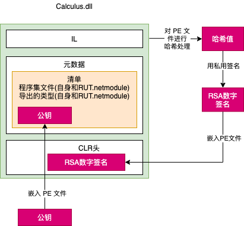

# 第 3 章 共享程序集和强命名程序集

本章内容：
* <a href="3_1">两种程序集，两种部署</a>
* <a href="3_2">为程序集分配强名称</a>
* <a href="3_3">全局程序集缓存</a>
* <a href="3_4">在生成的程序集中引用强命名程序集</a>
* <a href="3_5">强命名程序集能防篡改</a>
* <a href="3_6">延迟签名</a>
* <a href="3_7">私有部署强命名程序集</a>
* <a href="3_8">“运行时”如何解析类型引用</a>
* <a href="3_9">高级管理控制(配置)</a>

第 2 章讲述了生成、打包和部署程序集的步骤。我将重点放在所谓的私有部署(private deployment)上。进行私有部署，程序集放在应用程序的基目录(或子目录)，由这个应用程序独享。以私有方式部署程序集，可以对程序集的命名、版本和行为进行最全面的控制。

本章重点是如何创建可由多个应用程序共享的程序集。 Microsoft .NET Framework 随带的程序集就是典型的全局部署程序集，因为所有托管应用程序都要使用 Microsoft 在 .NET Framework Class Library(FCL)中定义的类型。

第 2 章讲过， Windows 以前在稳定性上的口碑很差，主要原因是应用程序要用别人实现的代码进行生成和测试。(想想看，你开发的 Windows 应用程序是不是要调用由 Microsoft 开发人员写好的代码？)另外，许多公司都开发了供别人嵌入的控件。事实上， .NET Framework 鼓励这样做，以后的控件开发商会越来越多。

随着时间的推移， Microsoft 开发人员和控件开发人员会修改代码，这或许是为了修复bug、进行安全更新、添加功能等。最终，新代码会进入用户机器。以前安装好的、正常工作的应用程序突然要面对“陌生”的代码，不再是应用程序最初生成和测试时的代码。因此，应用程序的行为不再是可以预测的，这是造成 Windows 不稳定的根源。

文件的版本控制是个难题。取得其他代码文件正在使用的一个文件，即时只修改其中一位(将 0 变成 1，或者将 1 变成 0)，就无法保证使用该文件的代码还能正常工作。使用文件的新版本时，道理是一样的。之所以这样说，是因为许多应用程序都有意或无意地利用了 bug。如果文件的新版本修复了 bug，应用程序就不能像预期的那样运行了。

所以现在的问题是：如何在修复 bug 并添加新功能的同时，保证不会中断应用程序的正常运行？我对这个问题进行过大量思考，最后结论是完全不可能！但是，这个答案明显不够好。分发的文件总是有 bug，公司总是希望推陈出新。必须有一种方式在分发新文件的同时，尽量保证应用程序良好工作。如果应用程序不能良好工作，必须有一种简单的方式将应用程序恢复到上一次已知良好的状态。

本章将解释 .NET Framework 为了解决版本控制问题而建立的基础结构。事先说一句：要讲述的内容比较复杂。将讨论 CLR 集成的大量算法、规则和策略。还要提到应用程序开发人员必须熟练使用的大量工具和实用程序。之所以复杂，是因为如前所述，版本控制本来就是一个复杂的问题。

## <a name="3_1">3.1 两种程序集，两种部署</a>

CLR 支持两种程序集：**弱命名程序集**(weakly named assembly)和**强命名程序集**(strongly named assembly)。
> 重要提示 任何文档都找不到“弱命名程序集”这个术语，这是我自创的。事实上，文档中没有对应的术语来表示弱命名的程序集。通过自造术语，我在提到不同种类的程序集时可以避免歧义。

弱命名和强命名程序集结构完全相同。也就是说，它们都使用第 1 章和第 2 章讨论的 PE 文件格式、PE32(+)头、CLR头、元数据、清单表以及IL。生成工具也相同，都是C# 编译器或者 AL.exe。两者真正的区别在于，强命名程序集使用发布者的公钥/私钥进行了签名。这一对密钥允许对程序集进行唯一性的标识、保护和版本控制，并允许程序集部署到用户机器的任何地方，甚至可以部署到 Internet 上。由于程序集被唯一性地标识，所以当应用程序绑定到强命名程序集时，CLR 可以应用一些已知安全的策略。本章将解释什么是强命名程序集，以及 CLR 向其应用的策略。

程序集可采用两种方式部署：私有或全局。私有部署的程序集是指部署到应用程序基目录或者某个子目录的程序集。弱命名程序集只能以私有方式部署。第 2 章已讨论了私有部署的程序集。全局部署的程序集是指部署到一些公认位置的程序集。CLR 在查找程序集时，会检查这些位置。强命名程序集既可私有部署，也可全局部署。本章将解释如何创建和部署强命名程序集。表 3-1 总结了程序集的种类及其部署方式。

  表 3-1 弱命名和强命名程序集的部署方式
  |程序集种类|可以私有部署|可以全局部署|
  |:---:|:---:|:---:|
  |弱命名|是|否|
  |强命名|是|是|

## <a name="3_2">3.2 为程序集分配强名称</a>

要由多个应用程序访问的程序集必须放到公认的目录。另外，检测到对程序集的引用时，CLR 必须能自动检查该目录。但现在的问题是：两个(或更多)公司可能生成具有相同文件名的程序集。所以，假如两个程序集都复制到相同的公认目录，最后一个安装的就是“老大”，造成正在使用旧程序集的所有应用程序都无法正常工作(这正是 Windows “DLL hell”的由来，因为共享 DLL 全都复制到 System32 目录)。

只根据文件名来区分程序集明显不够。CLR 必须支持对程序集进行唯一性标识的机制。这就是所谓的“强命名程序集”。强命名程序集具有 4 个重要特性，它们共同对程序集进行唯一性标识：文件名(不计扩展名)、版本号、语言文化和公钥。由于公钥数字很大，所以经常使用从公钥派生的小哈希值，称为 **公钥标记**(public key token)。以下程序集标识字符串(有时称为**程序集显示名称**)标识了 4 个完全不同的程序集文件：

```sys
"MyTypes,Version=1.0.8123.0, Culture=neutral, PublicKeyToken=b77a5c561934e089"
"MyTypes,Version=1.0.8123.0, Culture="en-US", PublicKeyToken=b77a5c561934e089"
"MyTypes,Version=2.0.1234.0, Culture=neutral, PublicKeyToken=b77a5c561934e089"
"MyTypes,Version=1.0.8123.0, Culture=neutral, PublicKeyToken=b03f5f7f11d50a3a"
```

第一个标识的是程序集文件 MyTypes.exe 或 MyTypes.dll (无法根据“程序集标识字符串”判断文件扩展名)。生成该程序集的公司为其分配的版本号是 1.0.8123.0，而且程序集中没有任何内容与一种特定语言文化关联，因为 **Culture** 设为 **neutral** 。当然，任何公司都可以生成 MyTypes.dll(或 MyTypes.exe)程序集文件，为其分配相同的版本号 1.0.8123.0，并将语言文化设为中性。

所以，必须有一种方式区分恰好具有相同特性的两个公司的程序集。出于几方面的考虑，Microsoft 选择的是标准的公钥/私钥加密技术，而没有选择其他唯一性标识技术，如 GUID(Globally Unique Identifier，全局唯一标识符)、URL(Uniform Resource Locator，统一资源定位符)和URN(Uniform Resource Name，统一资源名称)。具体地说，使用加密技术，不仅能在程序集安装到一台机器上时检查其二进制数据的完整性，还允许每个发布者授予一套不同的权限。本章稍后会讨论这些技术。所以，一个公司要想唯一性地标识自己的程序集，必须创建一对公钥/私钥。然后，公钥可以和程序集关联。没有任何两家公司有相同的公钥/私钥对。这样一来，两家公司可以创建具有相同名称、版本和语言文化的程序集，同时不会产生任何冲突。  
> 注意 可以利用辅助类 `System.Reflection.AssemblyName` 轻松构造程序集名称，并获取程序集名称的各个组成部分。该类提供了几个公共实例属性，比如 **CultureInfo**，**FullName**，**KeyPair**，**Name** 和 **Version**，还提供了几个公共实例方法，比如 **GetPublicKey**，**GetPublicKeyToken**，**SetPublicKey** 和 **SetPublicKeyToken**。

第 2 章介绍了如何命名程序集文件，以及如何应用程序集版本号和语言文化。弱命名程序集可在清单元数据中嵌入程序集版本和语言文化；然而，CLR 通过探测子目录查找附属程序集(satellite assembly)时，会忽略版本号，只用语言文化信息。由于弱命名程序集总是私有部署，所以 CLR 在应用程序基目录或子目录(具体子目录由 XML 配置文件的 `probing` 元素的 `privatePath` 特性指定)中搜索程序集文件时只使用程序集名称(添加.dll 或 .exe扩展名)。

强命名程序集除了有文件名、程序集版本号和语言文化，还用发布者私钥进行了签名。

创建强命名程序集第一步是用 .NET Framework SDK 和 Microsoft Visual Studio 随带的  Strong Name 实用程序(SN.exe)获取密钥。SN.exe 允许通过多个命令行开关都区分大小写。为了生成公钥/私钥对，像下面这样运行 SN.exe：  
`SN -k MyCompany.snk`

这告诉 SN.exe 创建 MyCompany.snk 文件。文件中包含二进制形式的公钥和私钥。

公钥数字很大；如果愿意，创建 .snk 文件后可再次使用 SN.exe 查看实际公钥。这需要执行两次 SN.exe(C:\Program Files (x86)\Microsoft SDKs\Windows\v10.0A\bin\NETFX 4.8 Tools)。 第一次用 `-p` 开关创建只含公钥的文件 *(MyCompany.PublicKey)*:  
`SN –p MyCompany.snk MyCompany.PublicKey sha256`
> 本例使用 .NET Framework 4.5 引入的增强型强命名(Enhanced Strong Naming)。要生成和以前版本的 .NET Framework 兼容的程序集，还必须用 `AssemblySignatureKeyAttribute` 创建联署签名(counter-signature)。详情参见 *[http://msdn.microsoft.com/en-us/library/hh415055(v=vs.110).aspx](https://docs.microsoft.com/en-us/dotnet/standard/assembly/enhanced-strong-naming?redirectedfrom=MSDN)*

第二次用`-tp`开关执行，传递只含公钥的文件：  

`SN -tp MyCompany.PublicKey`  

执行上述命令，在我的机器上得到的输出如下：

```txt

Microsoft(R) .NET Framework 强名称实用工具 版本 4.0.30319.0
版权所有(C) Microsoft Corporation。保留所有权利。

公钥(哈希算法: sha256):
002400000c8000009400000006020000002400005253413100040000010001002d326e81541132
a1526fde64c6bd8ec89d7cc87e8c66513c6539b15de901995838f25360b35c4a0112521cd004e3
27498b439d3747026ad0cf5bb62ff3c031bbc8a21c28d4b282f20171e9387190dbb891e2d7186d
500ae7753b89e93790137d3c26e381a7120ea8459ef835ee11905447771dbc763017e3da297ac1
a9d843be

公钥标记为 10561fa1662d41b8
```

注意， SN.exe 实用程序未提供任何显示私钥的途径。

公钥太大，难以使用。为了简化开发人员的工作(也为了方便最终用户)，人们设计了 **公钥标记**(public key token)。公钥标记是公钥的 64 位哈希值。SN.exe 的 `-tp` 开关在输出结果的末尾显示了与完整公钥对应的公钥标记。

知道了如何创建公钥/私钥对，创建强命名程序集就简单了。编译程序集时使用 `/keyfile:<file>` 编译器开关：

`csc /keyfile:MyCompany.snk Program.cs`

C# 编译器看到这个开关会打开指定文件(MyCompany.snk)，用私钥对程序集进行签名，并将公钥嵌入清单。注意只能对含清单的程序集文件进行签名；程序集其他文件不能被显式签名。

要在 Visual Studio 中新建公钥/私钥文件，可显示项目属性，点击“签名”标签，勾选“为程序集签名”，然后从“选择强名称密钥文件”选择框中选择“<新建···>”。

“对文件进行签名”的准确含义是：生成强命名程序集时，程序集的 FileDef 清单元数据表列出构成程序集的所有文件。每将一个文件名添加到清单，都对文件内容进行哈希处理。哈希值和文件名一道存储到 FileDef 表中。要覆盖默认哈希算法，可使用 AL.exe 的 `/algid` 开关，或者在程序集的某个源代码文件中，在 assembly 这一级上应用定制特性 `System.Reflection.AssemblyAlgorithmIdAttribute`。默认使用 SHA-1 算法。

生成包含清单的 PE 文件后，会对 PE 文件的完整内容(除去 Authenticode Signature、程序集强名称数据以及 PE 头校验和)进行哈希处理，如图 3-1 所示。哈希值用发布者的私钥进行签名，得到的 RSA 数字签名存储到 PE 文件的一个保留区域(进行哈希处理时，会忽略这个区域)。PE 文件的 CLR 头进行更新，反映数字签名在文件中的嵌入位置。

  
图 3-1 对程序集进行签名  

发布者公钥也嵌入 PE 文件的 AssemblyDef 清单元数据表。文件名、程序集版本号、语言文化和公钥的组合为这个程序集赋予了一个强名称，它保证是唯一的。两家公司除非共享密钥对，否则即使都生成了名为 OurLibrary 的程序集，公钥/私钥也不能相同。

到此为此，程序集及其所有文件就可以打包和分发了。

如第 2 章所述，编译器在编译源代码时会检测引用的类型和成员。必须向编译器指定要引用的程序集——C#编译器是用`/reference` 编译器开关。编译器的一项工作是在最终的托管模块中生成 AssemblyRef 元数据表，其中每个记录项都指明被引用程序集的名称(无路径和扩展名)、版本号、语言文化和公钥信息。  
> 重要提示 由于公钥是很大的数字，而一个程序集可能引用其他大量程序集，所以在最终生成的文件中，相当大一部分会被公钥信息占据。为了节省存储空间， Microsoft 对公钥进行哈希处理，并获取哈希值的最后 8 个字节。 AssemblyRef 表实际存储的是这种简化的公钥值(称为“公钥标记”)。开发人员和最终用户一般看到的都是公钥标记，而不是完整公钥。    
> 但要注意，CLR 在做出安全或信任决策时，永远都不会使用公钥标记，因为几个公钥可能在哈希处理之后得到同一个公钥标记。

下面是一个简单类库 DLL 文件的 AssemblyRef 元数据信息(使用 ILDasm.exe 获得)：

```C#
AssemblyRef #1 (23000001)
-------------------------------------------------------
Token: 0x23000001
Public Key or Token: b7 7a 5c 56 19 34 e0 89 
Name: mscorlib
Version: 4.0.0.0
Major Version: 0x00000004
Minor Version: 0x00000000
Build Number: 0x00000000
Revision Number: 0x00000000
Locale: <null>
HashValue Blob:
Flags: [none] (00000000)
```

可以看出，这个 DLL 程序集引用了具有以下特性的一个程序集中的类型：  
`"MSCorLib, Version=4.0.0.0, Culture=neutral, PublicKeyToken=b77a5c561934e089"`  

遗憾的是， ILDasm.exe 在本该使用术语"Culture"的地方使用了“Locale”。检查 DLL 程序集的 AssemblyDef 元数据表看到以下内容：

```C#
Assembly
-------------------------------------------------------
Token: 0x20000001
Name : SomeClassLibrary
Public Key :
Hash Algorithm : 0x00008004
Version: 3.0.0.0
Major Version: 0x00000003
Minor Version: 0x00000000
Build Number: 0x00000000
Revision Number: 0x00000000
Locale: <null>
Flags : [none] (00000000)
```

它等价于：
`"SomeClassLibrary, Version=3.0.0.0, Culture=neutral, PublicKeyToken=null"`  

之所以没有公钥标记，是由于 DLL 程序集没有用公钥/私钥对进行签名，这使它成为弱命名程序集。如果用 SN.exe 创建密钥文件，再用`/keyfile` 编译器开关进行编译，最终的程序集就是经过签名的。使用 ILDasm.exe 查看新程序集的元数据， AssemblyDef 记录项就会在 Public Key 字段之后显示相应的字节，表明它是强命名程序集。顺便说一句，AssemblyDef 的记录项总是存储完整公钥，而不是公钥标记，这是为了保证文件没有被篡改。本章后面将解释强命名程序集如何防篡改。

## <a name="3_3">3.3 全局程序集缓存</a>

知道如何创建强命名程序集之后，接着学习如何部署它，以及 CLR 如何利用信息来定位并加载程序集。

由多个应用程序访问的程序集必须放到公认的目录，而且 CLR 检测到对程序集的引用时，必须知道检查该目录。这个公认位置就是**全局程序集缓存(Global Assembly Cache,GAC)**。GAC 的具体位置是一种实现细节，不同版本会有所变化。但是，一般能在以下目录发现它：
`%SystemRoot%\Microsoft.NET\Assembly`

GAC 目录是结构化的：其中包含许多子目录，子目录名称用算法生成。永远不要将程序集文件手动复制到 GAC 目录；相反，要用工具完成这项任务。工具知道 GAC 的内部结构，并知道如何生成正确的子目录名。

开发和测试时在 GAC 中安装强命名程序集最常用的工具是 [GACUtil.exe](https://docs.microsoft.com/zh-cn/dotnet/framework/tools/gacutil-exe-gac-tool)。`C:\Program Files (x86)\Microsoft SDKs\Windows\v10.0A\bin\NETFX 4.8 Tools`如果直接运行，不添加任何命令行参数，就会自动显示用法：

```C#
Microsoft (R) .NET Global Assembly Cache Utility.  Version 4.0.30319.0
Copyright (c) Microsoft Corporation.  All rights reserved.

Usage: Gacutil <command> [ <options> ]
Commands:
  /i <assembly_path> [ /r <...> ] [ /f ]
    Installs an assembly to the global assembly cache.  //将某个程序集安装到全局程序集缓存中

  /il <assembly_path_list_file> [ /r <...> ] [ /f ]
    Installs one or more assemblies to the global assembly cache. // 讲一个或多个程序集安装到全局程序集缓存中

  /u <assembly_display_name> [ /r <...> ]
    Uninstalls an assembly from the global assembly cache. // 将某个程序集从全局程序集缓存卸载

  /ul <assembly_display_name_list_file> [ /r <...> ]
    Uninstalls one or more assemblies from the global assembly cache. // 将一个或多个程序集从全局程序集缓存卸载

  /l [ <assembly_name> ]
    List the global assembly cache filtered by <assembly_name> // 列出通过 <assembly_name> 筛选出的全局程序集缓存

  /lr [ <assembly_name> ]
    List the global assembly cache with all traced references. // 列出全局程序集缓存以及所有跟踪引用

  /cdl
    Deletes the contents of the download cache  // 删除下载缓存的内容

  /ldl
    Lists the contents of the download cache   // 列出下载缓存的内容

  /?
    Displays a detailed help screen  // 显示详细帮助屏幕

 Options:
  /r <reference_scheme> <reference_id> <description>
    Specifies a traced reference to install (/i, /il) or uninstall (/u, /ul). // 指定要安装 (/i, /il) 或卸载(/u, /ul) 的跟踪引用

  /f
    Forces reinstall of an assembly.  // 强制重新安装程序集

  /nologo
    Suppresses display of the logo banner  // 取消显示徽标版权标志

  /silent
    Suppresses display of all output    // 取消显示所有输出
```

使用 GACUtil.exe 的`/i` 开关将程序集安装到 GAC，`/u`开关从 GAC 卸载程序集。注意不能将弱命名程序集放到 GAC 。向 GACUtil.exe 传递弱命名程序集的文件名会报错：**“将程序集添加到缓存失败：尝试安装没有强名称的程序集。”**  **Failure adding assembly to the cache: Attempt to install an assembly without a strong name.**
> 注意  GAC 默认只能由 Windows Administrator 用户组的成员操作。如果执行 GACUtil.exe 用户不是该组的成员， GACUtil.exe 将无法安装或卸载程序集。

.NET Framework 重分发包不随带提供 GACUtil.exe 工具。如果应用程序含有需要部署到 GAC 的程序集，应该使用 Windows Installer(MSI)，因为 MSI 使用户机器上肯定会安装，又能将程序集安装到 GAC 的工具。
> 重要提示 在GAC 中全局部署是对程序集进行注册的一种形式，虽然这个过程对 Windows 注册表没有半点影响。将程序集安装到 GAC 破坏了我们想要达到的一个基本目标，即：简单地安装、备份、还原、移动和卸载应用程序。所以，建议尽量进行私有而不是全局部署。

为什么要在 GAC 中“注册”程序集？假定两家公司都生成了名为 OurLibrary 的程序集，两个程序集都由一个 OurLibrary.dll 文件构成。这两个文件显然不能存储到同一个目录，否则最后一个安装的会覆盖第一个，造成应用程序被破坏。相反，将程序集安装到 GAC ，就会在 `%SystemRoot%\Microsoft.NET\Assembly` 目录下创建专门的子目录，程序集文件会复制到其中一个子目录。

一般没人去检查 GAC 的子目录，所以 GAC 的结构对你来说并不重要。只要使用的工具和 CLR 知道这个结构就可以了。

## <a name="3_4">3.4 在生成的程序集中引用强命名程序集</a>

你生成的任何程序集都包含对其他
